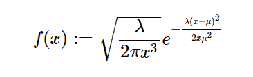

# Python 中的 sympy.stats.Wald()

> 原文:[https://www.geeksforgeeks.org/sympy-stats-wald-in-python/](https://www.geeksforgeeks.org/sympy-stats-wald-in-python/)

借助于`**sympy.stats.Wald()**`方法，利用该方法可以得到代表逆高斯分布和 Wald 分布的连续随机变量。



> **句法:** `sympy.stats.Wald(name, mean, lamda)`
> 其中，mean 和 lamda 为正数。
> 
> **返回:**返回连续随机变量。

**示例#1 :**
在这个示例中我们可以看到，通过使用`sympy.stats.Wald()`方法，我们能够通过使用该方法获得表示逆高斯或 wald 分布的连续随机变量。

```
# Import sympy and Wald
from sympy.stats import Wald, density
from sympy import Symbol, pprint

z = Symbol("z")
mean = Symbol("mean", positive = True)
lamda = Symbol("lamda", positive = True)

# Using sympy.stats.Wald() method
X = Wald("x", mean, lamda)
gfg = density(X)(z)

pprint(gfg)
```

**输出:**

> 2
> -λ*(均值+z)
> ———T2】_ _ _ _ 2
> _ _ _ _/1 2 *均值* z
> \/2 * \/λ*/—* e
> /3
> \/z
> —————————————————————————————————————
> _
> 2 * \/pi

**例 2 :**

```
# Import sympy and Wald
from sympy.stats import Wald, density
from sympy import Symbol, pprint

z = 0.86
mean = 6
lamda = 2.35

# Using sympy.stats.Wald() method
X = Wald("x", mean, lamda)
gfg = density(X)(z)

pprint(gfg)
```

**输出:**

> 0.49868646362573
> ————
> _ _ _ _
> \/pi