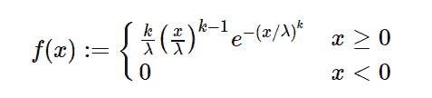

# Python 中的 sympy.stats.Weibull()

> 原文:[https://www . geesforgeks . org/sympy-stats-Weibull-in-python/](https://www.geeksforgeeks.org/sympy-stats-weibull-in-python/)

借助`**sympy.stats.Weibull()**`方法，我们可以得到代表威布尔分布的连续随机变量。



> **语法:** `sympy.stats.Weibull(name, alpha, beta)`
> 其中，α和β是实数。
> 
> **返回:**返回连续随机变量。

**例#1 :**
在这个例子中我们可以看到，通过使用`sympy.stats.Weibull()`方法，我们能够通过使用这个方法得到代表威布尔分布的连续随机变量。

```
# Import sympy and Weibull
from sympy.stats import Weibull, density
from sympy import Symbol, pprint

z = Symbol("z")
a = Symbol("a", positive = True)
l = Symbol("l", positive = True)

# Using sympy.stats.Weibull() method
X = Weibull("x", a, l)
gfg = density(X)(z)

pprint(gfg)
```

**输出:**

> l
> /z \
> l–1-|-|
> /z \ \ a/
> l * |-| * e
> \ a/
> ———
> a

**例 2 :**

```
# Import sympy and Weibull
from sympy.stats import Weibull, density
from sympy import Symbol, pprint

z = 2
a = 3
l = 4

# Using sympy.stats.Weibull() method
X = Weibull("x", a, l)
gfg = density(X)(z)

pprint(gfg)
```

**输出:**

> -16
> —
> 81
> 32 * e
> —
> 81