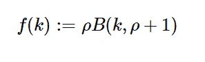

# 不错。stats . yulesimon()在 Python

中

> 哎哎哎:# t0]https://www . geeksforgeeks . org/symy-stats-yulsmon-in-python/

借助`**sympy.stats.YuleSimon()**`方法，我们可以得到代表 Yule-Simon 分布的随机变量。



> **语法:** `sympy.stats.YuleSimon(name, rho)`
> **返回:**返回随机变量。

**示例#1 :**
在这个示例中，我们可以看到，通过使用`sympy.stats.YuleSimon()`方法，我们能够使用该方法获得 Yule-Simon 分布。

```
# Import sympy and Yule-Simon
from sympy.stats import YuleSimon, density, E, variance
from sympy import Symbol, simplify

rho = 5

# Using sympy.stats.YuleSimon() method
X = YuleSimon("X", rho)
gfg = density(X)(0.5)

print(gfg)
```

**输出:**

> 5*beta(0.5，6)

**例 2 :**

```
# Import sympy and Yule-Simon
from sympy.stats import YuleSimon, density, E, variance
from sympy import Symbol, simplify

rho = 5
z = Symbol("z")

# Using sympy.stats.YuleSimon() method
X = YuleSimon("X", rho)
gfg = density(X)(z)

print(gfg)
```

**输出:**

> 5*beta(z，6)