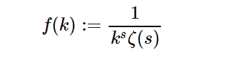

# Python 中的 sympy.stats.Zeta()

> 原文:[https://www.geeksforgeeks.org/sympy-stats-zeta-in-python/](https://www.geeksforgeeks.org/sympy-stats-zeta-in-python/)

借助`**sympy.stats.Zeta()**`方法，我们可以得到代表 Zeta 分布的随机变量。



> **语法:** `sympy.stats.Zeta(name, s)`
> **返回:**返回随机变量。

**示例#1 :**
在这个示例中，我们可以看到，通过使用`sympy.stats.Zeta()`方法，我们能够使用该方法获得 Zeta 分布。

```py
# Import sympy and Zeta 
from sympy.stats import Zeta, density, E, variance
from sympy import Symbol

s = 7

# Using sympy.stats.Zeta() method
X = Zeta("x", s)
gfg = density(X)(0.33333)

print(gfg)
```

**输出:**

> /泽塔(7)

**例 2 :**

```py
# Import sympy and Zeta 
from sympy.stats import Zeta, density, E, variance
from sympy import Symbol

s = 3
z = Symbol("z")

# Using sympy.stats.Zeta() method
X = Zeta("x", s)
gfg = density(X)(z)

print(gfg)
```

**输出:**

> 1/(z**3*zeta(3))