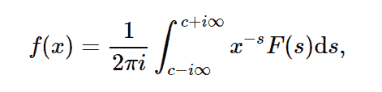

# python 中的 sympy . transforms . inverse _ mellin _ transform()

> 原文:[https://www . geeksforgeeks . org/sympy-transforms-inverse _ mellin _ transform-in-python/](https://www.geeksforgeeks.org/sympy-transforms-inverse_mellin_transform-in-python/)

借助`**inverse_mellin_transform**`方法，我们可以计算逆梅林变换并返回函数。



> **语法:** `inverse_mellin_transform(F, s, x, strip)`
> **返回:**返回函数 F(x)。

**示例#1 :**
在这个示例中，我们可以看到，通过使用`**inverse_mellin_transform()**`方法，我们能够通过执行逆 mallin 变换来获得函数 F(x)。

```
# import inverse_mellin_transform
from sympy.integrals.transforms import inverse_mellin_transform
from sympy import oo, gamma
from sympy.abc import x, s

# Using inverse_mellin_transform() method
gfg = inverse_mellin_transform(gamma(s), s, x, (0, oo))

print(gfg)
```

**输出:**

> exp(-x)

**例 2 :**

```
# import inverse_mellin_transform
from sympy.integrals.transforms import inverse_mellin_transform
from sympy import oo, gamma
from sympy.abc import x, s

# Using inverse_mellin_transform() method
gfg = inverse_mellin_transform(gamma(s + 1), s, x, (0, oo))

print(gfg)
```

**输出:**

> x*exp(-x)