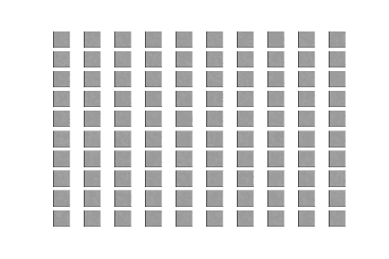
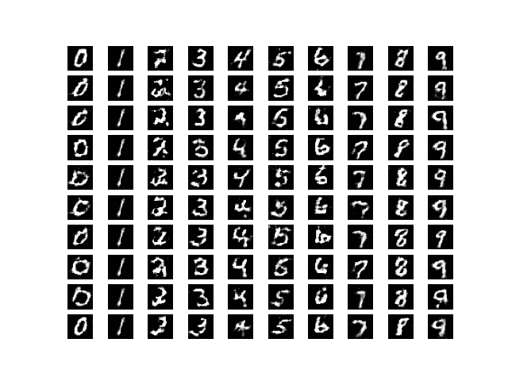
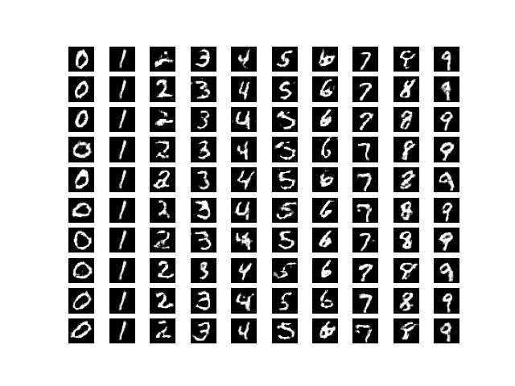
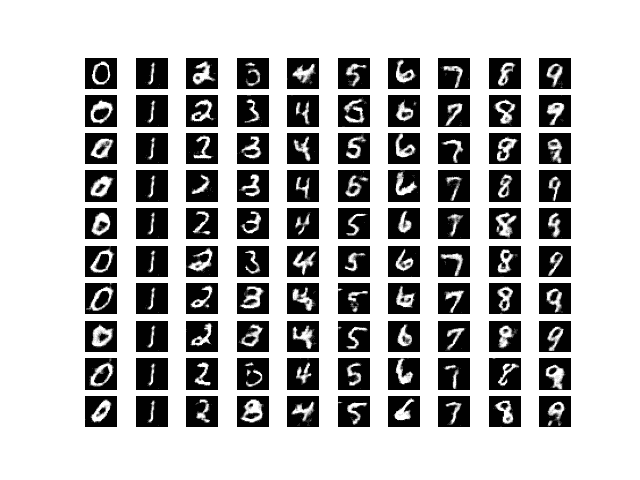
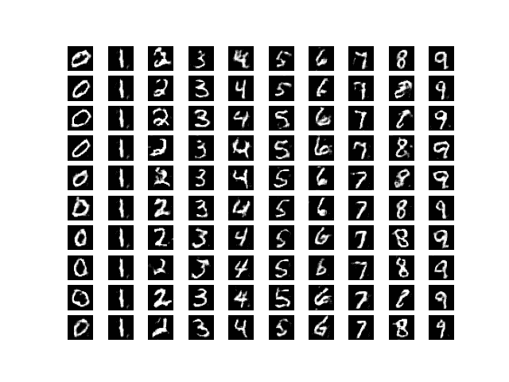
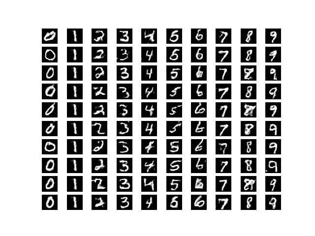
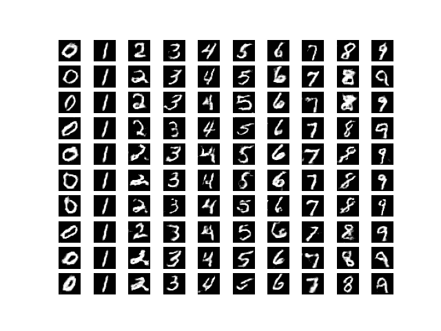
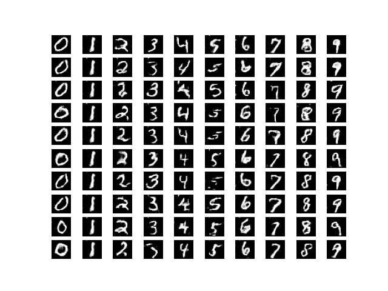

# 使用 Keras 和 Tensorflow 构建辅助 GAN

> 原文:[https://www . geesforgeks . org/building-an-assist-gan-use-keras-and-tensorflow/](https://www.geeksforgeeks.org/building-an-auxiliary-gan-using-keras-and-tensorflow/)

先决条件:[生成性对抗网络](https://www.geeksforgeeks.org/generative-adversarial-network-gan/)

本文将演示如何使用 Keras 和 TensorFlow 库构建一个辅助生成对抗网络。使用的数据集是预加载到 Keras 中的 **MNIST 图像数据集**。

**第一步:设置环境**

```py
Step 1 : Open Anaconda prompt in Administrator mode. 

Step 2 : Create a virtual environment using the command : conda create --name acgan python=3.7 

Step 3 : Then, activate the environment using the command : conda activate acgan

Step 4 : Install the following libraries -
         4.1 - Tensorflow --> pip install tensorflow==2.1
 4.2 - Keras      --> pip install keras==2.3.1      
```

**步骤 2:导入所需的库**

## 蟒蛇 3

```py
from keras.datasets import mnist
from keras.layers import Input, Dense, Reshape, Flatten, Dropout, multiply
from keras.layers.convolutional import UpSampling2D, Conv2D
from keras.layers import BatchNormalization, Activation, Embedding, ZeroPadding2D
from keras.models import Sequential, Model
from keras.layers.advanced_activations import LeakyReLU

from tensorflow.keras.optimizers import Adam

import matplotlib.pyplot as plt
import numpy as np
```

**第三步:定义用于后续流程的参数**

## 蟒蛇 3

```py
# Defining the Input shape
image_shape = (28, 28, 1)
classes = 10
latent_dim = 100

# Defining the optimizer and the losses 
optimizer = Adam(0.0002, 0.5)
losses = ['binary_crossentropy','sparse_categorical_crossentropy']
```

**第 4 步:定义一个实用函数来构建生成器**

## 蟒蛇 3

```py
def build_generator():

    model = Sequential()

    # Building the input layer
    model.add(Dense(128 * 7 * 7, activation="relu", input_dim=latent_dim))
    model.add(Reshape((7, 7, 128)))
    model.add(BatchNormalization(momentum=0.82))
    model.add(UpSampling2D())

    model.add(Conv2D(128, (3,3), padding="same"))
    model.add(BatchNormalization(momentum=0.82))
    model.add(Activation("relu"))
    model.add(UpSampling2D())

    model.add(Conv2D(64, (3,3), padding="same"))
    model.add(BatchNormalization(momentum=0.82))
    model.add(Activation("relu"))

    model.add(Conv2D(1, (3,3), padding='same'))
    model.add(Activation("tanh"))

    # Generating the output image
    noise = Input(shape=(latent_dim,))
    label = Input(shape=(1,), dtype='int32')
    z = Flatten()(Embedding(classes, latent_dim)(label))

    model_input = multiply([noise, z])
    image = model(model_input)

    return Model([noise, label], image)
```

**步骤 5:定义一个实用函数来构建鉴别器**

## 蟒蛇 3

```py
def build_discriminator():

    model = Sequential()

    # Building the input layer
    model.add(Conv2D(16, (3,3), strides=2, input_shape=image_shape, padding="same"))
    model.add(LeakyReLU(alpha=0.2))
    model.add(Dropout(0.25))

    model.add(Conv2D(32, (3,3), strides=2, padding="same"))
    model.add(ZeroPadding2D(padding=((0,1),(0,1))))
    model.add(LeakyReLU(alpha=0.2))
    model.add(Dropout(0.25))

    model.add(BatchNormalization(momentum=0.8))

    model.add(Conv2D(64, (3,3), strides=2, padding="same"))
    model.add(LeakyReLU(alpha=0.2))
    model.add(Dropout(0.25))

    model.add(BatchNormalization(momentum=0.8))

    model.add(Conv2D(128, (3,3), strides=1, padding="same"))
    model.add(LeakyReLU(alpha=0.2))
    model.add(Dropout(0.25))

    model.add(Flatten())

    image = Input(shape=image_shape)

    # Extract features from images
    features = model(image)

    # Building the output layer
    validity = Dense(1, activation="sigmoid")(features)
    label = Dense(classes, activation="softmax")(features)

    return Model(image, [validity, label])
```

**第 6 步:定义一个实用函数来显示生成的图像**

## 蟒蛇 3

```py
def display_images():
    r = 10
    c = 10
    noise = np.random.normal(0, 1, (r * c,latent_dim))

    new_labels = np.array([num for _ in range(r) for num in range(c)])
    gen_images = generator.predict([noise, new_labels])

    # Rescale images 0 - 1
    gen_images = 0.5 * gen_images + 0.5

    fig, axs = plt.subplots(r, c)
    count = 0
    for i in range(r):
        for j in range(c):
            axs[i,j].imshow(gen_images[count,:,:,0], cmap='gray')
            axs[i,j].axis('off')
            count += 1
    plt.show()
    plt.close()
```

**第 7 步:构建和训练交流-氮化镓**

## 蟒蛇 3

```py
def train_acgan(epochs, batch_size=128, sample_interval=50):

    # Load the dataset
    (X, y), (_, _) = mnist.load_data()

    # Configure inputs
    X = X.astype(np.float32)
    X = (X - 127.5) / 127.5
    X = np.expand_dims(X, axis=3)
    y = y.reshape(-1, 1)

    # Adversarial ground truths
    valid = np.ones((batch_size, 1))
    fake = np.zeros((batch_size, 1))

    for epoch in range(epochs):

        # Select a random batch of images
        index = np.random.randint(0, X.shape[0], batch_size)
        images = X[index]

        # Sample noise as generator input
        noise = np.random.normal(0, 1, (batch_size, latent_dim))

        # The labels of the digits that the generator tries to create an
        # image representation of
        new_labels = np.random.randint(0, 10, (batch_size, 1))

        # Generate a half batch of new images
        gen_images = generator.predict([noise, new_labels])

        image_labels = y[index]

        # Training the discriminator
        disc_loss_real = discriminator.train_on_batch(
          images, [valid, image_labels])
        disc_loss_fake = discriminator.train_on_batch(
          gen_images, [fake, new_labels])
        disc_loss = 0.5 * np.add(disc_loss_real, disc_loss_fake)

        # Training the generator
        gen_loss = combined.train_on_batch(
          [noise, new_labels], [valid, new_labels])

        # Print the accuracies
        print ("%d [acc.: %.2f%%, op_acc: %.2f%%]" % (
          epoch, 100 * disc_loss[3], 100 * disc_loss[4]))

        # display at every defined epoch interval
        if epoch % sample_interval == 0:
            display_images()
```

**第八步:构建生成性对抗网络**

## 蟒蛇 3

```py
# Build and compile the discriminator
discriminator = build_discriminator()
discriminator.compile(loss=losses,
    optimizer=optimizer,
    metrics=['accuracy'])

# Build the generator
generator = build_generator()

# Defining the input for the generator
#and generating the images
noise = Input(shape=(latent_dim,))
label = Input(shape=(1,))
image = generator([noise, label])

# Disable the Discriminator
# For the combined model we will only train the generator
discriminator.trainable = False

# The discriminator takes in the generated image
# as input and determines validity
# and the label of that image
valid, target_label = discriminator(image)

# The combined model (both generator and discriminator)
# Training the generator to fool the discriminator
combined = Model([noise, label], [valid, target_label])
combined.compile(loss=losses, optimizer=optimizer)

train_acgan(epochs=14000, batch_size=32, sample_interval=2000)
```

**输出(每 2000 个历元间隔):**

**纪元 0**



**纪元 2000**



**纪元 4000**



**纪元 6000**



**纪元 8000**



**纪元 10000**



**纪元 12000**



**纪元 14000**



**最终结果**

通过视觉观察生成图像的进程，可以得出结论，网络工作在可接受的水平。通过对网络进行更多时间的训练或调整网络参数，可以提高图像质量。如有任何疑问/疑问，请在下面评论。