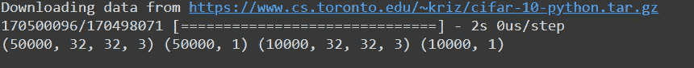
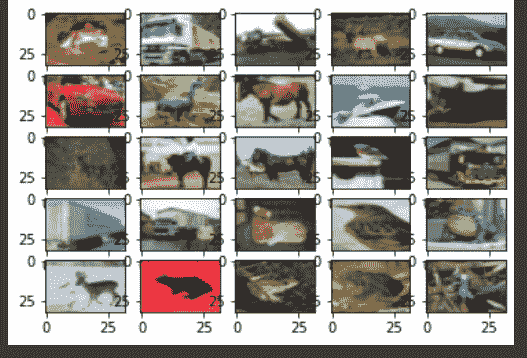

# cifar-ten image class ification in tensorlow

> 原文:[https://www . geesforgeks . org/cifar-10-image-classing-in-tensorflow/](https://www.geeksforgeeks.org/cifar-10-image-classification-in-tensorflow/)

### **先决条件:**

*   [图像分类](https://www.geeksforgeeks.org/python-image-classification-using-keras/)
*   [卷积神经网络](https://www.geeksforgeeks.org/introduction-convolution-neural-network/)包括基本的[汇集](https://www.geeksforgeeks.org/cnn-introduction-to-pooling-layer/)、[卷积层](https://www.geeksforgeeks.org/keras-conv2d-class/)和神经网络中的[归一化以及](https://www.geeksforgeeks.org/how-to-normalize-center-and-standardize-image-pixels-in-keras/)[脱落](https://www.geeksforgeeks.org/dropout-in-neural-networks/)。
*   数据增加。
*   [神经网络](https://www.geeksforgeeks.org/neural-networks-a-beginners-guide/)。
*   [Numpy 数组](https://www.geeksforgeeks.org/numpy-in-python-set-1-introduction/)。

在本文中，我们将讨论如何使用张量流对图像进行分类。[图像分类](https://www.geeksforgeeks.org/python-image-classification-using-keras/)是将图像分类为各自类别类别的方法。CIFAR-10 数据集，正如它所暗示的，有 10 种不同类别的图像。共有 10 个不同类别的 6 万张图片，分别命名为**飞机**、**汽车**、**鸟**、**猫**、**鹿**、**狗**、**蛙**、**马**、**船**、**卡车**。所有图像的尺寸都是 32×32。总共有 50000 张列车图像和 10000 张测试图像。

为了构建一个图像分类器，我们使用了[张量流](https://www.geeksforgeeks.org/introduction-to-tensorflow/)的 keras API 来构建我们的模型。为了建立一个模型，建议有 GPU 支持，或者你也可以使用谷歌 colab 笔记本。

### **分步实施:**

*   编写任何代码的第一步是导入所有必需的库和模块。这包括导入 tensorflow 和其他模块，如 numpy。如果模块不存在，您可以使用**命令提示符**上的 **pip 安装 tensorflow** 下载，或者如果您使用的是 jupyter 笔记本电脑，只需键入**！pip 在单元中安装 tensorflow** 并运行，以便下载模块。其他模块也可以类似地导入。

## 蟒蛇 3

```py
import tensorflow as tf  

# Display the version
print(tf.__version__)    

# other imports
import numpy as np
import matplotlib.pyplot as plt
from tensorflow.keras.layers import Input, Conv2D, Dense, Flatten, Dropout
from tensorflow.keras.layers import GlobalMaxPooling2D, MaxPooling2D
from tensorflow.keras.layers import BatchNormalization
from tensorflow.keras.models import Model
```

**输出:**

```py
2.4.1
```

上述代码的输出应该显示您正在使用的张量流版本，例如 2.4.1 或任何其他版本。

*   现在我们有了所需的模块支持，让我们加载数据。CIFAR-10 的数据集在 [tensorflow](https://www.geeksforgeeks.org/introduction-to-tensorflow/) keras API 上提供，我们可以使用**tensorflow . keras . datasets . CIFAR 10**在本地机器上下载，然后使用 [load_data()](https://www.geeksforgeeks.org/datasets-in-keras/) 函数将其分发到训练和测试集中。

## 蟒蛇 3

```py
# Load in the data
cifar10 = tf.keras.datasets.cifar10

# Distribute it to train and test set
(x_train, y_train), (x_test, y_test) = cifar10.load_data()
print(x_train.shape, y_train.shape, x_test.shape, y_test.shape)
```

**输出:**

上面代码的输出将显示所有四个分区的形状，如下所示



这里我们可以看到，我们有 5000 个训练图像和 1000 个测试图像，如上所述，所有的图像都是 32×32 的大小，并且有 3 个颜色通道，即图像是彩色图像。同样可见的是，每个图像只有一个标签。

*   直到现在，我们都有自己的数据。但是，我们仍然不能将它直接发送到我们的神经网络。我们需要处理数据，以便将其发送到网络。这个过程的第一件事是减少像素值。目前，所有图像像素都在 1-256 的范围内，我们需要将这些值减少到 0 到 1 之间的值。这使我们的模型能够轻松跟踪趋势并进行高效的培训。我们可以简单地通过将所有像素值除以 255.0 来实现这一点。

我们要做的另一件事是使用 flat()函数展平标签值(简单来说就是以行的形式重新排列标签值)。

## 蟒蛇 3

```py
# Reduce pixel values
x_train, x_test = x_train / 255.0, x_test / 255.0

# flatten the label values
y_train, y_test = y_train.flatten(), y_test.flatten()
```

*   现在是看到我们数据集的一些图像的好时机。我们可以将它以子图网格的形式可视化。因为图像尺寸只有 32×32，所以不要对图像期望太高。这将是一个模糊的。我们可以使用 matplotlib 中的[子图()](https://www.geeksforgeeks.org/matplotlib-pyplot-subplots-in-python/)函数进行可视化，并循环显示训练数据集部分的前 25 幅图像。

## 蟒蛇 3

```py
# visualize data by plotting images
fig, ax = plt.subplots(5, 5)
k = 0

for i in range(5):
    for j in range(5):
        ax[i][j].imshow(x_train[k], aspect='auto')
        k += 1

plt.show()
```

**输出:**



虽然图像不清晰，但有足够的像素让我们指定这些图像中有哪个对象。

*   完成所有步骤后，现在是建立我们的模型的时候了。我们将使用卷积神经网络或美国有线电视新闻网来训练我们的模型。它包括使用卷积层，也就是 Conv2d 层，以及池化和标准化方法。最后，我们将它传递到一个密集层，最后的密集层是我们的输出层。我们正在使用“ [relu](https://www.geeksforgeeks.org/activation-functions/) 激活功能。输出层使用“softmax”功能。

## 蟒蛇 3

```py
# number of classes
K = len(set(y_train))

# calculate total number of classes
# for output layer
print("number of classes:", K)

# Build the model using the functional API
# input layer
i = Input(shape=x_train[0].shape)
x = Conv2D(32, (3, 3), activation='relu', padding='same')(i)
x = BatchNormalization()(x)
x = Conv2D(32, (3, 3), activation='relu', padding='same')(x)
x = BatchNormalization()(x)
x = MaxPooling2D((2, 2))(x)

x = Conv2D(64, (3, 3), activation='relu', padding='same')(x)
x = BatchNormalization()(x)
x = Conv2D(64, (3, 3), activation='relu', padding='same')(x)
x = BatchNormalization()(x)
x = MaxPooling2D((2, 2))(x)

x = Conv2D(128, (3, 3), activation='relu', padding='same')(x)
x = BatchNormalization()(x)
x = Conv2D(128, (3, 3), activation='relu', padding='same')(x)
x = BatchNormalization()(x)
x = MaxPooling2D((2, 2))(x)

x = Flatten()(x)
x = Dropout(0.2)(x)

# Hidden layer
x = Dense(1024, activation='relu')(x)
x = Dropout(0.2)(x)

# last hidden layer i.e.. output layer
x = Dense(K, activation='softmax')(x)

model = Model(i, x)

# model description
model.summary()
```

**输出:**


我们的模型现在已经准备好了，是时候编译它了。我们正在使用 model.compile()函数来编译我们的模型。对于参数，我们使用

*   亚当优化器
*   作为损失函数的稀疏分类交叉熵
*   度量=['准确性']

## 蟒蛇 3

```py
# Compile
model.compile(optimizer='adam',
              loss='sparse_categorical_crossentropy',
              metrics=['accuracy'])
```