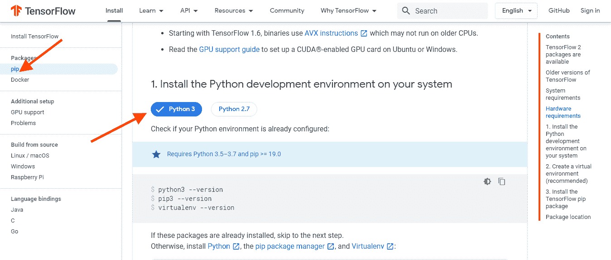
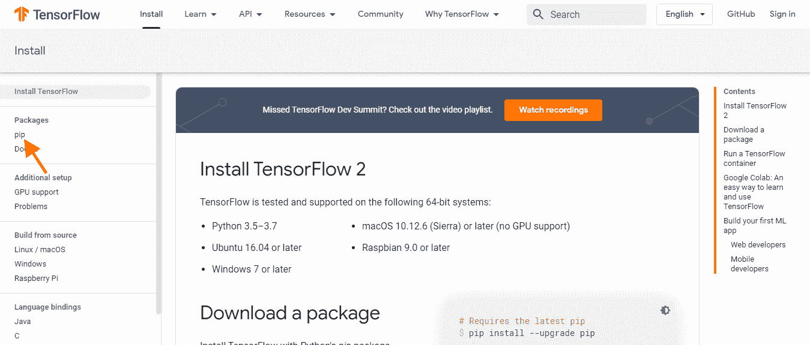
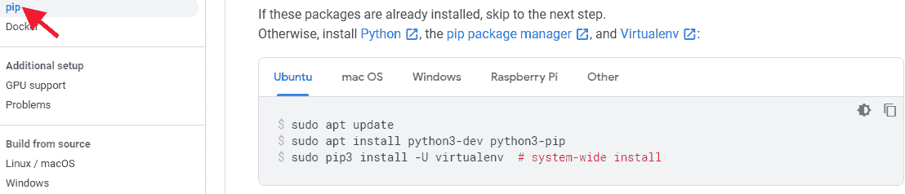
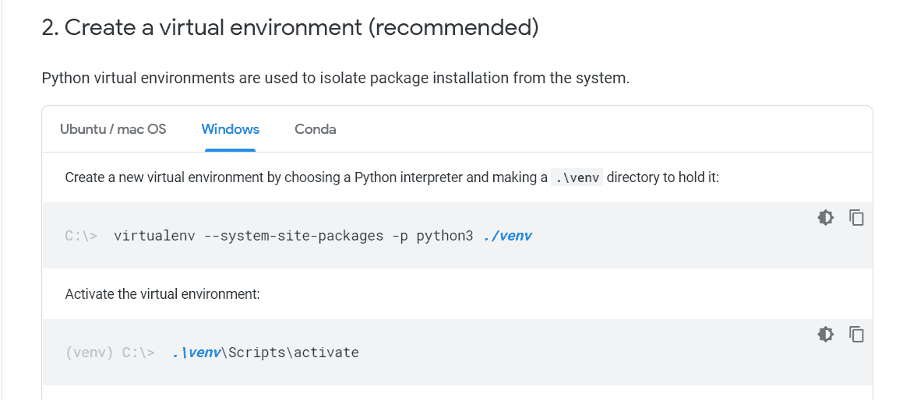
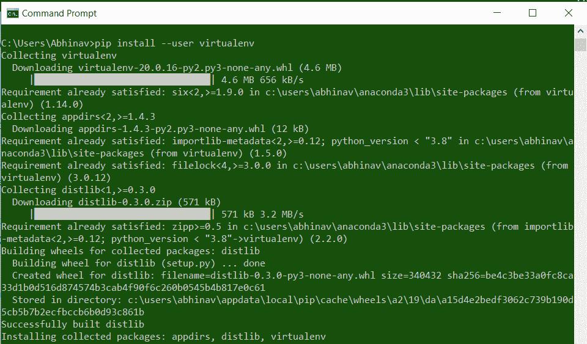
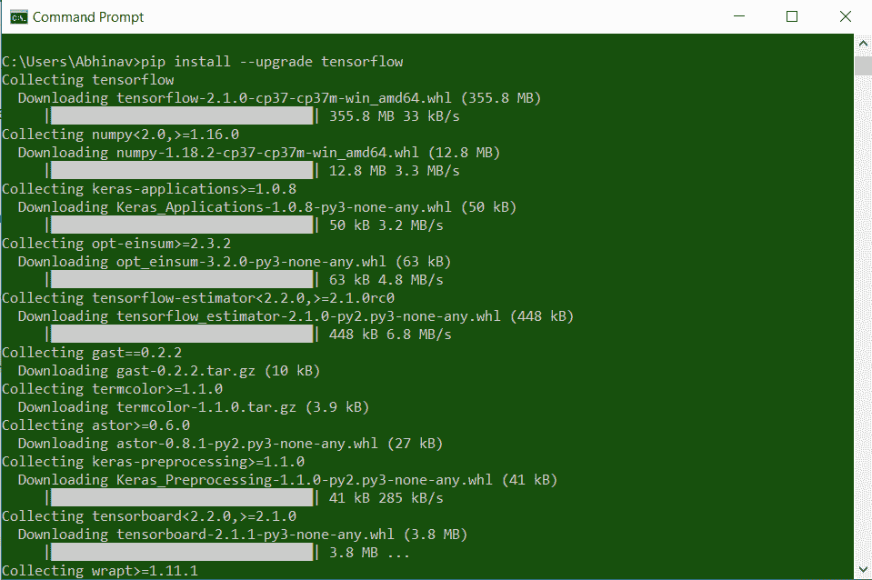

# 如何在 Windows 中安装 Python Tensorflow？

> 原文:[https://www . geesforgeks . org/how-install-python-tensorflow-in-windows/](https://www.geeksforgeeks.org/how-to-install-python-tensorflow-in-windows/)

[Tensorflow](https://www.geeksforgeeks.org/introduction-to-tensorflow/) 是一个免费的开源软件库，用来做计算数学，构建机器学习模型更深刻的深度学习模型。
它是谷歌大脑团队打造的谷歌产品，因此它为 ML 和 DL 提供了与人类行为兼容的大量操作性能。它可以在多个 CPU 和 GPU 上运行。

#### 张量流的特征:

*   **计算框架**–是一个在一个地方提供巨大计算框架的平台。在这种情况下，计算被视为数据流图。
*   **移动部署**–这是一种通过移动部署构建项目的简单方法
*   **高性能**–由于其易用性和不同的工具包，它提供了高性能的用户体验。

#### 下载和安装:

Tensorflow 可以从其官网[tensorflow.org](https://www.tensorflow.org/)下载，通过以下步骤帮助安装:

**第一步:**点击 Tensorflow 网站顶部导航栏上的安装。


**第二步:**在继续之前我们需要获取 python 环境。在左侧选择 pip，转到 python 部分，安装 python 环境进行操作。


**第三步:** Python 环境可以从[python.org](https://www.python.org/downloads/)下载。在 windows 上安装 python 请参考:[如何在 Windows 上安装 Python？](https://www.geeksforgeeks.org/how-to-install-python-on-windows/)

**第四步:**要安装 Tensorflow，我们需要 python 的 pip。通常，如果 python 版本是 3 或更高版本，pip 已经安装好了。想了解更多关于 pip 安装的信息，请参考:[如何在 Windows 中安装 pip？](https://www.geeksforgeeks.org/how-to-install-pip-on-windows/)

对于所有操作系统用户，查看如下截图所示的 TensorFlow pip 部分:

Tensorflow 也可以下载安装在不同的操作系统上:


**第五步:**创建 TensorFlow 虚拟环境


这可以通过使用以下命令来完成:

```py
pip install --user virtualenv
```



**步骤 6:** 设置好虚拟环境后，使用以下命令安装 Tensorflow pip 包:

```py
pip install --upgrade tensorflow 
```



安装后，您可以根据自己的选择在 python 编程环境中导入 TensorFlow(这里是 python IDE，如步骤 5 所述)。