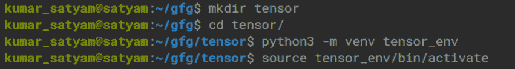
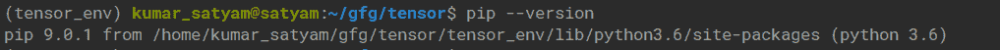
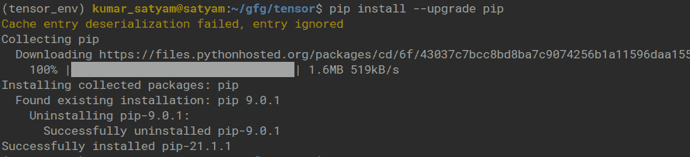
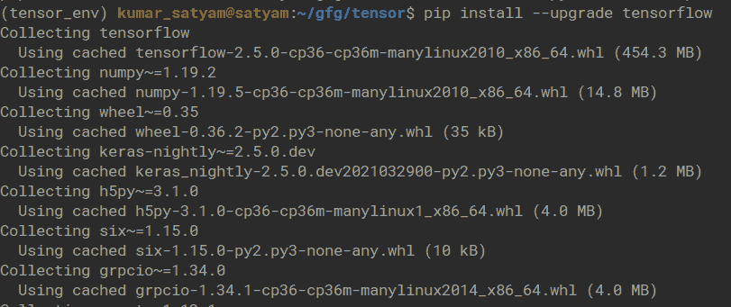
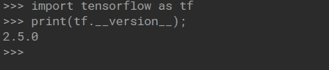

# 在 Linux 上安装 Tensorflow

> 原文:[https://www.geeksforgeeks.org/install-tensorflow-on-linux/](https://www.geeksforgeeks.org/install-tensorflow-on-linux/)

在本文中，我们将看到如何在 Linux 中安装 TensorFlow。这是一个完全开源的使用数据流图进行数值计算的库。

### **系统**要求 **:**

*   Python 3.6 到 3.8。
*   Pip 19.0 或更高版本。
*   Ubuntu 16.04 或更高版本。

### **分步安装:**

**步骤 1:** 为 python venv 模型创建一个虚拟环境。

```
sudo apt install python3-venv python3-dev
```


**步骤 2:** 创建 python 3 虚拟环境。

```
mkdir tensor
cd tensor/
python3 -m venv <virtual_environment_name>
```



**步骤 3:** 现在在虚拟环境中检查 pip 版本。

```
pip --version
```



这里我们的 pip 是 9，因此我们需要使用升级来升级 pip:

```
pip install --upgrade pip
```



**步骤 4:** 使用 pip 安装 TensorFlow:

```
pip install --upgrade tensorflow
```



**第五步:**检查安装是否正确。

```
import tensorflow as tf
print(tf.__version__);
```

