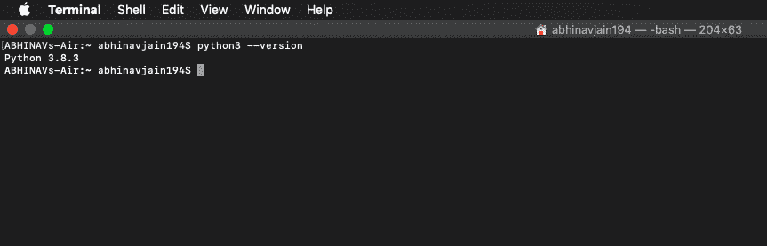
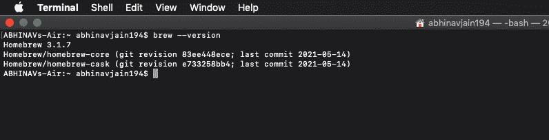
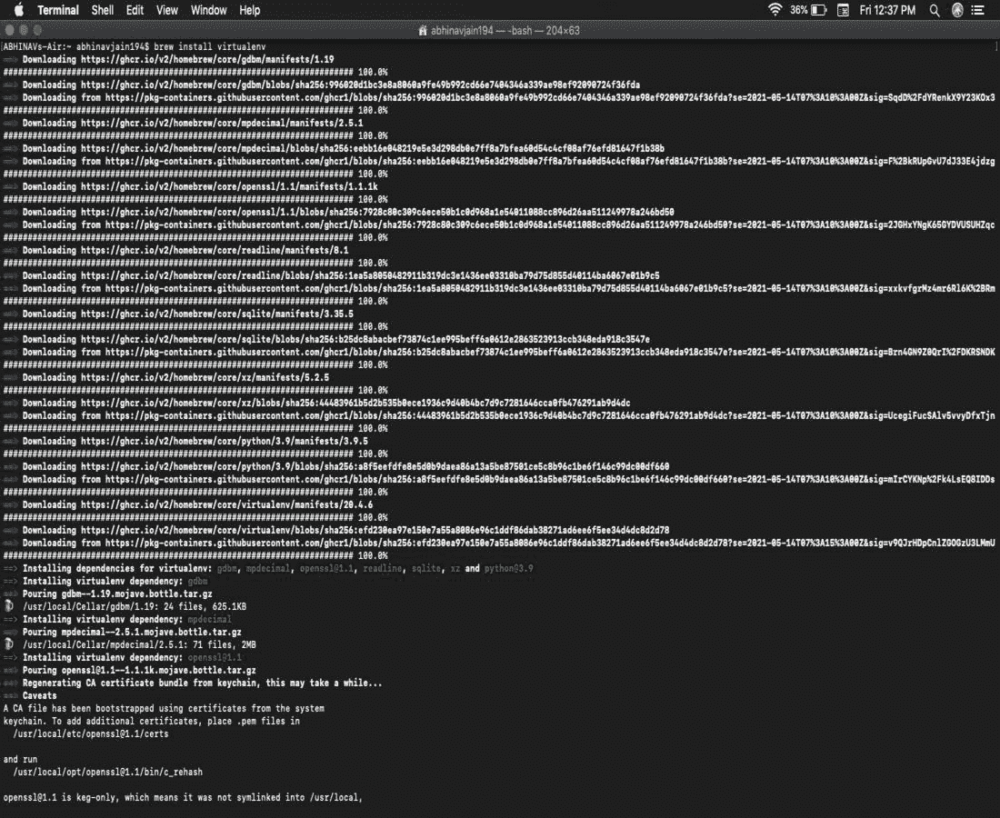
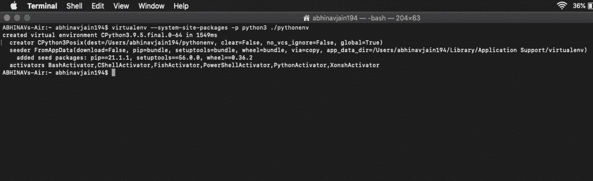
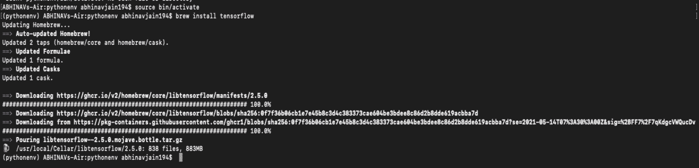
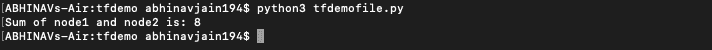

# 在 MacOS 上安装 tensorlow

> 哎哎哎:# t0]https://www . geeksforgeeks . org/install-tensorlow-on-macos/

[TensorFlow](https://www.geeksforgeeks.org/introduction-to-tensorflow/) 是一个由谷歌大脑团队开发的[开源](https://www.geeksforgeeks.org/difference-between-open-source-software-and-closed-source-software/)软件库。它被广泛用于实现深度学习模型，帮助解决现实世界的问题。在本文中，我们学习如何使用[自制程序在苹果电脑上安装 TensorFlow。](https://www.geeksforgeeks.org/homebrew-installation-on-macos/)

**要求:**

1.  python 3.6–3.8
2.  macOS 10.12.6 (Sierra)或更高版本(不支持 GPU)

### **安装张量流:**

**步骤 1:** 验证 python 版本:

```
$ python3 --version
```



**步骤 2:** 验证是否安装了 brew:

```
$ brew --version
```



**步骤 3:** 创建虚拟环境:

```
$ brew install virtualenv
```



**第四步:**创建新的虚拟环境后，创建一个./pytonev 目录保存。

```
$ virtualenv --system-site-packages -p python3 ./pythonenv
```



**第五步:**进去。/pytonev

```
$ cd ./pythonenv
```

**步骤 6:** 激活虚拟环境

```
source bin/activate
```

**步骤 7：** 安装张量流。

```
brew install tensorflow
```



**第 8 步:**在/pytonev 内部创建一个名为 **tfdemo 的新文件夹。**在 **tfdemo** 中创建一个名为 **tfdemofile.py.** 的新文件

**步骤 9:** 运行文件:

```
$ python3 tfdemofile.py
```

## 蟒蛇 3

```
# importing tensorflow
import tensorflow as tf

# creating nodes in computation graph
node1 = tf.constant(3, dtype = tf.int32)
node2 = tf.constant(5, dtype = tf.int32)
node3 = tf.add(node1, node2)

# create tensorflow session object
sess = tf.Session()

# evaluating node3 and printing the result
print("Sum of node1 and node2 is:", sess.run(node3))

# closing the session
sess.close()
```

**输出:**

