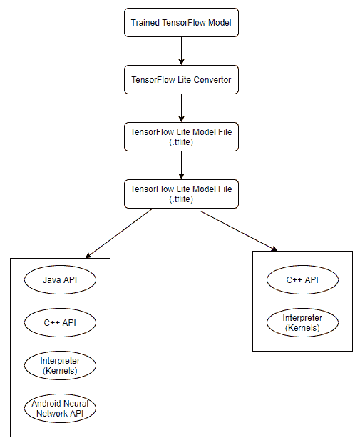

# TensorFlow Lite 简介

> 原文:[https://www . geesforgeks . org/introduction-to-tensorflow-lite/](https://www.geeksforgeeks.org/introduction-to-tensorflow-lite/)

TensorFlow 是一个免费的开源机器学习库。TensorFlow 是由谷歌大脑团队的开发人员和工程师创建的，作为谷歌人工智能研究组织的一部分，目的是执行机器学习和深度神经网络研究，但该技术足够通用，可以用于许多其他领域！

当一个人使用 TensorFlow 来实现和训练机器学习算法时，他通常会得到一个模型文件，这个文件会占用大量的存储空间，并且需要一个 GPU 来运行推理。在大多数移动设备上，巨大的磁盘空间和图形处理器等奢侈品是不可用的。TensorFlow Lite 是一个在移动设备上运行机器学习模型的解决方案。

**TensorFlow Lite** 是一个特别的功能，主要是为移动等嵌入式设备设计的。这使用自定义内存分配器来实现执行延迟和最小负载。它还解释了支持平面缓冲区的新文件格式。TensorFlow Lite 采用现有的模型，并将其转换为同类产品中的优化版本。tflite 文件。

### TensorFlow Lite 的优势:

*   快速轻松地将 TensorFlow 模型转换为 TensorFlow lite 模型，以实现移动友好型模型。
*   凭借简单性，为 iOS 和安卓设备构建机器学习应用。
*   与基于服务器的架构相比，移动模型支持的更有效的替代方案。
*   在移动设备上，它允许离线推理。
*   Tensorflow Lite 允许人们在智能手机上轻松执行机器学习模型，允许人们执行传统的机器学习任务，而不需要外部应用编程接口或服务器。因此，这些型号将在未连接到互联网的设备上运行。

### TensorFlow Lite 的缺点:

*   它不会优化模型大小。因此，移动设备可能需要更大的存储空间。
*   在 TensorFlow Lite 过程中，可靠性和优化的代价是模型精度的折衷。因此，TensorFlow Lite 模型的准确性不如功能齐全的同类产品。

### TensorFlow Lite 的架构:

**TensorFlow Mobile** 是 TensorFlow Lite 的继承者，它被用于安卓和 iOS(操作系统)等移动平台。它用于开发 TensorFlow 模型，并将该模型集成到移动环境中。

### TensorFlow 手机的使用案例

TensorFLow Mobile 三个主要且重要的用例为如下:

*   **TensorFlow 中的手势识别:**通过分析传感器数据，它习惯于控制应用程序或执行手或其他手势支持的任何特殊任务。
*   **TensorFlow 中的图像识别:**我 t 使用来检测或获取用手机拍摄的图像。如果用户正在拍照以了解一些信息，或者想要在其上使用一些效果(滤镜)，则图像识别起到正确识别照片的测量作用。例如:相机、图像编辑器、等。
*   **TensorFlow 中的语音识别:**各种与语音相关的应用可以使用 TensorFlow 构建语音驱动的界面。正确识别声音语音识别是在这里适用。从到有很多流行的应用，其中一些在语音识别系统上工作的是谷歌翻译、谷歌助手、等。

### TensorFlow Lite Vs. TensorFlow Mobile

<figure class="table">

| 

#### TensorFlow Lite

 | 

#### tensorlow mobile

 |
| --- | --- |
| 减少二进制文件大小。 | 最大二进制文件大小。 |
| 更好的性能。 | 良好的性能 |
| 它支持选择性算子集 | 它支持所有类型的运算符 |

</figure>

因此，TensorFlow Lite 在一致性和二进制文件大小方面优于其前身 TensorFlow Mobile。

### 张量流 Lite 的应用；

*   移动设备(IOS 和安卓)
*   物联网(IOT)
*   raspberry pi(消歧义)