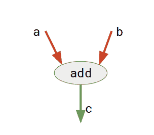
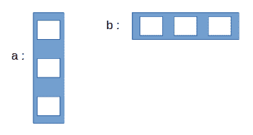
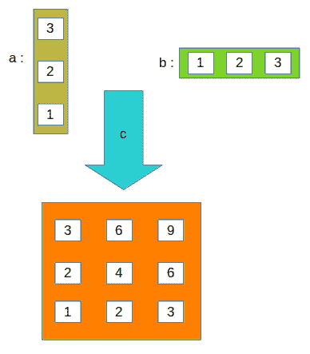

# TensorFlow 简介

> 原文:[https://www.geeksforgeeks.org/introduction-to-tensorflow/](https://www.geeksforgeeks.org/introduction-to-tensorflow/)

本文是对使用 Python 编程语言的 **TensorFlow** 库的简单介绍。

**简介**

**TensorFlow** 是一个开源软件库。 **TensorFlow** 最初是由谷歌机器智能研究组织内的谷歌大脑团队的研究人员和工程师开发的，目的是进行机器学习和深度神经网络研究，但该系统足够通用，也适用于各种其他领域！

让我们先试着理解 **TensorFlow** 这个词到底是什么意思！

**张量流**基本上是一个使用**数据流图**进行数值计算的软件库，其中:

*   图中**节点**代表数学运算。
*   图中的**边**表示它们之间通信的多维数据数组(称为**张量**)。(请注意，**张量**是张量流中数据的中心单位)。

考虑下面给出的图表:



这里 **add** 是表示加法运算的节点。 **a** 和 **b** 是输入张量， **c** 是合成张量。

这种灵活的架构允许您使用单个应用编程接口将计算部署到桌面、服务器或移动设备中的一个或多个中央处理器或图形处理器上！

**tensorlow API**

**TensorFlow** 提供多种 API(应用编程接口)。这些可以分为两大类:

1.  低级别应用编程接口:
    *   完全编程控制
    *   推荐给机器学习研究者
    *   提供对模型的精细控制
    *   **TensorFlow 核心**是 TensorFlow 的低级 API。
2.  高级应用编程接口:
    *   建立在 **TensorFlow 核心**之上
    *   比 **TensorFlow Core** 更容易学习和使用
    *   使重复任务变得更容易，并且在不同用户之间更加一致
    *   **tf.contrib.learn** 就是一个高级 API 的例子。

在本文中，我们首先讨论 **TensorFlow Core** 的基础知识，然后探索更高级别的 API， **tf.contrib.learn** 。

**张量流核心**

**1。安装 TensorFlow**

这里提供了一个简单的安装指南:
[安装 TensorFlow](https://www.tensorflow.org/install/) 。

安装完成后，您可以通过在 python 解释器中运行以下命令来确保安装成功:

```py
import tensorflow as tf
```

**2。计算图**

任何 **TensorFlow Core** 程序都可以分为两个独立的部分:

*   构建计算图。一个**计算图**不过是一系列排列成节点图的张量流运算。

*   运行计算图。为了实际评估节点，我们必须在**会话**中运行计算图。会话封装了 TensorFlow 运行时的控制和状态。

现在，让我们编写我们的第一个 **TensorFlow** 程序来理解上面的概念:

```py
# importing tensorflow
import tensorflow as tf

# creating nodes in computation graph
node1 = tf.constant(3, dtype=tf.int32)
node2 = tf.constant(5, dtype=tf.int32)
node3 = tf.add(node1, node2)

# create tensorflow session object
sess = tf.Session()

# evaluating node3 and printing the result
print("Sum of node1 and node2 is:",sess.run(node3))

# closing the session
sess.close()
```

输出:

```py
Sum of node1 and node2 is: 8

```

让我们试着理解上面的代码:

*   **步骤 1:创建计算图** 通过创建计算图，我们意味着定义节点。Tensorflow 为各种任务提供不同类型的节点。每个节点取零个或多个张量作为输入，并产生一个张量作为输出。

*   在上述程序中，节点**节点 1** 和节点**节点 2** 属于 **tf.constant** 类型。一个**常量**节点不接受输入，输出一个内部存储的值。注意，我们也可以使用 **dtype** 参数指定输出张量的数据类型。

    ```py
    node1 = tf.constant(3, dtype=tf.int32)
    node2 = tf.constant(5, dtype=tf.int32)

    ```

*   **节点 3** 属于**类型。它将两个张量作为输入，并将它们的和作为输出张量返回。

    ```py
    node3 = tf.add(node1, node2)

    ```** 

*   **Step 2 : Run the computational graph** In order to run the computational graph, we need to create a **session**. To create a session, we simply do:

    ```py
    sess = tf.Session()

    ```

    现在，我们可以调用会话对象的**运行**方法在任何节点上执行计算:

    ```py
    print("Sum of node1 and node2 is:",sess.run(node3))

    ```

    这里，**节点 3** 得到评估，进一步调用**节点 1** 和**节点 2** 。最后，我们使用以下命令关闭会话:

    ```py
    sess.close()

    ```

    **注意:**使用会话的另一种(也是更好的)方法是像这样使用**和**:

    ```py
    with tf.Session() as sess:
        print("Sum of node1 and node2 is:",sess.run(node3))

    ```

    这种方法的好处是，您不需要显式关闭会话，因为一旦控制超出带有块的**的范围，会话就会自动关闭。**

    **3。变量**

    TensorFlow 也有**变量**节点，可以保存变量数据。它们主要用于保存和更新训练模型的参数。

    变量是包含张量的内存缓冲区。它们必须显式初始化，并且可以在训练期间和之后保存到磁盘。您可以稍后恢复保存的值来练习或分析模型。

    需要注意的**常量**和**变量**之间的一个重要区别是:

    > 常量的值存储在图形中，并且它的值在加载图形的地方被复制。变量是单独存储的，可能存在于参数服务器上。

    下面给出了一个使用**变量**的例子:

    ```py
    # importing tensorflow
    import tensorflow as tf

    # creating nodes in computation graph
    node = tf.Variable(tf.zeros([2,2]))

    # running computation graph
    with tf.Session() as sess:

        # initialize all global variables 
        sess.run(tf.global_variables_initializer())

        # evaluating node
        print("Tensor value before addition:\n",sess.run(node))

        # elementwise addition to tensor
        node = node.assign(node + tf.ones([2,2]))

        # evaluate node again
        print("Tensor value after addition:\n", sess.run(node))
    ```

    输出:

    ```py
    Tensor value before addition:
     [[ 0\.  0.]
     [ 0\.  0.]]
    Tensor value after addition:
     [[ 1\.  1.]
     [ 1\.  1.]]

    ```

    在上述程序中:

    *   我们定义一个类型为**变量**的节点，并赋予它一些初始值。

        ```py
        node = tf.Variable(tf.zeros([2,2]))

        ```

    *   要初始化当前会话范围内的变量节点，我们需要做:

        ```py
        sess.run(tf.global_variables_initializer())

        ```

    *   要给变量节点赋值，我们可以使用**赋值**方法，如下所示:

        ```py
        node = node.assign(node + tf.ones([2,2]))

        ```

    **4。占位符**

    图形可以被参数化以接受外部输入，称为**占位符**。占位符是以后提供值的承诺。

    在评估涉及**占位符**节点的图形时， **feed_dict** 参数被传递给会话的 **run** 方法，以指定为这些占位符提供具体值的张量。

    考虑下面给出的例子:

    ```py
    # importing tensorflow
    import tensorflow as tf

    # creating nodes in computation graph
    a = tf.placeholder(tf.int32, shape=(3,1))
    b = tf.placeholder(tf.int32, shape=(1,3))
    c = tf.matmul(a,b)

    # running computation graph
    with tf.Session() as sess:
        print(sess.run(c, feed_dict={a:[[3],[2],[1]], b:[[1,2,3]]}))
    ```

    输出:

    ```py
    [[3 6 9]
     [2 4 6]
     [1 2 3]]

    ```

    让我们试着理解上面的程序:

    *   We define placeholder nodes **a** and **b** like this:

        ```py
        a = tf.placeholder(tf.int32, shape=(3,1))
        b = tf.placeholder(tf.int32, shape=(1,3))

        ```

        第一个参数是张量的数据类型，可选参数之一是张量的形状。

    *   我们定义了另一个节点 **c** ，它进行矩阵乘法运算( **matmul** )。我们将两个占位符节点作为参数传递。

        ```py
        c = tf.matmul(a,b)

        ```

    *   Finally, when we run the session, we pass the value of placeholder nodes in **feed_dict** argument of **sess.run**:

        ```py
        print(sess.run(c, feed_dict={a:[[3],[2],[1]], b:[[1,2,3]]}))

        ```

        考虑下面显示的图表来明确概念:

    *   最初:
        
    *   sess.run 后:
        

#### 5.例如:线性回归模型

下面给出了一个使用张量流核心应用编程接口的**线性回归模型**的实现。

```py
# importing the dependencies
import tensorflow as tf
import numpy as np
import matplotlib.pyplot as plt

# Model Parameters
learning_rate = 0.01
training_epochs = 2000
display_step = 200

# Training Data
train_X = np.asarray([3.3,4.4,5.5,6.71,6.93,4.168,9.779,6.182,7.59,2.167,
                         7.042,10.791,5.313,7.997,5.654,9.27,3.1])
train_y = np.asarray([1.7,2.76,2.09,3.19,1.694,1.573,3.366,2.596,2.53,1.221,
                         2.827,3.465,1.65,2.904,2.42,2.94,1.3])
n_samples = train_X.shape[0]

# Test Data
test_X = np.asarray([6.83, 4.668, 8.9, 7.91, 5.7, 8.7, 3.1, 2.1])
test_y = np.asarray([1.84, 2.273, 3.2, 2.831, 2.92, 3.24, 1.35, 1.03])

# Set placeholders for feature and target vectors
X = tf.placeholder(tf.float32)
y = tf.placeholder(tf.float32)

# Set model weights and bias
W = tf.Variable(np.random.randn(), name="weight")
b = tf.Variable(np.random.randn(), name="bias")

# Construct a linear model
linear_model = W*X + b

# Mean squared error
cost = tf.reduce_sum(tf.square(linear_model - y)) / (2*n_samples)

# Gradient descent
optimizer = tf.train.GradientDescentOptimizer(learning_rate).minimize(cost)

# Initializing the variables
init = tf.global_variables_initializer()

# Launch the graph
with tf.Session() as sess:
    # Load initialized variables in current session
    sess.run(init)

    # Fit all training data
    for epoch in range(training_epochs):

        # perform gradient descent step
        sess.run(optimizer, feed_dict={X: train_X, y: train_y})

        # Display logs per epoch step
        if (epoch+1) % display_step == 0:
            c = sess.run(cost, feed_dict={X: train_X, y: train_y})
            print("Epoch:{0:6} \t Cost:{1:10.4} \t W:{2:6.4} \t b:{3:6.4}".
                  format(epoch+1, c, sess.run(W), sess.run(b)))

    # Print final parameter values
    print("Optimization Finished!")
    training_cost = sess.run(cost, feed_dict={X: train_X, y: train_y})
    print("Final training cost:", training_cost, "W:", sess.run(W), "b:", 
          sess.run(b), '\n')

    # Graphic display
    plt.plot(train_X, train_y, 'ro', label='Original data')
    plt.plot(train_X, sess.run(W) * train_X + sess.run(b), label='Fitted line')
    plt.legend()
    plt.show()

    # Testing the model
    testing_cost = sess.run(tf.reduce_sum(tf.square(linear_model - y)) / (2 * test_X.shape[0]),
                            feed_dict={X: test_X, y: test_y})

    print("Final testing cost:", testing_cost)
    print("Absolute mean square loss difference:", abs(training_cost - testing_cost))

    # Display fitted line on test data
    plt.plot(test_X, test_y, 'bo', label='Testing data')
    plt.plot(train_X, sess.run(W) * train_X + sess.run(b), label='Fitted line')
    plt.legend()
    plt.show()
```

```py
Epoch:   200      Cost:    0.1715      W: 0.426      b:-0.4371
Epoch:   400      Cost:    0.1351      W:0.3884      b:-0.1706
Epoch:   600      Cost:    0.1127      W:0.3589      b:0.03849
Epoch:   800      Cost:   0.09894      W:0.3358      b:0.2025
Epoch:  1000      Cost:   0.09047      W:0.3176      b:0.3311
Epoch:  1200      Cost:   0.08526      W:0.3034      b:0.4319
Epoch:  1400      Cost:   0.08205      W:0.2922      b:0.5111
Epoch:  1600      Cost:   0.08008      W:0.2835      b:0.5731
Epoch:  1800      Cost:   0.07887      W:0.2766      b:0.6218
Epoch:  2000      Cost:   0.07812      W:0.2712      b:  0.66
Optimization Finished!
Final training cost: 0.0781221 W: 0.271219 b: 0.65996 

Final testing cost: 0.0756337
Absolute mean square loss difference: 0.00248838

```

让我们试着理解上面的代码。

*   首先，我们定义一些参数来训练我们的模型，比如:

    ```py
    learning_rate = 0.01
    training_epochs = 2000
    display_step = 200

    ```

*   然后我们为特征和目标向量定义占位符节点。

    ```py
    X = tf.placeholder(tf.float32)
    y = tf.placeholder(tf.float32)

    ```

*   然后，我们为权重和偏差定义可变节点。

    ```py
    W = tf.Variable(np.random.randn(), name="weight")
    b = tf.Variable(np.random.randn(), name="bias")

    ```

*   **线性模型**是计算线性回归模型假设的操作节点。

    ```py
    linear_model = W*X + b

    ```

*   每次梯度下降的损失(或成本)计算为均方误差，其节点定义为:

    ```py
    cost = tf.reduce_sum(tf.square(linear_model - y)) / (2*n_samples)

    ```

*   最后，我们有**优化器**节点，它实现了梯度下降算法。

    ```py
    optimizer = tf.train.GradientDescentOptimizer(learning_rate).minimize(cost)

    ```

*   现在，通过应用梯度下降算法将训练数据拟合到线性模型中。任务重复**训练 _ 历代记**次数。在每个历元中，我们执行梯度下降步骤，如下所示:

    ```py
    sess.run(optimizer, feed_dict={X: train_X, y: train_y})

    ```

*   在每一个**显示 _ 步**的时期数后，我们打印电流损耗值，该值使用:

    ```py
    c = sess.run(cost, feed_dict={X: train_X, y: train_y})

    ```

    找到
*   模型根据测试数据进行评估，**测试 _ 成本**的计算方法为:

    ```py
    testing_cost = sess.run(tf.reduce_sum(tf.square(linear_model - y)) / (2 * test_X.shape[0]),
                              feed_dict={X: test_X, y: test_y})

    ```

### 

**tf .基准学习**

**tf.contrib.learn** 是简化机器学习机制的高级 TensorFlow 库，包括以下内容:

*   跑步训练循环
*   运行评估循环
*   管理数据集
*   管理喂养

让我们尝试使用 **tf.contrib.learn** 来查看我们在上面使用的相同数据上的线性回归的实现。

```py
# importing the dependencies
import tensorflow as tf
import numpy as np

# declaring list of features
features = [tf.contrib.layers.real_valued_column("X")]

# creating a linear regression estimator
estimator = tf.contrib.learn.LinearRegressor(feature_columns=features)

# training and test data
train_X = np.asarray([3.3,4.4,5.5,6.71,6.93,4.168,9.779,6.182,7.59,2.167,
                         7.042,10.791,5.313,7.997,5.654,9.27,3.1])
train_y = np.asarray([1.7,2.76,2.09,3.19,1.694,1.573,3.366,2.596,2.53,1.221,
                         2.827,3.465,1.65,2.904,2.42,2.94,1.3])
test_X = np.asarray([6.83, 4.668, 8.9, 7.91, 5.7, 8.7, 3.1, 2.1])
test_y = np.asarray([1.84, 2.273, 3.2, 2.831, 2.92, 3.24, 1.35, 1.03])

# function to feed dict of numpy arrays into the model for training
input_fn = tf.contrib.learn.io.numpy_input_fn({"X":train_X}, train_y, 
                                              batch_size=4, num_epochs=2000)

# function to feed dict of numpy arrays into the model for testing
test_input_fn = tf.contrib.learn.io.numpy_input_fn({"X":test_X}, test_y)

# fit training data into estimator
estimator.fit(input_fn=input_fn)

# print value of weight and bias
W = estimator.get_variable_value('linear/X/weight')[0][0]
b = estimator.get_variable_value('linear/bias_weight')[0]
print("W:", W, "\tb:", b)

# evaluating the final loss
train_loss = estimator.evaluate(input_fn=input_fn)['loss']
test_loss = estimator.evaluate(input_fn=test_input_fn)['loss']
print("Final training loss:", train_loss)
print("Final testing loss:", test_loss)
```

```py
W: 0.252928     b: 0.802972
Final training loss: 0.153998
Final testing loss: 0.0777036

```

让我们试着理解上面的代码。

*   使用列表来声明特征矩阵的形状和类型。列表的每个元素定义了一列的结构。在上面的例子中，我们只有一个存储真实值的特征，并被命名为 **X** 。

    ```py
    features = [tf.contrib.layers.real_valued_column("X")]

    ```

*   然后，我们需要一个估计量。估计量只不过是一个预定义的模型，有许多有用的方法和参数。在上面的例子中，我们使用了线性回归模型估计量。

    ```py
    estimator = tf.contrib.learn.LinearRegressor(feature_columns=features)

    ```

*   出于训练目的，我们需要使用一个输入函数，该函数负责在训练时向估计器提供数据。它将要素列值作为字典。可以指定许多其他参数，如批次大小、时期数量等。

    ```py
    input_fn = tf.contrib.learn.io.numpy_input_fn({"X":train_X}, 
                  train_y, batch_size=4, num_epochs=2000)

    ```

*   为了将训练数据拟合到估计量，我们简单地使用估计量的**拟合**方法，其中输入函数作为参数传递。

    ```py
    estimator.fit(input_fn=input_fn)

    ```

*   一旦训练完成，我们就可以使用估计器的 **get_variable_value** 方法获得不同变量的值。您可以使用**get _ variable _ name**方法获得所有变量的列表。

    ```py
    W = estimator.get_variable_value('linear/X/weight')[0][0]
    b = estimator.get_variable_value('linear/bias_weight')[0]

    ```

*   均方误差/损失可计算为:

    ```py
    train_loss = estimator.evaluate(input_fn=input_fn)['loss']
    test_loss = estimator.evaluate(input_fn=test_input_fn)['loss']

    ```

这就结束了这篇**介绍 TensorFlow** 的文章！

从这里，你可以尝试探索这个教程: [MNIST 适合 ML 初学者](https://www.tensorflow.org/get_started/mnist/beginners)。

本文由 [**尼基尔·库马尔**](https://www.facebook.com/nikhilksingh97) 供稿。如果你喜欢 GeeksforGeeks 并想投稿，你也可以使用[contribute.geeksforgeeks.org](http://www.contribute.geeksforgeeks.org)写一篇文章或者把你的文章邮寄到 contribute@geeksforgeeks.org。看到你的文章出现在极客博客主页上，帮助其他极客。

如果你发现任何不正确的地方，或者你想分享更多关于上面讨论的话题的信息，请写评论。