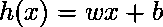
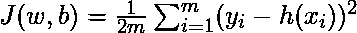

# 使用张量流的线性回归

> 原文:[https://www . geesforgeks . org/线性回归-使用-tensorflow/](https://www.geeksforgeeks.org/linear-regression-using-tensorflow/)

## 先决条件

在使用张量流实现线性回归之前，我们将简要总结一下它。由于我们不会涉及线性回归或张量流的细节，请阅读以下文章了解更多细节:

*   [线性回归(Python 实现)](https://www.geeksforgeeks.org/linear-regression-python-implementation/)
*   [TensorFlow 简介](https://www.geeksforgeeks.org/introduction-to-tensorflow/)
*   [张量流张量介绍](https://www.geeksforgeeks.org/introduction-tensor-tensorflow/)

## 线性回归概述

线性回归是一种非常常见的统计方法，它允许我们从一组给定的连续数据中学习一个函数或关系。比如给我们一些`x`和对应的`y`的数据点，我们需要学习它们之间的关系，这叫做一个**假设**。

在线性回归的情况下，假设是一条直线，即

，其中`w`是一个称为**权重**的向量，`b`是一个称为**偏差**的标量。权重和偏差称为模型的**参数**。

我们所需要做的就是从给定的数据集估计 w 和 b 的值，使得结果假设产生最小成本`J`，该成本由以下**成本函数**

定义，其中`m`是给定数据集中的数据点数量。这个成本函数也被称为**均方误差**。

为了找到`J`最小的参数优化值，我们将使用一种常用的优化算法**梯度下降**。以下是梯度下降的伪代码:

```
Repeat untill Convergence {
    w = w - α * δJ/δw
    b = b - α * δJ/δb
} 
```

，其中`α`是一个**超参数**，称为**学习率**。

## 张量流

Tensorflow 是谷歌制作的开源计算库。这是创建需要高端数值计算和/或需要利用图形处理单元进行计算的应用程序的常用选择。这些是 Tensorflow 成为机器学习应用程序(尤其是深度学习)最受欢迎的选择之一的主要原因。它也有像估计器这样的应用程序接口，在构建机器学习应用程序时提供了高层次的抽象。在本文中，我们将不使用任何高级 API，而是在惰性执行模式下使用低级张量流构建线性回归模型，在惰性执行模式下，张量流创建**有向无环图**或 DAG，跟踪所有计算，然后在**张量流会话**中执行所有计算。

## 履行

我们将从导入必要的库开始。我们将使用 **Numpy** 和张量流进行计算，使用 **Matplotlib** 进行绘图。

## 蟒蛇 3

```
import numpy as np
import tensorflow as tf
import matplotlib.pyplot as plt
```

为了使随机数可预测，我们将为 Numpy 和 Tensorflow 定义固定种子。

## 蟒蛇 3

```
np.random.seed(101)
tf.set_random_seed(101)
```

现在，让我们生成一些随机数据来训练线性回归模型。

## 蟒蛇 3

```
# Generating random linear data
# There will be 50 data points ranging from 0 to 50
x = np.linspace(0, 50, 50)
y = np.linspace(0, 50, 50)

# Adding noise to the random linear data
x += np.random.uniform(-4, 4, 50)
y += np.random.uniform(-4, 4, 50)

n = len(x) # Number of data points
```

让我们将训练数据可视化。

## 蟒蛇 3

```
# Plot of Training Data
plt.scatter(x, y)
plt.xlabel('x')
plt.xlabel('y')
plt.title("Training Data")
plt.show()
```