# ML |使用张量流对象检测 API 训练图像分类器

> 原文:[https://www . geesforgeks . org/ml-训练-图像-分类器-使用-tensorflow-对象-检测-api/](https://www.geeksforgeeks.org/ml-training-image-classifier-using-tensorflow-object-detection-api/)

本文旨在学习如何使用 Tensorflow 的对象检测 API 构建一个对象检测器。

**要求:**

*   Python 编程
*   机器学习基础
*   神经网络基础(非必修)
*   建立一个酷项目的热情(强制性):p

即使你没有前三个要素，也欢迎你来冒险。别担心迷路，我会正确引导你走完旅程的！

**什么是物体检测？**
物体检测是在图像或视频中寻找真实世界物体的实例的过程，例如人脸、建筑物和自行车。对象检测算法通常使用提取的特征和学习算法来识别对象类别的实例。它通常用于图像检索、安全、监控和高级驾驶员辅助系统(自动驾驶汽车)等应用。我个人使用对象检测来构建一个基于图像的搜索引擎的原型。

**什么是 Tensorflow 的对象检测 API？**
Tensorflow 是谷歌大脑创建的开源深度学习框架。张量流的对象检测应用编程接口是一个强大的工具，使每个人都能够创建自己强大的图像分类器。使用张量流的对象检测应用编程接口不需要编码或编程知识。但是要理解它的工作原理，了解 python 编程和机器学习的基础知识会有所帮助。

在开始冒险之前，让我们确保 Python 3 安装在您的系统中

安装 python 和 pip [请参考本网站](https://realpython.com/installing-python/)

首先是最重要的！确保您的系统中安装了下面给出的软件包。这些在你的冒险中是必不可少的。

```py
       pip install protobuf
       pip install pillow
       pip install lxml
       pip install Cython
       pip install jupyter
       pip install matplotlib
       pip install pandas
       pip install opencv-python 
       pip install tensorflow

```

为了开始冒险，我们必须拿到车辆并对其进行必要的配置。
**Tensorflow 的物体检测 API**

1.  我们可以从 github 获得 Tensorflow 的对象检测 API
2.  访问提供的链接:[在此下载](https://github.com/tensorflow/models)

下载模型文件夹后，将其提取到项目目录中。我们可以在里面找到 **object_detection** 目录

```py
 models-master/research/ 
```

*   **创建一个 PYTHONPATH 变量:**
    必须创建一个 PYTHONPATH 变量，该变量指向\模型、\模型\研究和\模型\研究\slim 目录。从任何目录以下列方式发出命令。就我而言，

```py
   set PYTHONPATH=F:\Programming\geeksforgeeks_project\models-master;F:\Programming\geeksforgeeks_project\models-master\research;F:\Programming\geeksforgeeks_project\models-master\research\slim
```

**编译 protobuf 文件并运行 setup.py:**
需要编译 Protobuf 文件，TensorFlow 使用这些文件来配置模型和训练参数。
要编译协议文件，首先需要得到 protobuf 编译器。你可以[在这里](https://github.com/protocolbuffers/protobuf/releases)下载。下载 windows 操作系统的**protocol-3.8-win 64 . zip**文件，其他操作系统下载相关的 zip 文件。将 bin 文件夹提取到研究目录。
复制下面给定的代码，并将其保存为您的研究目录中的 **use_protobuf.py** 。

```py
  import os 
  import sys 
  args = sys.argv 
  directory = args[1] 
  protoc_path = args[2] 
  for file in os.listdir(directory):
     if file.endswith(".proto"):
         os.system(protoc_path+" "+directory+"/"+file+" --python_out=.")
```

转到命令提示符下的研究目录，并使用下面给出的命令。

```py
python use_protobuf.py  .\object_detection\protos\ .\bin\protoc
```

这会编译所有 protobuf 文件，并从\object_detection\protos 文件夹中的每个 name.proto 文件创建一个 name_pb2.py 文件。
最后，从 models-master\research 目录运行以下命令:

```py
  python setup.py build
  python setup.py install
```

安装完成后，将安装一个名为**物体检测**的包。

*   **Testing the API:**
    For testing the Object Detection api, go to object_detection directory and enter the following command:

    ```py
    jupyter notebook object_detection_tutorial.ipynb
    ```

    这将在浏览器中打开 jupyter 笔记本。
    <u>注意:</u>如果你有一行 sys.path.append(..))在笔记本的第一个单元格中，删除那一行。

    运行笔记本的所有单元格，并检查是否得到类似下图的输出:
    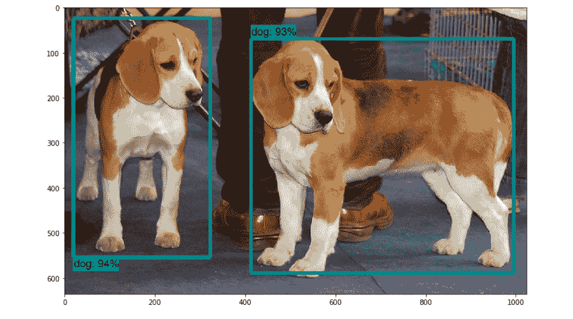
    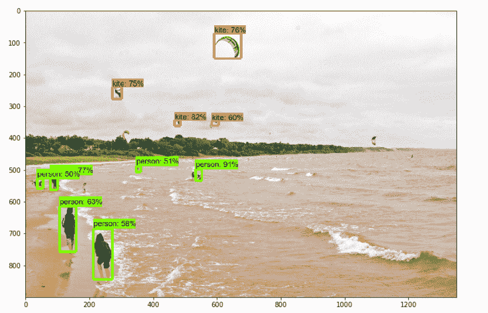

    这样，我们成功地配置了我们的车辆。

    **让我们开始我们的旅程吧！**

    要到达目的地，我们需要通过 6 个检查点:

    1.  准备数据集
    2.  标注数据集
    3.  生成培训记录
    4.  配置培训
    5.  训练模型
    6.  导出推理图

    计划使用分类器检测哪些对象。

    *   **Check Point 1: Preparing Dataset:**

        在这次冒险中，我将构建一个检测鞋子和水瓶的分类器。请记住，数据集是构建分类器中最重要的东西。这将是完成对象检测的分类器的基础。收集尽可能多的不同种类的图像组成的对象。在研究目录中创建一个名为 images 的目录。将 80%的图像存储到**列车**目录中，将 20%的图像存储到图像目录内的**测试**目录中。我在火车目录里收集了 50 张图片，在测试目录里收集了 10 张图片。图像数量越多，分类器的精度就越好。

        列车目录中的图像

        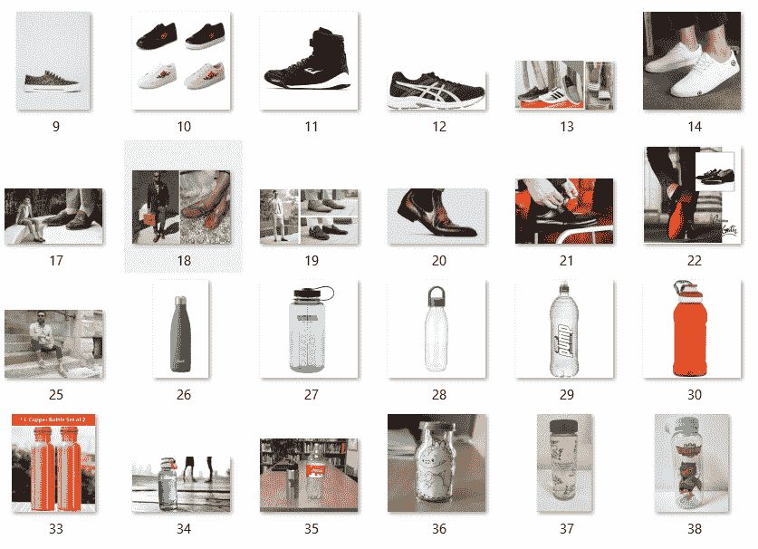

        测试目录中的图像

        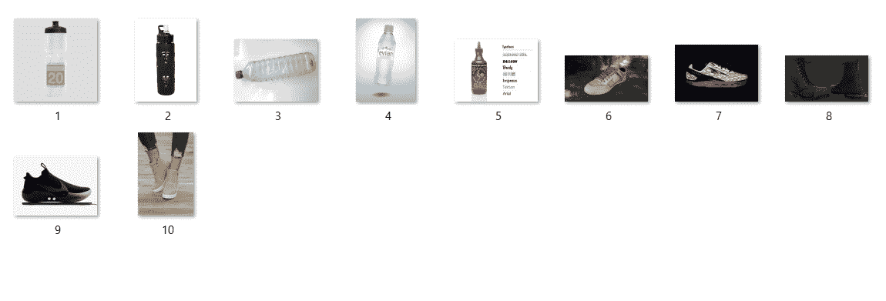

    *   **Check Point 2: Labeling the Dataset:**
        To cross this checkpoint, we need to have a tool called as **labelimg**. You can get it from: [labelimg download](https://tzutalin.github.io/labelImg/)

        打开 labelimg 应用程序，开始在图像上有对象的地方绘制矩形框。并给它们贴上适当的名称，如图所示:
        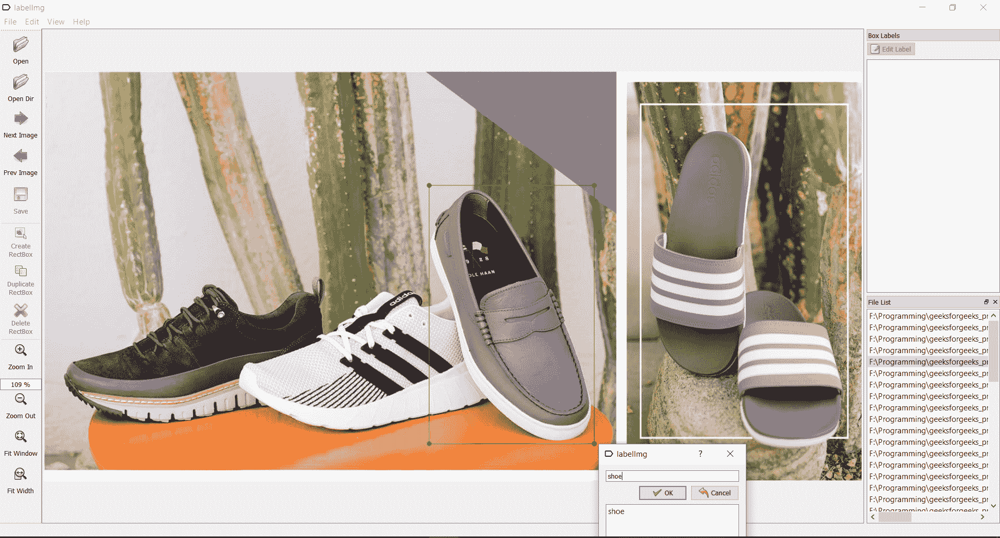
        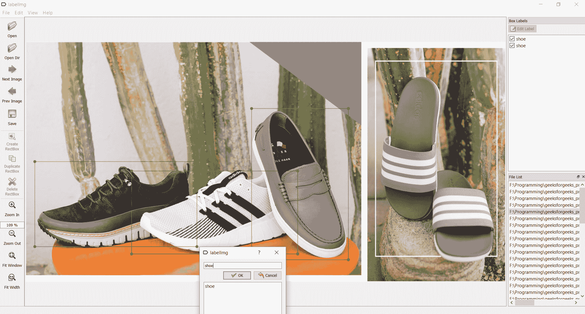

        标记后保存每个图像，这样会生成一个 xml 文件，文件中包含相应图像的名称，如下图所示。
        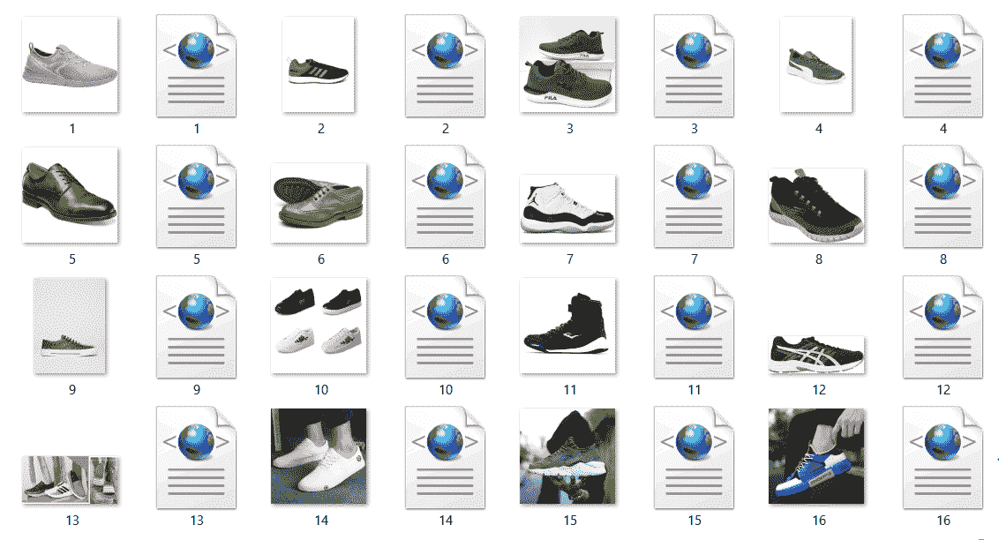

    *   **Check Point 3: Generating Records for Training:**
        To cross this check point, we need to create TFRecords that can be served as input data for training of the object detector. In order to create the TFRecords we will use two scripts from [Dat Tran’s Racoon Detector](https://github.com/datitran/raccoon_dataset). Namely the **xml_to_csv.py** and **generate_tfrecord.py** files. Download them and save them in object_detection folder.

        用以下代码替换 xml_to_csv.py 的 main()方法:

        ```py
        def main():
            for folder in ['train', 'test']:
                image_path = os.path.join(os.getcwd(), ('images/' + folder))
                xml_df = xml_to_csv(image_path)
                xml_df.to_csv(('images/'+folder+'_labels.csv'), index=None)
                print('Successfully converted xml to csv.')
        ```

        此外，如下图所示，在 return 语句之前添加 xml_to_csv()方法中的下面几行代码。

        ```py
        names=[]
            for i in xml_df['filename']:
                names.append(i+'.jpg')
            xml_df['filename']=names
        ```

        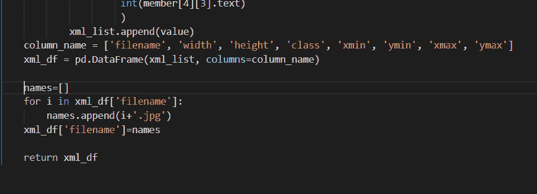
        首先让我们通过在 object_detection 目录下运行 xml_to_csv.py 文件并使用以下命令将所有的 XML 文件转换为 CSV 文件:

        ```py
        python xml_to_csv.py
        ```

        这将在图像文件夹中创建 **test.csv** 和 **train.csv** 文件。

        接下来，在文本编辑器中打开 generate_tfrecord.py 文件，编辑方法 **class_text_to_int()** ，如下图第 30 行所示。

        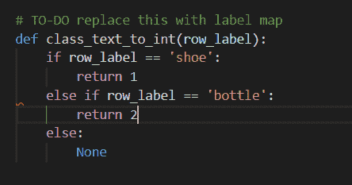

        然后，通过从\object_detection 文件夹发出以下命令来生成 TFRecord 文件:

        ```py
        python generate_tfrecord.py --csv_input=images\train_labels.csv --image_dir=images\train --output_path=train.record
        python generate_tfrecord.py --csv_input=images\test_labels.csv --image_dir=images\test --output_path=test.record
        ```

        这将在 object_detection 目录中创建 test.record 和 train.record 文件。

    *   **Check Point 4: Configuring Training:**

        为了通过这个检查点，我们首先需要创建一个标签地图。

        在 object_detection 目录内新建一个名为**训练**的目录。

        使用文本编辑器创建一个新文件，并将其保存为训练目录中的 **labelmap.pbtxt** 。标签映射通过定义类名到类标识号的映射来告诉培训师每个对象是什么。
        现在，以下面的格式在 labelmap.pbtxt 文件中添加内容，为您的分类器创建一个 labelmap。

        ```py
        item {
          id: 1
          name: 'shoe'
        }

        item {
          id: 2
          name: 'bottle'
        }
        ```

        标签地图标识号应与 **generate_tfrecord.py** 文件中定义的相同。

        现在开始配置训练吧！

        我们需要一个模型，即算法来训练我们的分类器。在这个项目中，我们将使用**fast _ rcnn _ initiation**模型。Tensorflow 的对象检测 API 附带了大量的模型。导航至**物体检测\样本\配置**。
        在这个位置你可以找到很多 API 提供的所有模型的配置文件。您可以使用此链接下载型号[。下载文件**更快 _rcnn_inception_v2_coco** 。下载完成后，将文件夹**fast _ rcnn _ inception _ v2 _ coco _ 2018 _ 01 _ 28**解压到 object_detection 目录。要了解模型](https://github.com/tensorflow/models/blob/master/research/object_detection/g3doc/detection_model_zoo.md)[的工作原理，请参考本文](https://medium.com/@smallfishbigsea/faster-r-cnn-explained-864d4fb7e3f8)。

        由于我们在这个项目中使用的是**fast _ rcnn _ 盗梦空间 _v2_coco** 模型，所以从 object _ detection \ samples \ configs 中复制**fast _ rcnn _ 盗梦空间 _v2_coco.config** 文件，并将其粘贴到之前创建的训练目录中。
        使用文本编辑器打开配置文件，并对文件进行以下更改。
        <u>注意:</u>路径必须用单个正斜杠(不是反斜杠)输入，否则 TensorFlow 在尝试训练模型时会给出文件路径错误！此外，路径必须使用双引号( " )，而不是单引号(')。

        *   **第 10 行:**将 num _ classes 值设置为分类器正在分类的对象数量。在我的例子中，当我对鞋子和瓶子进行分类时，应该是 num _ classes。
        *   **In Line 107:** Give the absolute path of model.ckpt file to the **file_tuning_checkpoint** parameter. model.ckpt file is present in the location object_detection/faster_rcnn_inception_v2_coco_2018_01_28. In my case,

            fine _ tune _ check point:“F:/Programming/geesforgeks _ project/models-master/research/object _ detection/fast _ rcnn _ inception _ v2 _ coco _ 2018 _ 01 _ 28/model . ckpt”

        *   **train_input_reader 区间:**你可以在 120 线找到这个区间。在本节中，将 input_path 参数设置为 train.record 文件。在我这里是
            输入路径:“F:/Programming/geeks forgeeks _ project/models-master/research/object _ detection/train . record”。

        将 label_map_path 参数设置为 labelmap.pbtxt 文件。我的情况是:
        label _ map _ path:“F:/Programming/geeksforgeeks _ project/models-master/research/object _ detection/training/labelmap . pbtxt”

        *   **评估配置部分:**你可以在 128 行找到这个部分。将 num_examples 参数设置为测试目录中存在的图像数量。就我而言，
            num_examples: 10
        *   **eval_input_reader section:** You can find this section in the line 134\. Similar to train_input_reader section, set the paths to test.record and labelmap.pbtxt files. In my case,
            input_path: “F:/Programming/geeksforgeeks_project/models-master/research/object_detection/train.record”

            label _ map _ path:“F:/Programming/geesforgeks _ project/models-master/research/object _ detection/training/label map . pbtxt”

    这样，所有配置都完成了，我们将到达最后一个检查点。

    *   **Check Point 5: Training the Model:**
    Finally the time has come to train our model. You can find a file named **train.py** at the location object_detection/legacy/.

    复制 train.py 文件并将其粘贴到 object_detection 目录中。
    导航到 object_detection 目录，运行以下命令开始训练你的模型！

    ```py
    python train.py --logtostderr --train_dir=training/ --pipeline_config_path=training/faster_rcnn_inception_v2_coco.config

    ```

    在培训开始之前，初始化设置大约需要 1 分钟。训练开始时，看起来像:
    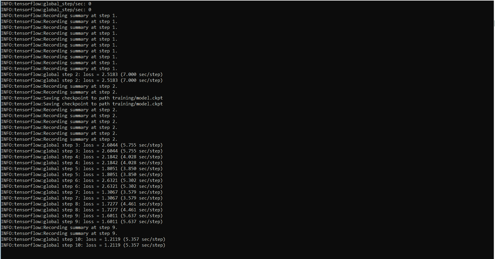

    Tensorflow 每 5 分钟创建一个检查点并存储它。您可以看到所有的检查点都保存在训练目录中。
    
    可以使用 TensorBoard 查看培训作业的进度。为此，请打开一个新的命令提示符并导航到 object_detection 目录，然后发出以下命令:

    ```py
    tensorboard --logdir=training
    ```

    张量板看起来像:
    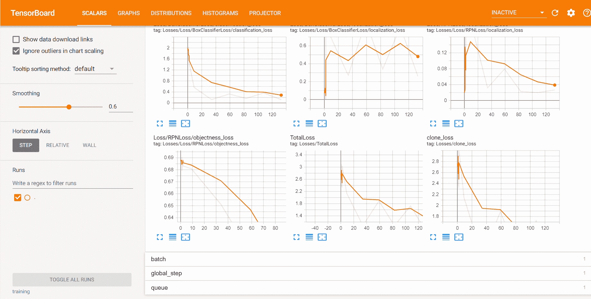

    继续训练过程，直到损失小于或等于 0.1。

    *   **Check Point 6: Exporting Inference Graph:**
    This is the last checkpoint to be crossed to reach the destination.
    Now that we have a trained model we need to generate an inference graph, which can be used to run the model. For doing so we need to first of find out the highest saved step number. For this, we need to navigate to the training directory and look for the model.ckpt file with the biggest index.

    然后，我们可以通过在命令行中键入以下命令来创建推理图。

    ```py
    python export_inference_graph.py --input_type image_tensor --pipeline_config_path training/faster_rcnn_inception_v2_coco.config --trained_checkpoint_prefix training/model.ckpt-XXXX --output_directory inference_graph
    ```

    XXXX 应该由最高的检查站编号来填充。
    这将在\ object _ detection \ explicence _ graph 文件夹中创建一个冻结的 _ explicence _ graph . Pb 文件。那个。pb 文件包含对象检测分类器。

至此，我们已经完成了分类器的构建。完成我们的冒险剩下的就是使用我们的模型来探测物体。

使用以下代码在 object_detection 目录中创建一个 python 文件:

```py
# Write Python3 code here
import os
import cv2
import numpy as np
import tensorflow as tf
import sys

# This is needed since the notebook is stored in the object_detection folder.
sys.path.append("..")

# Import utilites
from utils import label_map_util
from utils import visualization_utils as vis_util

# Name of the directory containing the object detection module we're using
MODEL_NAME = 'inference_graph' # The path to the directory where frozen_inference_graph is stored.
IMAGE_NAME = '11man.jpg'  # The path to the image in which the object has to be detected.

# Grab path to current working directory
CWD_PATH = os.getcwd()

# Path to frozen detection graph .pb file, which contains the model that is used
# for object detection.
PATH_TO_CKPT = os.path.join(CWD_PATH, MODEL_NAME, 'frozen_inference_graph.pb')

# Path to label map file
PATH_TO_LABELS = os.path.join(CWD_PATH, 'training', 'labelmap.pbtxt')

# Path to image
PATH_TO_IMAGE = os.path.join(CWD_PATH, IMAGE_NAME)

# Number of classes the object detector can identify
NUM_CLASSES = 2

# Load the label map.
# Label maps map indices to category names, so that when our convolution
# network predicts `5`, we know that this corresponds to `king`.
# Here we use internal utility functions, but anything that returns a
# dictionary mapping integers to appropriate string labels would be fine
label_map = label_map_util.load_labelmap(PATH_TO_LABELS)
categories = label_map_util.convert_label_map_to_categories(
        label_map, max_num_classes = NUM_CLASSES, use_display_name = True)
category_index = label_map_util.create_category_index(categories)

# Load the Tensorflow model into memory.
detection_graph = tf.Graph()
with detection_graph.as_default():
    od_graph_def = tf.GraphDef()
    with tf.gfile.GFile(PATH_TO_CKPT, 'rb') as fid:
        serialized_graph = fid.read()
        od_graph_def.ParseFromString(serialized_graph)
        tf.import_graph_def(od_graph_def, name ='')

    sess = tf.Session(graph = detection_graph)

# Define input and output tensors (i.e. data) for the object detection classifier

# Input tensor is the image
image_tensor = detection_graph.get_tensor_by_name('image_tensor:0')

# Output tensors are the detection boxes, scores, and classes
# Each box represents a part of the image where a particular object was detected
detection_boxes = detection_graph.get_tensor_by_name('detection_boxes:0')

# Each score represents level of confidence for each of the objects.
# The score is shown on the result image, together with the class label.
detection_scores = detection_graph.get_tensor_by_name('detection_scores:0')
detection_classes = detection_graph.get_tensor_by_name('detection_classes:0')

# Number of objects detected
num_detections = detection_graph.get_tensor_by_name('num_detections:0')

# Load image using OpenCV and
# expand image dimensions to have shape: [1, None, None, 3]
# i.e. a single-column array, where each item in the column has the pixel RGB value
image = cv2.imread(PATH_TO_IMAGE)
image_expanded = np.expand_dims(image, axis = 0)

# Perform the actual detection by running the model with the image as input
(boxes, scores, classes, num) = sess.run(
    [detection_boxes, detection_scores, detection_classes, num_detections],
    feed_dict ={image_tensor: image_expanded})

# Draw the results of the detection (aka 'visualize the results')

vis_util.visualize_boxes_and_labels_on_image_array(
    image,
    np.squeeze(boxes),
    np.squeeze(classes).astype(np.int32),
    np.squeeze(scores),
    category_index,
    use_normalized_coordinates = True,
    line_thickness = 8,
    min_score_thresh = 0.60)

# All the results have been drawn on the image. Now display the image.
cv2.imshow('Object detector', image)

# Press any key to close the image
cv2.waitKey(0)

# Clean up
cv2.destroyAllWindows()
```

给出第 17 行中要检测的对象所在图像的路径。

以下是我的模型的一些结果。

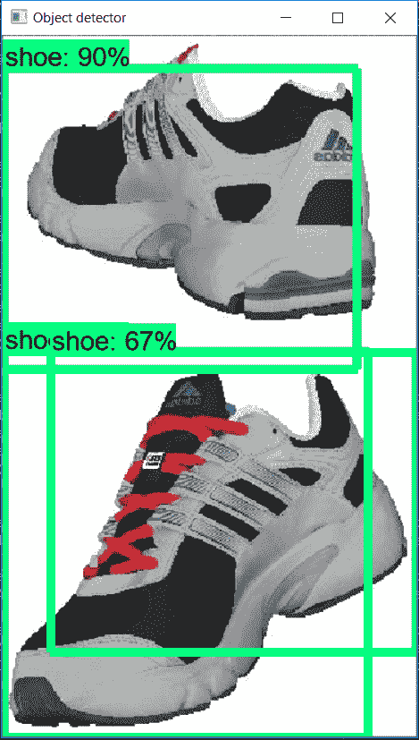
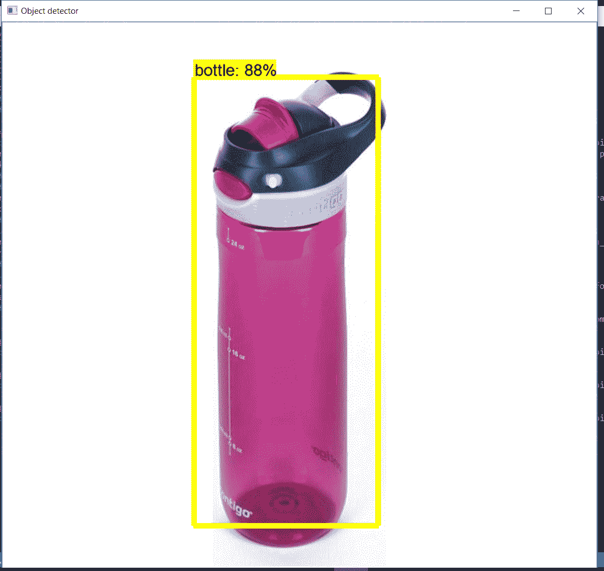

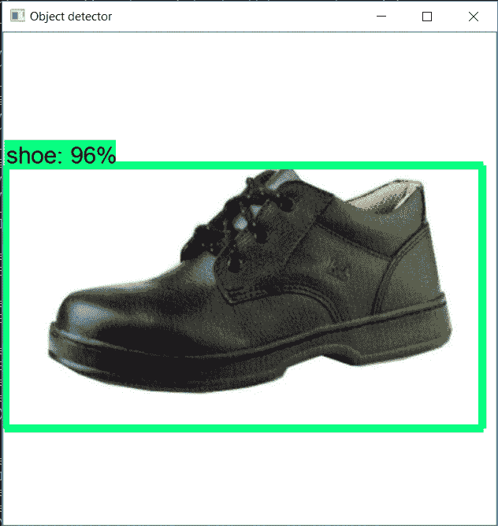
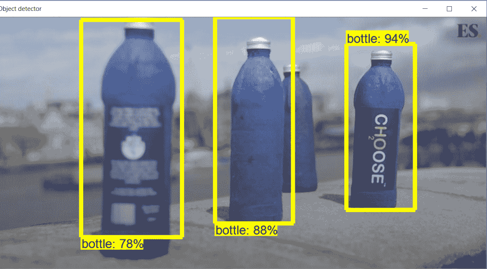

所以我们的模型终于准备好了。该模型还被用于构建基于图像的搜索引擎，该引擎通过检测图像中的对象来使用图像输入进行搜索。