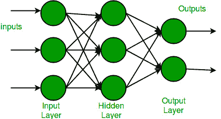
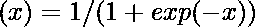

# 张量流中的多层感知器学习

> 原文:[https://www . geesforgeks . org/多层-感知器-tensorflow 中的学习/](https://www.geeksforgeeks.org/multi-layer-perceptron-learning-in-tensorflow/)

在本文中，我们将使用 TensorFlow 库了解多层感知器的概念及其在 Python 中的实现。

## 多层感知器

多层感知也被称为 MLP。它是完全连接的密集层，可以将任何输入维度转换为所需维度。多层感知是具有多层的神经网络。为了创建一个神经网络，我们将神经元组合在一起，使得一些神经元的输出成为其他神经元的输入。

这里可以找到对**神经网络和张量流**的温和介绍:

*   [神经网络](https://www.geeksforgeeks.org/neural-networks-a-beginners-guide/)
*   [TensorFlow 简介](https://www.geeksforgeeks.org/introduction-to-tensorflow/)

多层感知器有一个输入层，对于每个输入，有一个神经元(或节点)，它有一个输出层，每个输出有一个节点，它可以有任意数量的隐藏层，每个隐藏层可以有任意数量的节点。多层感知器(MLP)的示意图如下所示。



在上面的多层感知器图中，我们可以看到有三个输入，因此有三个输入节点，隐藏层有三个节点。输出层给出两个输出，因此有两个输出节点。输入层中的节点接受输入并将其转发以供进一步处理，在上面的图中，输入层中的节点将其输出转发给隐藏层中的三个节点中的每一个，以同样的方式，隐藏层处理信息并将其传递给输出层。

多层感知中的每个节点都使用一个 sigmoid 激活函数。sigmoid 激活函数将实数值作为输入，并使用 sigmoid 公式将其转换为 0 到 1 之间的数字。



现在我们已经完成了多层感知的理论部分，让我们继续使用 **TensorFlow** 库在 **python** 中实现一些代码。

## 逐步实施

**步骤 1:** 导入必要的库。

## 蟒蛇 3

```
# importing modules
import tensorflow as tf
import numpy as np
from tensorflow.keras.models import Sequential
from tensorflow.keras.layers import Flatten
from tensorflow.keras.layers import Dense
from tensorflow.keras.layers import Activation
import matplotlib.pyplot as plt
```