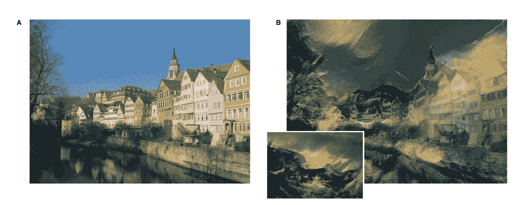
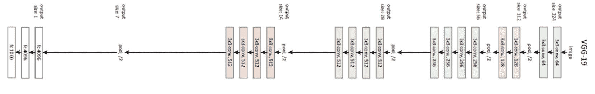
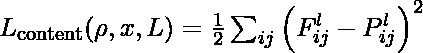
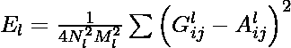
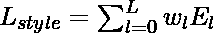
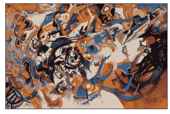
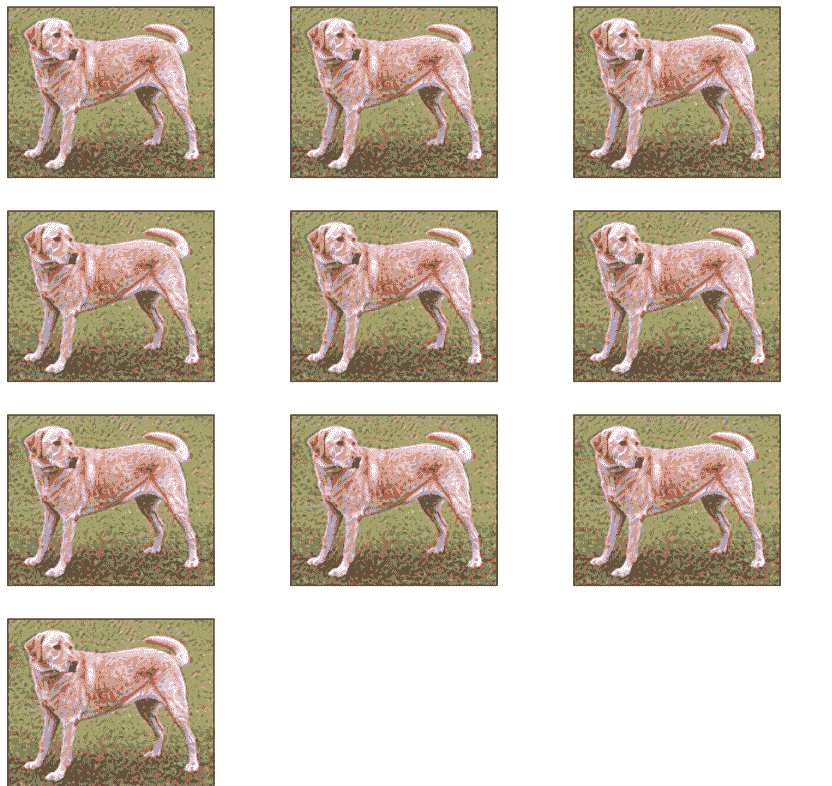
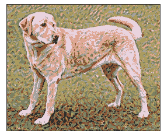

# 用 TensorFlow 进行神经风格转移

> 原文:[https://www . geesforgeks . org/neural-style-transfer-with-tensorflow/](https://www.geeksforgeeks.org/neural-style-transfer-with-tensorflow/)

神经风格转移是一种优化技术，用于拍摄两幅图像，一幅*内容*图像和一幅*风格参考*图像(如著名画家的作品)——并将它们混合在一起，使输出图像看起来像内容图像，但以风格参考图像的风格“绘制”。许多流行的安卓 iOS 应用程序都使用了这种技术，如 *Prisma* 、 *DreamScope* 、 *PicsArt* 。

[](https://media.geeksforgeeks.org/wp-content/uploads/20200820225906/styletransferexample.PNG)

*风格转换 A 的一个例子是* a *内容图像，B 与风格图像一起输出在**左下角*

### **架构**:

神经风格转印纸使用由 VGG-19 网络的中间层生成的特征图来生成输出图像。该体系结构以风格和内容图像为输入，存储由 VGG 网络卷积层提取的特征。

[](https://media.geeksforgeeks.org/wp-content/uploads/20200823113126/vgg19-architecture.png)

VGG-19 体系结构

**含量损失:**

为了计算内容成本，当我们传递生成的图像和原始图像时，我们应用由内容层生成的矩阵之间的均方差。让 *p* 和 *x* 为原始图像和生成的图像，P 和 F 为它们在图层 *l* 中各自的特征表示。然后，我们定义两个特征表示之间的平方误差损失



**风格丧失**:

为了计算样式成本，我们将首先计算 gram 矩阵。gram 矩阵计算包括计算特定图层的矢量化特征图之间的内积。这里 G <sub>ij</sub> (l)表示层 l 的矢量化特征 I、j 之间的内积。

现在为了计算来自特定的损失，我们将找到根据样式图像和生成图像的特征向量计算的 gram 矩阵的均方差。这然后被加权到层加权因子。

设 a 和 x 为原始图像和生成的图像，al 和 Gl 为 l 层中各自的风格表示(克矩阵)，l 层对总损失的贡献为:

因此，总风格损失为:


**全损**

总损失是我们上面定义的风格和内容损失的线性组合:


其中 *α* 和 *β* 分别是内容和风格重构的权重因子。

**张量流中的实现:**

*   首先，我们导入必要的模块。在这篇文章中，我们将 TensorFlow v2 与 Keras 一起使用。我们还将从 tf.keras API 导入 VGG-19 型号。

**代码:**

## 蟒蛇 3

```py
# import numpy, tensorflow and matplotlib
import tensorflow as tf
import numpy as np
import matplotlib.pyplot as plt

# import VGG 19 model and keras Model API
from tensorflow.python.keras.applications.vgg19 import VGG19, preprocess_input
from tensorflow.python.keras.preprocessing.image import load_img, img_to_array
from tensorflow.python.keras.models import Model
```

*   现在，我们导入内容和样式图像，并将它们保存到工作目录中。

**代码:**

## 蟒蛇 3

```py
# Image Credits: Tensorflow Doc
content_path = tf.keras.utils.get_file('content.jpg',
                                       'https://storage.googleapis.com/download.tensorflow.org/example_images/YellowLabradorLooking_new.jpg')
style_path = tf.keras.utils.get_file('style.jpg',
                                     'https://storage.googleapis.com/download.tensorflow.org/example_images/Vassily_Kandinsky%2C_1913_-_Composition_7.jpg')
```

*   现在，我们用 ImageNet 权重初始化 VGG 模型，我们还将移除顶层并使其不可训练。

**代码:**

## 蟒蛇 3

```py
# code
# this function download the VGG model and initiliase it
model = VGG19(
    include_top=False,
    weights='imagenet'
)
# set training to False
model.trainable = False
# Print details of different layers

model.summary()
```

**输出:**

```py
Downloading data from https://storage.googleapis.com/tensorflow/keras-applications/vgg19/vgg19_weights_tf_dim_ordering_tf_kernels_notop.h5
80142336/80134624 [==============================] - 1s 0us/step
Model: "vgg19"
_________________________________________________________________
Layer (type)                 Output Shape              Param #   
=================================================================
input_1 (InputLayer)         [(None, None, None, 3)]   0         
_________________________________________________________________
block1_conv1 (Conv2D)        (None, None, None, 64)    1792      
_________________________________________________________________
block1_conv2 (Conv2D)        (None, None, None, 64)    36928     
_________________________________________________________________
block1_pool (MaxPooling2D)   (None, None, None, 64)    0         
_________________________________________________________________
block2_conv1 (Conv2D)        (None, None, None, 128)   73856     
_________________________________________________________________
block2_conv2 (Conv2D)        (None, None, None, 128)   147584    
_________________________________________________________________
block2_pool (MaxPooling2D)   (None, None, None, 128)   0         
_________________________________________________________________
block3_conv1 (Conv2D)        (None, None, None, 256)   295168    
_________________________________________________________________
block3_conv2 (Conv2D)        (None, None, None, 256)   590080    
_________________________________________________________________
block3_conv3 (Conv2D)        (None, None, None, 256)   590080    
_________________________________________________________________
block3_conv4 (Conv2D)        (None, None, None, 256)   590080    
_________________________________________________________________
block3_pool (MaxPooling2D)   (None, None, None, 256)   0         
_________________________________________________________________
block4_conv1 (Conv2D)        (None, None, None, 512)   1180160   
_________________________________________________________________
block4_conv2 (Conv2D)        (None, None, None, 512)   2359808   
_________________________________________________________________
block4_conv3 (Conv2D)        (None, None, None, 512)   2359808   
_________________________________________________________________
block4_conv4 (Conv2D)        (None, None, None, 512)   2359808   
_________________________________________________________________
block4_pool (MaxPooling2D)   (None, None, None, 512)   0         
_________________________________________________________________
block5_conv1 (Conv2D)        (None, None, None, 512)   2359808   
_________________________________________________________________
block5_conv2 (Conv2D)        (None, None, None, 512)   2359808   
_________________________________________________________________
block5_conv3 (Conv2D)        (None, None, None, 512)   2359808   
_________________________________________________________________
block5_conv4 (Conv2D)        (None, None, None, 512)   2359808   
_________________________________________________________________
block5_pool (MaxPooling2D)   (None, None, None, 512)   0         
=================================================================
Total params: 20,024,384
Trainable params: 0
Non-trainable params: 20,024,384
________________________________________________________________
```

*   现在，我们使用 VGG 19 中的 Keras 预处理输入来加载和处理图像。 *expand_dims* 功能添加一个维度来表示输入中的多个图像。此*预处理 _ 输入*功能(在 VGG 19 中使用)将输入的 RGB 转换为 BGR 图像，并根据 ImageNet 数据(无缩放)将这些值集中在 0 附近。

**代码:**

## 蟒蛇 3

```py
# code to load and process image
def load_and_process_image(image_path):
    img = load_img(image_path)
    # convert image to array
    img = img_to_array(img)
    img = preprocess_input(img)
    img = np.expand_dims(img, axis=0)
    return img
```

*   现在，我们定义*去处理*函数，该函数获取输入图像并执行上面导入的*预处理 _ 输入*函数的逆运算。为了显示未处理的图像，我们还定义了一个显示函数。

**代码:**

## 蟒蛇 3

```py
# code
def deprocess(img):
    # perform the inverse of the pre processing step
    img[:, :, 0] += 103.939
    img[:, :, 1] += 116.779
    img[:, :, 2] += 123.68
    # convert RGB to BGR
    img = img[:, :, ::-1]

    img = np.clip(img, 0, 255).astype('uint8')
    return img

def display_image(image):
    # remove one dimension if image has 4 dimension
    if len(image.shape) == 4:
        img = np.squeeze(image, axis=0)

    img = deprocess(img)

    plt.grid(False)
    plt.xticks([])
    plt.yticks([])
    plt.imshow(img)
    return
```

*   现在，我们使用上面的函数来显示样式和内容图像

**代码:**

## 蟒蛇 3

```py
# load content image
content_img = load_and_process_image(content_path)
display_image(content_img)

# load style image
style_img = load_and_process_image(style_path)
display_image(style_img)
```

**输出:**

[](https://media.geeksforgeeks.org/wp-content/uploads/20200820212333/content.png)

内容图像

[](https://media.geeksforgeeks.org/wp-content/uploads/20200820212335/style.png)

样式图像

*   现在，我们使用 Keras 定义内容和样式模型。模型 API。内容模型以图像为输入，从上述 VGG 模型的*“block 5 _ conv 1”*输出特征图。

**代码:**

## 蟒蛇 3

```py
# define content model
content_layer = 'block5_conv2'
content_model = Model(
    inputs=model.input,
    outputs=model.get_layer(content_layer).output
)
content_model.summary()
```

**输出:**

```py
Model: "functional_9"
_________________________________________________________________
Layer (type)                 Output Shape              Param #   
=================================================================
input_1 (InputLayer)         [(None, None, None, 3)]   0         
_________________________________________________________________
block1_conv1 (Conv2D)        (None, None, None, 64)    1792      
_________________________________________________________________
block1_conv2 (Conv2D)        (None, None, None, 64)    36928     
_________________________________________________________________
block1_pool (MaxPooling2D)   (None, None, None, 64)    0         
_________________________________________________________________
block2_conv1 (Conv2D)        (None, None, None, 128)   73856     
_________________________________________________________________
block2_conv2 (Conv2D)        (None, None, None, 128)   147584    
_________________________________________________________________
block2_pool (MaxPooling2D)   (None, None, None, 128)   0         
_________________________________________________________________
block3_conv1 (Conv2D)        (None, None, None, 256)   295168    
_________________________________________________________________
block3_conv2 (Conv2D)        (None, None, None, 256)   590080    
_________________________________________________________________
block3_conv3 (Conv2D)        (None, None, None, 256)   590080    
_________________________________________________________________
block3_conv4 (Conv2D)        (None, None, None, 256)   590080    
_________________________________________________________________
block3_pool (MaxPooling2D)   (None, None, None, 256)   0         
_________________________________________________________________
block4_conv1 (Conv2D)        (None, None, None, 512)   1180160   
_________________________________________________________________
block4_conv2 (Conv2D)        (None, None, None, 512)   2359808   
_________________________________________________________________
block4_conv3 (Conv2D)        (None, None, None, 512)   2359808   
_________________________________________________________________
block4_conv4 (Conv2D)        (None, None, None, 512)   2359808   
_________________________________________________________________
block4_pool (MaxPooling2D)   (None, None, None, 512)   0         
_________________________________________________________________
block5_conv1 (Conv2D)        (None, None, None, 512)   2359808   
_________________________________________________________________
block5_conv2 (Conv2D)        (None, None, None, 512)   2359808   
=================================================================
Total params: 15,304,768
Trainable params: 0
Non-trainable params: 15,304,768
_________________________________________________________________
```

*   现在，我们使用 Keras 定义内容和样式模型。模型 API。样式模型以图像为输入，从上述 VGG 模型中输出*“区块 1_conv1”、“区块 3 _ con v1”*、*和区块 5 _ con v2”*的特征图。

**代码:**

## 蟒蛇 3

```py
# define style model
style_layers = [
    'block1_conv1',
    'block3_conv1',
    'block5_conv1'
]
style_models = [Model(inputs=model.input,
                      outputs=model.get_layer(layer).output) for layer in style_layers]
```

*   现在，我们定义内容损失函数，它将获取生成图像和真实图像的特征图，并计算它们之间的均方差。

**代码:**

## 蟒蛇 3

```py
# Content loss
def content_loss(content, generated):
    a_C = content_model(content)
    loss = tf.reduce_mean(tf.square(a_C - a_G))
    return loss
```

*   现在，我们定义了 gram 矩阵和风格损失函数。该函数还将真实和生成的图像作为模型的输入，并在计算不同层的风格损失权重之前计算它们的 gram 矩阵。

**代码:**

## 蟒蛇 3

```py
# gram matrix
def gram_matrix(A):
    channels = int(A.shape[-1])
    a = tf.reshape(A, [-1, channels])
    n = tf.shape(a)[0]
    gram = tf.matmul(a, a, transpose_a=True)
    return gram / tf.cast(n, tf.float32)

weight_of_layer = 1\. / len(style_models)

# style loss
def style_cost(style, generated):
    J_style = 0

    for style_model in style_models:
        a_S = style_model(style)
        a_G = style_model(generated)
        GS = gram_matrix(a_S)
        GG = gram_matrix(a_G)
        current_cost = tf.reduce_mean(tf.square(GS - GG))
        J_style += current_cost * weight_of_layer

    return J_style
```

*   现在，我们定义我们的训练函数，我们将训练我们的模型到 50 次迭代。该模型以输入图像、迭代次数为参数。

## 蟒蛇 3

```py
# training function
generated_images = []

def training_loop(content_path, style_path, iterations=50, a=10, b=1000):
    # load content and style images from their respective path
    content = load_and_process_image(content_path)
    style = load_and_process_image(style_path)
    generated = tf.Variable(content, dtype=tf.float32)

    opt = tf.keras.optimizers.Adam(learning_rate=7)

    best_cost = Inf
    best_image = None
    for i in range(iterations):
        % % time
        with tf.GradientTape() as tape:
            J_content = content_cost(content, generated)
            J_style = style_cost(style, generated)
            J_total = a * J_content + b * J_style

        grads = tape.gradient(J_total, generated)
        opt.apply_gradients([(grads, generated)])

        if J_total < best_cost:
            best_cost = J_total
            best_image = generated.numpy()

        print("Iteration :{}".format(i))
        print('Total Loss {:e}.'.format(J_total))
        generated_images.append(generated.numpy())

    return best_image
```

*   现在，我们使用上面定义的训练函数训练我们的模型。

**代码:**

## 蟒蛇 3

```py
# Train the model and get best image
final_img = training(content_path, style_path)
```

**输出:**

```py
CPU times: user 2 µs, sys: 1e+03 ns, total: 3 µs
Wall time: 6.2 µs
Iteration :0
Total Loss 5.133922e+11.
CPU times: user 2 µs, sys: 1e+03 ns, total: 3 µs
Wall time: 5.72 µs
Iteration :1
Total Loss 3.510511e+11.
CPU times: user 2 µs, sys: 1e+03 ns, total: 3 µs
Wall time: 6.68 µs
Iteration :2
Total Loss 2.069992e+11.
CPU times: user 3 µs, sys: 1e+03 ns, total: 4 µs
Wall time: 6.2 µs
Iteration :3
Total Loss 1.669609e+11.
CPU times: user 2 µs, sys: 1e+03 ns, total: 3 µs
Wall time: 6.44 µs
Iteration :4
Total Loss 1.575840e+11.
CPU times: user 2 µs, sys: 1e+03 ns, total: 3 µs
Wall time: 5.96 µs
Iteration :5
Total Loss 1.200623e+11.
CPU times: user 2 µs, sys: 1e+03 ns, total: 3 µs
Wall time: 5.96 µs
Iteration :6
Total Loss 8.824594e+10.
CPU times: user 2 µs, sys: 1e+03 ns, total: 3 µs
Wall time: 5.72 µs
Iteration :7
Total Loss 7.168546e+10.
CPU times: user 2 µs, sys: 1e+03 ns, total: 3 µs
Wall time: 5.48 µs
Iteration :8
Total Loss 6.207320e+10.
CPU times: user 3 µs, sys: 1e+03 ns, total: 4 µs
Wall time: 8.34 µs
Iteration :9
Total Loss 5.390836e+10.
CPU times: user 2 µs, sys: 1e+03 ns, total: 3 µs
Wall time: 6.2 µs
Iteration :10
Total Loss 4.735992e+10.
CPU times: user 2 µs, sys: 1e+03 ns, total: 3 µs
Wall time: 5.96 µs
Iteration :11
Total Loss 4.301782e+10.
CPU times: user 2 µs, sys: 1e+03 ns, total: 3 µs
Wall time: 6.2 µs
Iteration :12
Total Loss 3.912694e+10.
CPU times: user 2 µs, sys: 1e+03 ns, total: 3 µs
Wall time: 6.68 µs
Iteration :13
Total Loss 3.445185e+10.
CPU times: user 0 ns, sys: 3 µs, total: 3 µs
Wall time: 6.2 µs
Iteration :14
Total Loss 2.975165e+10.
CPU times: user 2 µs, sys: 0 ns, total: 2 µs
Wall time: 5.96 µs
Iteration :15
Total Loss 2.590984e+10.
CPU times: user 2 µs, sys: 1e+03 ns, total: 3 µs
Wall time: 20 µs
Iteration :16
Total Loss 2.302116e+10.
CPU times: user 2 µs, sys: 1e+03 ns, total: 3 µs
Wall time: 5.72 µs
Iteration :17
Total Loss 2.082643e+10.
CPU times: user 4 µs, sys: 1e+03 ns, total: 5 µs
Wall time: 8.34 µs
Iteration :18
Total Loss 1.906701e+10.
CPU times: user 2 µs, sys: 1e+03 ns, total: 3 µs
Wall time: 5.25 µs
Iteration :19
Total Loss 1.759801e+10.
CPU times: user 3 µs, sys: 1e+03 ns, total: 4 µs
Wall time: 6.2 µs
Iteration :20
Total Loss 1.635128e+10.
CPU times: user 2 µs, sys: 1e+03 ns, total: 3 µs
Wall time: 6.2 µs
Iteration :21
Total Loss 1.525327e+10.
CPU times: user 3 µs, sys: 1e+03 ns, total: 4 µs
Wall time: 5.96 µs
Iteration :22
Total Loss 1.418364e+10.
CPU times: user 4 µs, sys: 1 µs, total: 5 µs
Wall time: 9.06 µs
Iteration :23
Total Loss 1.306596e+10.
CPU times: user 2 µs, sys: 1e+03 ns, total: 3 µs
Wall time: 5.25 µs
Iteration :24
Total Loss 1.196509e+10.
CPU times: user 2 µs, sys: 1e+03 ns, total: 3 µs
Wall time: 5.96 µs
Iteration :25
Total Loss 1.102290e+10.
CPU times: user 2 µs, sys: 1e+03 ns, total: 3 µs
Wall time: 5.96 µs
Iteration :26
Total Loss 1.025539e+10.
CPU times: user 7 µs, sys: 3 µs, total: 10 µs
Wall time: 12.6 µs
Iteration :27
Total Loss 9.570500e+09.
CPU times: user 2 µs, sys: 1e+03 ns, total: 3 µs
Wall time: 5.72 µs
Iteration :28
Total Loss 8.917115e+09.
CPU times: user 2 µs, sys: 1e+03 ns, total: 3 µs
Wall time: 5.96 µs
Iteration :29
Total Loss 8.328761e+09.
CPU times: user 3 µs, sys: 1e+03 ns, total: 4 µs
Wall time: 9.54 µs
Iteration :30
Total Loss 7.840127e+09.
CPU times: user 2 µs, sys: 1e+03 ns, total: 3 µs
Wall time: 6.44 µs
Iteration :31
Total Loss 7.406647e+09.
CPU times: user 2 µs, sys: 1e+03 ns, total: 3 µs
Wall time: 8.34 µs
Iteration :32
Total Loss 6.967848e+09.
CPU times: user 2 µs, sys: 1e+03 ns, total: 3 µs
Wall time: 5.72 µs
Iteration :33
Total Loss 6.531650e+09.
CPU times: user 2 µs, sys: 1e+03 ns, total: 3 µs
Wall time: 5.72 µs
Iteration :34
Total Loss 6.136975e+09.
CPU times: user 2 µs, sys: 1 µs, total: 3 µs
Wall time: 5.96 µs
Iteration :35
Total Loss 5.788804e+09.
CPU times: user 2 µs, sys: 1e+03 ns, total: 3 µs
Wall time: 5.72 µs
Iteration :36
Total Loss 5.476942e+09.
CPU times: user 2 µs, sys: 1e+03 ns, total: 3 µs
Wall time: 6.2 µs
Iteration :37
Total Loss 5.204070e+09.
CPU times: user 3 µs, sys: 1 µs, total: 4 µs
Wall time: 6.2 µs
Iteration :38
Total Loss 4.954049e+09.
CPU times: user 2 µs, sys: 1e+03 ns, total: 3 µs
Wall time: 5.96 µs
Iteration :39
Total Loss 4.708641e+09.
CPU times: user 3 µs, sys: 2 µs, total: 5 µs
Wall time: 6.2 µs
Iteration :40
Total Loss 4.487677e+09.
CPU times: user 2 µs, sys: 1e+03 ns, total: 3 µs
Wall time: 5.96 µs
Iteration :41
Total Loss 4.296946e+09.
CPU times: user 2 µs, sys: 1e+03 ns, total: 3 µs
Wall time: 5.96 µs
Iteration :42
Total Loss 4.107909e+09.
CPU times: user 3 µs, sys: 1e+03 ns, total: 4 µs
Wall time: 6.44 µs
Iteration :43
Total Loss 3.918156e+09.
CPU times: user 3 µs, sys: 1e+03 ns, total: 4 µs
Wall time: 6.2 µs
Iteration :44
Total Loss 3.747263e+09.
CPU times: user 3 µs, sys: 1e+03 ns, total: 4 µs
Wall time: 8.34 µs
Iteration :45
Total Loss 3.595638e+09.
CPU times: user 2 µs, sys: 1e+03 ns, total: 3 µs
Wall time: 5.72 µs
Iteration :46
Total Loss 3.458928e+09.
CPU times: user 2 µs, sys: 1e+03 ns, total: 3 µs
Wall time: 6.2 µs
Iteration :47
Total Loss 3.331772e+09.
CPU times: user 4 µs, sys: 1e+03 ns, total: 5 µs
Wall time: 9.3 µs
Iteration :48
Total Loss 3.205911e+09.
CPU times: user 3 µs, sys: 1e+03 ns, total: 4 µs
Wall time: 5.96 µs
Iteration :49
Total Loss 3.089630e+09.
```

*   在最后一步，我们绘制最终和中间结果。

**代码:**

## 蟒蛇 3

```py
# code to display best generated image and last 10 intermediate results
plt.figure(figsize=(12, 12))

for i in range(10):
    plt.subplot(4, 3, i + 1)
    display_image(generated_images[i+39])
plt.show()

# plot best result
display_image(final_img)
```

**输出:**

[](https://media.geeksforgeeks.org/wp-content/uploads/20200820150016/l10res.PNG)

最近生成的 10 幅图像

[](https://media.geeksforgeeks.org/wp-content/uploads/20200820224306/bestimage.png)

最佳生成图像

**参考文献:**

*   [神经风格转移张量流教程](https://www.tensorflow.org/tutorials/generative/style_transfer)
*   [风格转印纸](https://www.cv-foundation.org/openaccess/content_cvpr_2016/papers/Gatys_Image_Style_Transfer_CVPR_2016_paper.pdf)