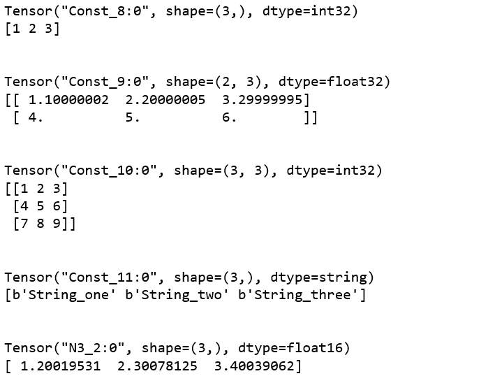
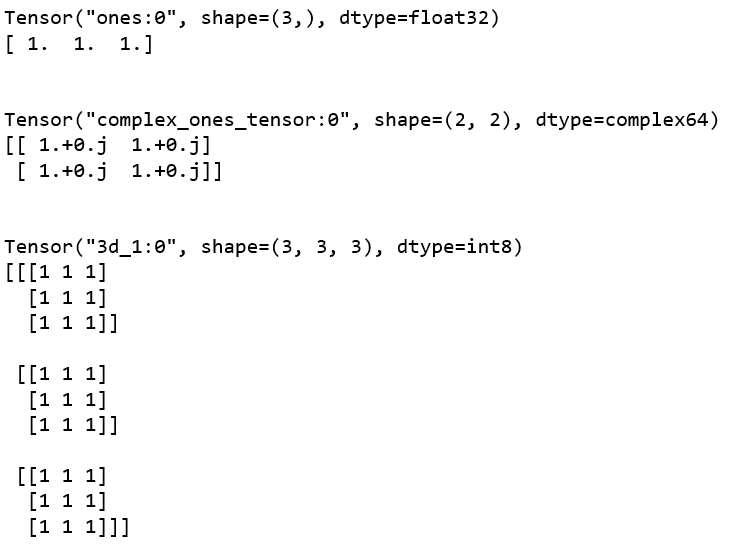
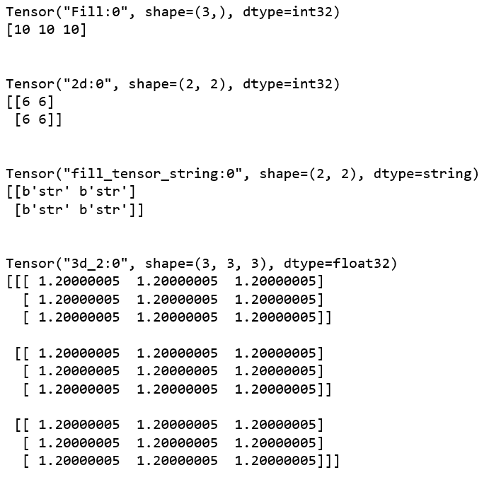
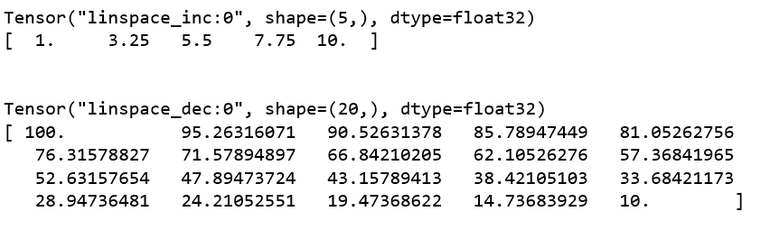
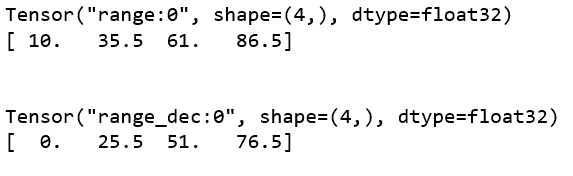

# Python |在张量流中使用不同的函数创建张量

> 原文:[https://www . geesforgeks . org/python-creating-tensors-use-differential-functions-in-tensorflow/](https://www.geeksforgeeks.org/python-creating-tensors-using-different-functions-in-tensorflow/)

Tensorflow 是一个开源的机器学习框架，用于复杂的数值计算。它是由谷歌的谷歌大脑团队开发的。Tensorflow 可以训练和运行深度神经网络，用于开发几个人工智能应用程序。

**什么是张量？**
一个**张量**可以描述为一个 n 维数值数组。张量可以称为广义矩阵。它可以是 0 维矩阵(单个数)、1 维矩阵(向量)、2 维矩阵或任何更高维的结构。张量由三个参数确定，即。等级、形状和大小。张量的维数被称为它的秩。张量的列数和行数被称为它的形状。并且，赋予张量元素的数据类型被称为它的类型。

**张量在张量流中的重要性:**
一个张量可以称为张量流的中心数据类型。这是因为张量是张量流框架内计算的基本组成部分。顾名思义，张量流是一个涉及定义和运行张量计算的框架。

让我们讨论一下在张量流中创建张量的所有不同方法。

**方法#1:** 使用`constant()`函数创建张量。

在张量流中创建张量最流行的函数是`constant()`函数。我们需要给出值或值列表作为创建张量的参数。如果给定的值是整数类型，那么 **int32** 是默认的数据类型。如果给定的值是浮点型的，则`float32`是默认的数据类型。

```
# Program to create tensor
# using the constant() function

import tensorflow as tf

t1 = tf.constant([1, 2, 3])
t2 = tf.constant([[1.1, 2.2, 3.3], [4, 5, 6]])
t3 = tf.constant([[1, 2, 3], [4, 5, 6], [7, 8, 9]])
t4 = tf.constant(["String_one", "String_two", "String_three"])
t5 = tf.constant([1.2, 2.3, 3.4], tf.float16, [3], 'N3', False)

sess = tf.Session()
print(t1)
print(sess.run(t1))
print("\n")

print(t2)
print(sess.run(t2))
print("\n")

print(t3)
print(sess.run(t3))
print("\n")

print(t4)
print(sess.run(t4))
print("\n")

print(t5)
print(sess.run(t5))
```

**输出:**


这里，t1 是一维张量，有三个整数数据类型 int32。t2 是二维张量，它包含数据类型 float32 的浮点值。t3 是一个三维张量，它包含数据类型 int32 的整数值。t4 是具有三个数据类型字符串的一维字符串。在 t5，我们给它取了一个名字“N3”，指定数据类型为“float16”，给 shape 的值为 3。因为 t5 的形状值是 3，所以我们不能在其中传递超过 3 个元素。否则，它将抛出一个错误。

**方法 2:** 使用`zeros()`函数创建张量。

`zeros()`函数用于创建张量，其所有元素为零。张量的`shape`是唯一需要的参数。

```
# Program to create tensor using the zeros() function

import tensorflow as tf

zero_int = tf.zeros([3])
zero_float = tf.zeros([3], tf.int32, 'zero_float')
zero_3d = tf.zeros([3, 3, 3], tf.int8, '3d')

sess = tf.Session()

print(zero_int)
print(sess.run(zero_int))
print("\n")

print(zero_float)
print(sess.run(zero_float))
print("\n")

print(zero_3d)
print(sess.run(zero_3d))
```

**输出:**


**方法#3:** 使用“one()”函数创建张量。

`ones()`函数基本上和`zeros()`函数做同样的事情，但是在这种情况下元素是 1 而不是 0。

```
# Program to create tensor using the ones() function

import tensorflow as tf

one_float = tf.ones([3])
one_complex = tf.ones([2, 2], tf.complex64, 'complex_ones_tensor')
one_3d = tf.ones([3, 3, 3], tf.int8, '3d')

sess = tf.Session()

print(one_float)
print(sess.run(one_float))
print("\n")

print(one_complex)
print(sess.run(one_complex))
print("\n")

print(one_3d)
print(sess.run(one_3d))
```

**输出:**


**方法#4:** 使用`fill()`功能创建张量。

`fill()`函数用于创建张量，张量中的所有元素都具有相同的值。元素的值将作为参数传递，数据类型取决于传递的值。

```
# Program to create tensor using the fill() function

import tensorflow as tf

fill_1d = tf.fill([3], 10)
fill_2d = tf.fill([2, 2], 6, '2d')
fill_string = tf.fill([2, 2], "str", 'fill_tensor_string')
fill_3d = tf.fill([3, 3, 3], 1.2, '3d')

sess = tf.Session()

print(fill_1d)
print(sess.run(fill_1d))
print("\n")

print(fill_2d)
print(sess.run(fill_2d))
print("\n")

print(fill_string)
print(sess.run(fill_string))
print("\n")

print(fill_3d)
print(sess.run(fill_3d))
```

**输出:**


**方法 5:** 使用`linspace()`函数创建张量。

`linspace()`函数用于创建张量，在张量中，我们指定起始值、结束值和元素数量作为自变量，张量的元素根据自变量改变其值。

```
# Program to create tensor using the linspace() function

import tensorflow as tf

linspace_inc = tf.linspace(1.0, 10.0, 5, "linspace_inc")
linspace_dec = tf.linspace(100.0, 10.0, 20, "linspace_dec")

sess = tf.Session()

print(linspace_inc)
print(sess.run(linspace_inc))
print("\n")

print(linspace_dec)
print(sess.run(linspace_dec))
```

**输出:**


**方法 6:** 使用`range()`功能创建张量。

`range()`函数与 linspace()函数几乎相同。唯一不同的是，在 range()函数中，我们指定了一个名为`delta`的值，用来计算张量的连续元素，而不是`linspace()`函数中的元素数量。

```
# Program to create tensor using the range() function

import tensorflow as tf

range_inc = tf.range(10.0, 100.0, delta = 25.5)
range_dec = tf.range(100.0, delta = 25.5, name ="range_dec")

sess = tf.Session()

print(range_inc)
print(sess.run(range_inc))
print("\n")

print(range_dec)
print(sess.run(range_dec))
```

**输出:**
