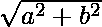
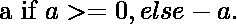
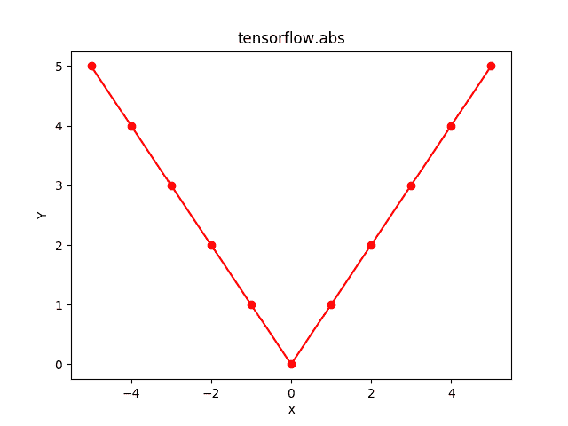

# Python | Tensorflow abs()方法

> 原文:[https://www.geeksforgeeks.org/python-tensorflow-abs-method/](https://www.geeksforgeeks.org/python-tensorflow-abs-method/)

[Tensorflow](https://www.geeksforgeeks.org/introduction-to-tensorflow/) 是谷歌开发的开源机器学习库。其应用之一是开发深度神经网络。
模块 **tensorflow.math** 为许多基本的数学运算提供支持。函数 TF . ABS()[别名 tf.math.abs]为 Tensorflow 中的*绝对*函数提供支持。它期望以复数形式输入或浮点数。输入类型是张量，如果输入包含一个以上的元素，则计算元素的绝对值。
对于复数，绝对值计算为。
对于浮点数，绝对值计算为

> **语法** : tf.abs(x，name=None)或 tf.math.abs(x，name=None)
> **参数**:
> **x**:float 16、float32、float64、int32、int64、complex64 或 complex128 类型的张量或稀疏度。
> **名称**(可选):操作的名称。
> **返回类型**:大小和类型与 x 相同的张量或稀疏度，具有绝对值。对于 complex64 或 complex128 输入，返回的 Tensor 将分别为 float32 或 float64 类型。

**代码#1:对于浮点数**

## 蟒蛇 3

```
# Importing the Tensorflow library
import tensorflow as tf

# A constant vector of size 5
a = tf.constant([-0.5, -0.1, 0, 0.1, 0.5], dtype = tf.float32)

# Applying the abs function and
# storing the result in 'b'
b = tf.abs(a, name ='abs')

# Initiating a Tensorflow session
with tf.Session() as sess:
    print('Input type:', a)
    print('Input:', sess.run(a))
    print('Return type:', b)
    print('Output:', sess.run(b))
```

**输出:**

```
Input type: Tensor("Const:0", shape=(5, ), dtype=float32)
Input : [-0.5 -0.1  0\.   0.1  0.5]
Return Type : Tensor("abs:0", shape=(5, ), dtype=float32)
Output : [0.5 0.1 0\.  0.1 0.5]
```

**代码#2:** 可视化

## 蟒蛇 3

```
# Importing the Tensorflow library
import tensorflow as tf

# Importing the NumPy library
import numpy as np

# Importing the matplotlib.pyplot function
import matplotlib.pyplot as plt

# A vector of size 11 with values from -5 to 5
a = np.linspace(-5, 5, 11)

# Applying the absolute function and
# storing the result in 'b'
b = tf.abs(a, name ='abs')

# Initiating a Tensorflow session
with tf.Session() as sess:
    print('Input:', a)
    print('Output:', sess.run(b))
    plt.plot(a, sess.run(b), color = 'red', marker = "o")
    plt.title("tensorflow.abs")
    plt.xlabel("X")
    plt.ylabel("Y")

    plt.show()
```

**输出:**

```
Input: [-5\. -4\. -3\. -2\. -1\.  0\.  1\.  2\.  3\.  4\.  5.]
Output: [5\. 4\. 3\. 2\. 1\. 0\. 1\. 2\. 3\. 4\. 5.]
```



**代码#3:对于复数**

## 蟒蛇 3

```
# Importing the Tensorflow library
import tensorflow as tf

# A constant vector of size 2
a = tf.constant([[-2.25 + 4.75j], [-3.25 + 5.75j]],
                              dtype = tf.complex64)

# Applying the abs function and
# storing the result in 'b'
b = tf.abs(a, name ='abs')

# Initiating a Tensorflow session
with tf.Session() as sess:
    print('Input type:', a)
    print('Input:', sess.run(a))
    print('Return type:', b)
    print('Output:', sess.run(b))
```

**输出:**

```
Input type: Tensor("Const_1:0", shape=(2, 1), dtype=complex64)
Input : [[-2.25+4.75j] [-3.25+5.75j]]
Return Type : Tensor("abs_1:0", shape=(2, 1), dtype=float32)
Output : [[5.255949 ] [6.6049223]]
```