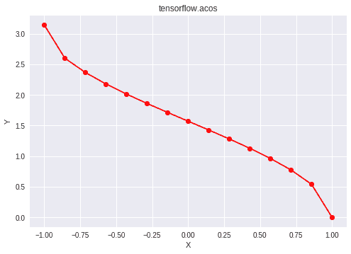

# Python | Tensorflow acos()方法

> 原文:[https://www . geesforgeks . org/python-tensorflow-acos-method/](https://www.geeksforgeeks.org/python-tensorflow-acos-method/)

[Tensorflow](https://www.geeksforgeeks.org/introduction-to-tensorflow/) 是谷歌开发的开源机器学习库。其应用之一是开发深度神经网络。
模块 **tensorflow.math** 为许多基本的数学运算提供支持。函数 TF . acos()[别名 tf.math.acos]为 Tensorflow 中的*反余弦*函数提供支持。它期望输入在[-1，1]范围内，并以弧度形式给出输出。如果输入不在范围[-1，1]内，则返回 *nan* 。输入类型是张量，如果输入包含一个以上的元素，则计算元素方向的反余弦。

> **语法** : tf.acos(x，name=None)或 tf.math.acos(x，name=None)
> **参数** :
> **x** :以下任一类型的张量:bfloat16、half、float32、float64、int32、int64、complex64 或 complex128。
> **名称**(可选):操作的名称。
> **返回类型**:与 x 类型相同的张量。

**代码#1:**

## 蟒蛇 3

```py
# Importing the Tensorflow library
import tensorflow as tf

# A constant vector of size 6
a = tf.constant([1.0, -0.5, 3.4, 0.2, 0.0, -2],
                            dtype = tf.float32)

# Applying the acos function and
# storing the result in 'b'
b = tf.acos(a, name ='acos')

# Initiating a Tensorflow session
with tf.Session() as sess:
    print('Input type:', a)
    print('Input:', sess.run(a))
    print('Return type:', b)
    print('Output:', sess.run(b))
```

**输出:**

```py
Input type: Tensor("Const_7:0", shape=(6, ), dtype=float32)
Input: [ 1\.  -0.5  3.4  0.2  0\.  -2\. ]
Return type: Tensor("acos:0", shape=(6, ), dtype=float32)
Output: [0\.        2.0943952       nan 1.3694384 1.5707964       nan]
```

**代码#2:** 可视化

## 蟒蛇 3

```py
# Importing the Tensorflow library
import tensorflow as tf

# Importing the NumPy library
import numpy as np

# Importing the matplotlib.pyplot function
import matplotlib.pyplot as plt

# A vector of size 15 with values from -1 to 1
a = np.linspace(-1, 1, 15)

# Applying the inverse cosine function and
# storing the result in 'b'
b = tf.acos(a, name ='acos')

# Initiating a Tensorflow session
with tf.Session() as sess:
    print('Input:', a)
    print('Output:', sess.run(b))
    plt.plot(a, sess.run(b), color = 'red', marker = "o")
    plt.title("tensorflow.acos")
    plt.xlabel("X")
    plt.ylabel("Y")

    plt.show()
```

**输出:**

```py
Input: [-1\.         -0.85714286 -0.71428571 -0.57142857 -0.42857143 -0.28571429
 -0.14285714  0\.          0.14285714  0.28571429  0.42857143  0.57142857
  0.71428571  0.85714286  1\.        ]
Output: [3.14159265 2.60049313 2.36639928 2.17904191 2.01370737 1.86054803
 1.7141439  1.57079633 1.42744876 1.28104463 1.12788528 0.96255075
 0.77519337 0.54109953 0\.        ]
```

