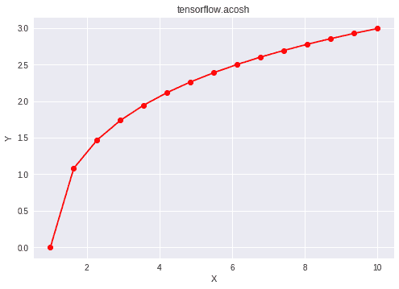

# Python | Tensorflow acosh()方法

> 原文:[https://www . geesforgeks . org/python-tensorflow-acosh-method/](https://www.geeksforgeeks.org/python-tensorflow-acosh-method/)

[Tensorflow](https://www.geeksforgeeks.org/introduction-to-tensorflow/) 是谷歌开发的开源机器学习库。其应用之一是开发深度神经网络。
模块 **tensorflow.math** 为许多基本的数学运算提供支持。函数 TF . acosh()[别名 tf.math.acosh]为 Tensorflow 中的*反双曲余弦*函数提供支持。它期望输入在范围[1，∞)内，对于该范围之外的任何输入，返回 *nan* 。输入类型是张量，如果输入包含一个以上的元素，则按元素计算反双曲余弦。

> **语法** : tf.acosh(x，name=None)或 tf.math.acosh(x，name=None)
> **参数** :
> **x** :以下任一类型的张量:float16、float32、float64、complex64 或 complex128。
> **名称**(可选):操作的名称。
> **返回类型**:与 x 类型相同的张量。

**代码#1:**

## 蟒蛇 3

```py
# Importing the Tensorflow library
import tensorflow as tf

# A constant vector of size 6
a = tf.constant([1.0, 0.5, 3.4, -2.1, 0.0, 6.5],
                             dtype = tf.float32)

# Applying the acosh function and
# storing the result in 'b'
b = tf.acosh(a, name ='acosh')

# Initiating a Tensorflow session
with tf.Session() as sess:
    print('Input type:', a)
    print('Input:', sess.run(a))
    print('Return type:', b)
    print('Output:', sess.run(b))
```

**输出:**

```py
Input type: Tensor("Const:0", shape=(6, ), dtype=float32)
Input: [ 1\.   0.5  3.4 -2.1  0\.   6.5]
Return type: Tensor("acosh:0", shape=(6, ), dtype=float32)
Output: [0\.            nan 1.894559      nan      nan 2.558979]
```

**代码#2:** 可视化

## 蟒蛇 3

```py
# Importing the Tensorflow library
import tensorflow as tf

# Importing the NumPy library
import numpy as np

# Importing the matplotlib.pyplot function
import matplotlib.pyplot as plt

# A vector of size 15 with values from 1 to 10
a = np.linspace(1, 10, 15)

# Applying the inverse hyperbolic cosine
# function and storing the result in 'b'
b = tf.acosh(a, name ='acosh')

# Initiating a Tensorflow session
with tf.Session() as sess:
    print('Input:', a)
    print('Output:', sess.run(b))
    plt.plot(a, sess.run(b), color = 'red', marker = "o")
    plt.title("tensorflow.acosh")
    plt.xlabel("X")
    plt.ylabel("Y")

    plt.show()
```

**输出:**

```py
Input: [ 1\.          1.64285714  2.28571429  2.92857143  3.57142857  4.21428571
  4.85714286  5.5         6.14285714  6.78571429  7.42857143  8.07142857
  8.71428571  9.35714286 10\.        ]
Output: [0\.         1.08055227 1.46812101 1.73714862 1.94591015 2.11724401
 2.26282815 2.38952643 2.50174512 2.60249262 2.69391933 2.77761797
 2.85480239 2.92641956 2.99322285]
```

