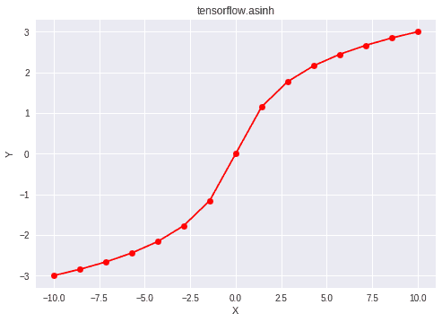

# python | tensorlow asinh()方法

> 原文:[https://www . geesforgeks . org/python-tensorflow-asinh-method/](https://www.geeksforgeeks.org/python-tensorflow-asinh-method/)

[Tensorflow](https://www.geeksforgeeks.org/introduction-to-tensorflow/) 是谷歌开发的开源机器学习库。其应用之一是开发深度神经网络。
模块 **tensorflow.math** 为许多基本的数学运算提供支持。函数 TF . asinh()[别名 tf.math.asinh]为 Tensorflow 中的*反双曲正弦*函数提供支持。输入类型是张量，如果输入包含一个以上的元素，则计算元素反双曲正弦。

> **语法** : tf.asinh(x，name=None)或 tf.math.asinh(x，name=None)
> **参数** :
> **x** :以下任一类型的张量:float16、float32、float64、complex64 或 complex128。
> **名称**(可选):操作的名称。
> **返回类型**:与 x 类型相同的张量。

**代码#1:**

## 蟒蛇 3

```py
# Importing the Tensorflow library
import tensorflow as tf

# A constant vector of size 6
a = tf.constant([1.0, -0.5, 3.4, 22.1, 0.0, -6.5],
                               dtype = tf.float32)

# Applying the asinh function and
# storing the result in 'b'
b = tf.asinh(a, name ='asinh')

# Initiating a Tensorflow session
with tf.Session() as sess:
    print('Input type:', a)
    print('Input:', sess.run(a))
    print('Return type:', b)
    print('Output:', sess.run(b))
```

**输出:**

```py
Input type: Tensor("Const_1:0", shape=(6, ), dtype=float32)
Input: [ 1\.  -0.5  3.4 22.1  0\.  -6.5]
Return type: Tensor("asinh:0", shape=(6, ), dtype=float32)
Output: [ 0.8813736  -0.48121184  1.9378793   3.7892363   0\.         -2.5708146 ]
```

**代码#2:** 可视化

## 蟒蛇 3

```py
# Importing the Tensorflow library
import tensorflow as tf

# Importing the NumPy library
import numpy as np

# Importing the matplotlib.pyplot function
import matplotlib.pyplot as plt

# A vector of size 15 with values from -10 to 10
a = np.linspace(-10, 10, 15)

# Applying the inverse hyperbolic sine
# function and storing the result in 'b'
b = tf.asinh(a, name ='asinh')

# Initiating a Tensorflow session
with tf.Session() as sess:
    print('Input:', a)
    print('Output:', sess.run(b))
    plt.plot(a, sess.run(b), color = 'red', marker = "o")
    plt.title("tensorflow.asinh")
    plt.xlabel("X")
    plt.ylabel("Y")

    plt.show()
```

**输出:**

```py
Input: [-10\.          -8.57142857  -7.14285714  -5.71428571  -4.28571429
  -2.85714286  -1.42857143   0\.           1.42857143   2.85714286
   4.28571429   5.71428571   7.14285714   8.57142857  10\.        ]
Output: [-2.99822295 -2.84496713 -2.66412441 -2.44368627 -2.16177575 -1.77227614
 -1.15447739  0\.          1.15447739  1.77227614  2.16177575  2.44368627
  2.66412441  2.84496713  2.99822295]
```

