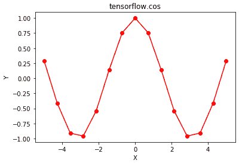

# Python | Tensorflow cos()方法

> 原文:[https://www.geeksforgeeks.org/python-tensorflow-cos-method/](https://www.geeksforgeeks.org/python-tensorflow-cos-method/)

[Tensorflow](https://www.geeksforgeeks.org/introduction-to-tensorflow/) 是谷歌开发的开源机器学习库。其应用之一是开发深度神经网络。
模块 **tensorflow.math** 为许多基本的数学运算提供支持。函数 TF . cos()[别名 tf.math.cos]为 Tensorflow 中的*余弦*函数提供支持。它需要弧度形式的输入，输出在[-1，1]范围内。输入类型是张量，如果输入包含一个以上的元素，则按元素计算余弦。

> **语法** : tf.cos(x，name=None)或 tf.math.cos(x，name=None)
> **参数** :
> **x** :以下任一类型的张量:float16、float32、float64、complex64 或 complex128。
> **名称**(可选):操作的名称。
> **返回类型**:与 x 类型相同的张量。

**代码#1:**

## 蟒蛇 3

```py
# Importing the Tensorflow library
import tensorflow as tf

# A constant vector of size 6
a = tf.constant([1.0, -0.5, 3.4, -2.1, 0.0, -6.5], dtype = tf.float32)

# Applying the sin function and
# storing the result in 'b'
b = tf.cos(a, name ='cos')

# Initiating a Tensorflow session
with tf.Session() as sess:
    print('Input type:', a)
    print('Input:', sess.run(a))
    print('Return type:', b)
    print('Output:', sess.run(b))
```

**输出:**

```py
Input type: Tensor("Const_2:0", shape=(6, ), dtype=float32)
Input: [ 1\.        -0.5        3.4000001 -2.0999999  0\.        -6.5      ]
Return type: Tensor("cos:0", shape=(6, ), dtype=float32)
Output: [ 0.54030228  0.87758255 -0.96679819 -0.50484604  1\.          0.97658765]
```

**代码#2:** 可视化

## 蟒蛇 3

```py
# Importing the Tensorflow library
import tensorflow as tf

# Importing the NumPy library
import numpy as np

# Importing the matplotlib.pyplot function
import matplotlib.pyplot as plt

# A vector of size 15 with values from -5 to 5
a = np.linspace(-5, 5, 15)

# Applying the sigmoid function and
# storing the result in 'b'
b = tf.cos(a, name ='cos')

# Initiating a Tensorflow session
with tf.Session() as sess:
    print('Input:', a)
    print('Output:', sess.run(b))
    plt.plot(a, sess.run(b), color = 'red', marker = "o")
    plt.title("tensorflow.cos")
    plt.xlabel("X")
    plt.ylabel("Y")

    plt.show()
```

**输出:**

```py
Input: [-5\.         -4.28571429 -3.57142857 -2.85714286 -2.14285714 -1.42857143
 -0.71428571  0\.          0.71428571  1.42857143  2.14285714  2.85714286
  3.57142857  4.28571429  5\.        ]
Output: [ 0.28366219 -0.41384591 -0.90903414 -0.9598162  -0.5413659   0.1417459
  0.75556135  1\.          0.75556135  0.1417459  -0.5413659  -0.9598162
 -0.90903414 -0.41384591  0.28366219]
```

