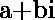
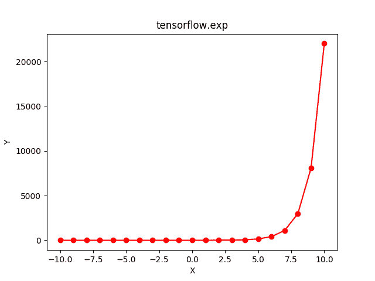

# Python | Tensorflow exp()方法

> 原文:[https://www.geeksforgeeks.org/python-tensorflow-exp-method/](https://www.geeksforgeeks.org/python-tensorflow-exp-method/)

[Tensorflow](https://www.geeksforgeeks.org/introduction-to-tensorflow/) 是谷歌开发的开源机器学习库。其应用之一是开发深度神经网络。
模块 **tensorflow.math** 为许多基本的数学运算提供支持。函数 TF . exp()[别名 tf.math.exp]为 Tensorflow 中的*指数*函数提供支持。它期望以复数形式输入或浮点数。输入类型是张量，如果输入包含一个以上的元素，则计算元素指数值，。

> **语法** : tf.exp(x，name=None)或 tf.math.exp(x，name=None)
> **参数**:
> **x**:bfloat 16、half、float32、float64、complex64 或 complex128 类型的张量。
> **名称**(可选):操作的名称。
> **返回类型**:与 x 相同大小和类型的张量。

**代码#1:**

## 蟒蛇 3

```
# Importing the Tensorflow library
import tensorflow as tf

# A constant vector of size 5
a = tf.constant([-0.5, -0.1, 0, 0.1, 0.5], dtype = tf.float32)

# Applying the exp function and
# storing the result in 'b'
b = tf.exp(a, name ='exp')

# Initiating a Tensorflow session
with tf.Session() as sess:
    print('Input type:', a)
    print('Input:', sess.run(a))
    print('Return type:', b)
    print('Output:', sess.run(b))
```

**输出:**

```
Input type: Tensor("Const:0", shape=(5, ), dtype=float32)
Input: [-0.5 -0.1  0\.   0.1  0.5]
Return type: Tensor("exp:0", shape=(5, ), dtype=float32)
Output: [0.60653067 0.9048374  1\.         1.105171   1.6487212 ]
```

**代码#2:** 可视化

## 蟒蛇 3

```
# Importing the Tensorflow library
import tensorflow as tf

# Importing the NumPy library
import numpy as np

# Importing the matplotlib.pyplot function
import matplotlib.pyplot as plt

# A vector of size 21 with values from -10 to 10
a = np.linspace(-10, 10, 21)

# Applying the exponential function and
# storing the result in 'b'
b = tf.exp(a, name ='exp')

# Initiating a Tensorflow session
with tf.Session() as sess:
    print('Input:', a)
    print('Output:', sess.run(b))
    plt.plot(a, sess.run(b), color = 'red', marker = "o")
    plt.title("tensorflow.abs")
    plt.xlabel("X")
    plt.ylabel("Y")

    plt.show()
```

**输出:**

```
Input: [-10\.  -9\.  -8\.  -7\.  -6\.  -5\.  -4\.  -3\.  -2\.  -1\.   0\.   1\.   2\.   3.
   4\.   5\.   6\.   7\.   8\.   9\.  10.]
Output: [4.53999298e-05 1.23409804e-04 3.35462628e-04 9.11881966e-04
 2.47875218e-03 6.73794700e-03 1.83156389e-02 4.97870684e-02
 1.35335283e-01 3.67879441e-01 1.00000000e+00 2.71828183e+00
 7.38905610e+00 2.00855369e+01 5.45981500e+01 1.48413159e+02
 4.03428793e+02 1.09663316e+03 2.98095799e+03 8.10308393e+03
 2.20264658e+04]
```

