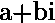
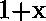
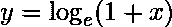
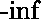
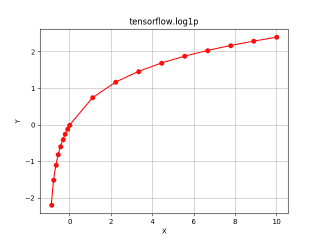

# Python | Tensorflow log1p()方法

> 原文:[https://www . geesforgeks . org/python-tensorflow-log1p-method/](https://www.geeksforgeeks.org/python-tensorflow-log1p-method/)

[Tensorflow](https://www.geeksforgeeks.org/introduction-to-tensorflow/) 是谷歌开发的开源机器学习库。其应用之一是开发深度神经网络。

模块`**tensorflow.math**`为许多基本的数学运算提供支持。功能`tf.log1p()`【别名`tf.math.log1p`】支持张量流中的*自然对数*功能。它期望以复数形式输入或浮点数。输入类型是张量，如果输入包含一个以上的元素，计算的元素对数，。

> **语法** : tf.log1p(x，名称=无)或 tf.math.log1p(x，名称=无)
> 
> **参数**:
> **x**:b float 16 型、半型、float32 型、float64 型、complex64 型或 complex128 型张量。
> **名称**(可选):操作的名称。
> 
> **返回类型**:与 x 大小和类型相同的张量。

**代码#1:**

## 蟒蛇 3

```
# Importing the Tensorflow library
import tensorflow as tf

# A constant vector of size 5
a = tf.constant([-1.5, -1, -0.5, 0, 0.5, 1, 1.5], dtype = tf.float32)

# Applying the log1p function and
# storing the result in 'b'
b = tf.log1p(a, name ='log1p')

# Initiating a Tensorflow session
with tf.Session() as sess:
    print('Input type:', a)
    print('Input:', sess.run(a))
    print('Return type:', b)
    print('Output:', sess.run(b))
```

**输出:**

```
Input type: Tensor("Const:0", shape=(7, ), dtype=float32)
Input: [-1.5 -1\.  -0.5  0\.   0.5  1\.   1.5]
Return type: Tensor("log1p:0", shape=(7, ), dtype=float32)
Output: [        nan        -inf -0.6931472   0\.          0.4054651   0.6931472
  0.91629076]

```

表示对于负值不存在 1+x 的自然对数，表示当输入接近-1 时，它接近负无穷大。

**代码#2:** 可视化

## 蟒蛇 3

```
# Importing the Tensorflow library
import tensorflow as tf

# Importing the NumPy library
import numpy as np

# Importing the matplotlib.pyplot function
import matplotlib.pyplot as plt

# A vector of size 20 with values from -1 to 0 and 0 to 10
a = np.append(np.linspace(-1, 0, 10), np.linspace(0, 10, 10))

# Applying the logarithmic function and
# storing the result in 'b'
b = tf.log1p(a, name ='log1p')

# Initiating a Tensorflow session
with tf.Session() as sess:
    print('Input:', a)
    print('Output:', sess.run(b))
    plt.plot(a, sess.run(b), color = 'red', marker = "o") 
    plt.title("tensorflow.abs") 
    plt.xlabel("X") 
    plt.ylabel("Y") 
    plt.grid()

    plt.show()
```

**输出:**

```
Input: [-1\.         -0.88888889 -0.77777778 -0.66666667 -0.55555556 -0.44444444
 -0.33333333 -0.22222222 -0.11111111  0\.          0\.          1.11111111
  2.22222222  3.33333333  4.44444444  5.55555556  6.66666667  7.77777778
  8.88888889 10\.        ]
Output: [       -inf -2.19722458 -1.5040774  -1.09861229 -0.81093022 -0.58778666
 -0.40546511 -0.25131443 -0.11778304  0\.          0\.          0.7472144
  1.17007125  1.46633707  1.69459572  1.88031287  2.03688193  2.17222328
  2.29141179  2.39789527]

```

