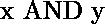

# Python | Tensorflow 逻辑 _and()方法

> 原文:[https://www . geesforgeks . org/python-tensorflow-logic _ and-method/](https://www.geeksforgeeks.org/python-tensorflow-logical_and-method/)

[Tensorflow](https://www.geeksforgeeks.org/introduction-to-tensorflow/) 是谷歌开发的开源机器学习库。其应用之一是开发深度神经网络。

模块`**tensorflow.math**`为许多基本逻辑操作提供支持。功能`tf.logical_and()`【别名`tf.math.logical_and`】为张量流中的*逻辑与*功能提供支持。它需要布尔类型的输入。输入类型是张量，如果张量包含一个以上的元素，则计算元素逻辑与，。

> **语法**:TF . logic _ and(x，y，name =无)或 TF . math . logic _ and(x，y，name =无)
> 
> **参数** :
> **x** :布尔型张量。
> **y** :布尔型张量。
> **名称**(可选):操作的名称。
> 
> **返回型**:与 x 或 y 大小相同的布尔型张量。

**代码:**

```
# Importing the Tensorflow library
import tensorflow as tf

# A constant vector of size 4
a = tf.constant([True, False, True, False], dtype = tf.bool)
b = tf.constant([True, False, False, True], dtype = tf.bool)

# Applying the AND function and
# storing the result in 'c'
c = tf.logical_and(a, b, name ='logical_and')

# Initiating a Tensorflow session
with tf.Session() as sess:
    print('Input type:', a)
    print('Input a:', sess.run(a))
    print('Input b:', sess.run(b))
    print('Return type:', c)
    print('Output:', sess.run(c))
```

**输出:**

```
Input type: Tensor("Const:0", shape=(4, ), dtype=bool)
Input a: [ True False  True False]
Input b: [ True False False  True]
Return type: Tensor("logical_and:0", shape=(4, ), dtype=bool)
Output: [ True False False False]

```