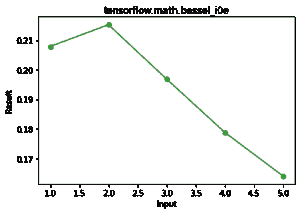

# Python–tensorflow . math . Bessel _ i1e()函数

> 原文:[https://www . geesforgeks . org/python-tensorflow-math-Bessel _ i1e-function/](https://www.geeksforgeeks.org/python-tensorflow-math-bessel_i1e-function/)

TensorFlow 是谷歌设计的开源 python 库，用于开发机器学习模型和深度学习神经网络。贝塞尔 _i1e()是张量流数学模块中的函数。该函数用于寻找元素态指数标度的一阶修正贝塞尔函数。

> **语法:**tensorflow . math . Bessel _ i1e(x，name)
> 
> **论据:**
> 
> *   **x:** 它是一个张量，这个张量允许的数据类型是 bfloat16，half，float32，float64。
> *   **名称:**是一个可选参数，用于给出操作名称。
> 
> **返回:**根据与 x 相同数据类型的 x，返回张量或稀疏张量。

```py
bessel_i1e(x) = exp(-abs(x)) bessel_i1(x)

bessel_i1e(x) is faster and numerically stabler than bessel_i1(x).

```

**例 1:**

## 蟒蛇 3

```py
# importing the library
import tensorflow as tf

# initializing the input
a = tf.constant([1,2,3,4,5], dtype = tf.float64)

# printing the input 
print('a: ',a)

# evaluating the result
r = tf.math.bessel_i1e(a)

# printing the result
print("Result: ",r)
```

**输出:**

```py
a:  tf.Tensor([1\. 2\. 3\. 4\. 5.], shape=(5,), dtype=float64)
Result:  tf.Tensor([0.20791042 0.21526929 0.19682671 0.17875084 0.16397227], shape=(5,), dtype=float64)

```

**示例 2:** 可视化

## 蟒蛇 3

```py
# importing the library
import tensorflow as tf
import matplotlib.pyplot as plt 

# initializing the input
a = tf.constant([1,2,3,4,5], dtype = tf.float64)

# evaluating the result
r = tf.math.bessel_i1e(a)

#plotting the graph
plt.plot(a, r, color = 'green', marker = "o")  
plt.title("tensorflow.math.bessel_i1e")  
plt.xlabel("Input")  
plt.ylabel("Result")  
plt.show() 
```

**输出:**

