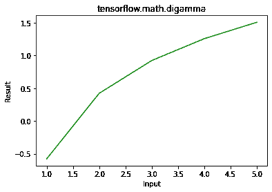

# Python–tensorflow . math . digamma()

> 哎哎哎:# t0]https://www . geeksforgeeks . org/python-tensorlow-math-digamma/

[TensorFlow](https://www.geeksforgeeks.org/introduction-to-tensorflow/) 是谷歌为开发机器学习模型和深度学习神经网络而设计的开源 Python 库。

**digamma()** 用于计算 Lgamma 的元素导数，即γ(x)绝对值的对数。

> **语法:** tensorflow.math.digamma( x，name)
> 
> **参数:**
> 
> *   **x:** 是输入张量。允许的数据类型有 bfloat16、half、float32、float64。
> *   **名称(可选):**定义操作的名称。
> 
> **返回:**返回与 x 相同数据类型的张量。

**例 1:**

## 蟒蛇 3

```py
# importing the library
import tensorflow as tf

# Initializing the input tensor
a = tf.constant([1, 2, 3, 4, 5], dtype = tf.float64)

# Printing the input tensor
print('Input: ', a)

# Calculating digamma
res = tf.math.digamma(x = a)

# Printing the result
print('Result: ', res)
```

**输出:**

```py
Input:  tf.Tensor([1\. 2\. 3\. 4\. 5.], shape=(5, ), dtype=float64)
Result:  tf.Tensor([-0.57721566  0.42278434  0.92278434  1.25611767  1.50611767], shape=(5, ), dtype=float64)
```

**示例 2:** 可视化

## 蟒蛇 3

```py
# importing the library
import tensorflow as tf
import matplotlib.pyplot as plt

# Initializing the input tensor
a = tf.constant([1, 2, 3, 4, 5], dtype = tf.float64)

# Calculating digamma
res = tf.math.digamma(x = a)

# Plotting the graph
plt.plot(a, res, color ='green')
plt.title('tensorflow.math.digamma')
plt.xlabel('Input')
plt.ylabel('Result')
plt.show()
```

**输出:**

