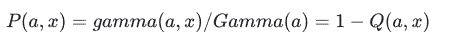
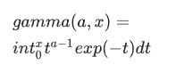

# python–tensorlow . math . igamma()

> 哎哎哎:# t0]https://www . geeksforgeeks . org/python-tensorlow-math-igamma/

TensorFlow 是谷歌设计的开源 Python 库，用于开发机器学习模型和深度学习神经网络。

**igamma()** 用于计算较低的正则化不完全伽马函数 P(a，x)。P(a，x)定义为:



其中γ(a，x)是下不完全γ函数，定义为:



> **语法:**tensorlow . math . igamma(x，y，name)
> 
> **参数:**
> 
> *   **x:** 它是张量。允许的数据类型有 float32、float64。
> *   **y:** 它是与 x 相同数据类型的张量。
> *   **名称(可选):**定义操作的名称
> 
> **返回:**它将数据类型的张量返回为 x。

**例 1:**

## 蟒蛇 3

```
# importing the library
import tensorflow as tf

# Initializing the input tensor
a = tf.constant([7, 8, 13, 11], dtype = tf.float64)
b = tf.constant([2, 8, 14, 5],  dtype = tf.float64)

# Printing the input tensor
print('a: ', a)
print('b: ', b)

# Calculating the result
res = tf.math.igamma(a, b)

# Printing the result
print('Result: ', res)
```

**输出:**

```
a:  tf.Tensor([ 7\.  8\. 13\. 11.], shape=(4, ), dtype=float64)
b:  tf.Tensor([ 2\.  8\. 14\.  5.], shape=(4, ), dtype=float64)
Result:  tf.Tensor([0.00453381 0.54703919 0.64154158 0.01369527], shape=(4, ), dtype=float64)

```

**例 2:**

## 蟒蛇 3

```
# Importing the libraray
import tensorflow as tf

# Initializing the input tensor
a = tf.constant([2, 8, 14, 5], dtype = tf.float32)
b = tf.constant([7, 8, 13, 11],  dtype = tf.float32)

# Printing the input tensor
print('a: ', a)
print('b: ', b)

# Calculating the result
res = tf.math.igamma(a, b)

# Printing the result
print('Result: ', res)
```

**输出:**

```
a:  tf.Tensor([ 2\.  8\. 14\.  5.], shape=(4, ), dtype=float32)
b:  tf.Tensor([ 7\.  8\. 13\. 11.], shape=(4, ), dtype=float32)
Result:  tf.Tensor([0.9927049  0.5470391  0.42695415 0.9848954 ], shape=(4, ), dtype=float32)
```