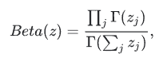
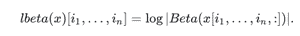
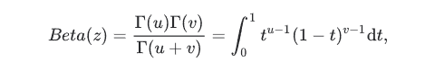

# python–tensorlow . math . belta()

> 哎哎哎:# t0]https://www . geeksforgeeks . org/python-tensorlow-math-belta/

TensorFlow 是谷歌设计的开源 Python 库，用于开发机器学习模型和深度学习神经网络。

**lbeta()** 用于计算 ln(|Beta(x)|)。它沿着最后一个维度减少张量。如果一维 z 是[z1，…，zk]，那么 Beta(z)定义为



如果 x 是 n+1 维张量，形状为[N]<sub>1</sub>，。。。，N <sub>n</sub> ，k】，最后一个维度被视为 z 向量，



如果 z = [u，v]，那么传统的二元贝塔函数定义为



> **语法:**tensorlow . math . belta(x，name)
> 
> **参数:**
> 
> *   **x:** 是秩为 n+1 的输入张量，其中 n > =0。允许的数据类型是浮点型或双精度型。
> *   **名称(可选):**定义操作的名称。
> 
> **返回:**
> 
> 它返回|Beta(x)|沿最后一个维度减少的对数。

**例 1:**

## 蟒蛇 3

```
# Importing the library
import tensorflow as tf

# Initializing the input tensor
a = tf.constant([[7, 8], [13, 11]], dtype = tf.float64)

# Printing the input tensor
print('a: ', a)

# Calculating the result
res = tf.math.lbeta(x = a)

# Printing the result
print('Result: ', res)
```

**输出:**

```
a:  tf.Tensor(
[[ 7\.  8.]
 [13\. 11.]], shape=(2, 2), dtype=float64)
Result:  tf.Tensor([-10.08680861 -16.5150485 ], shape=(2, ), dtype=float64)
```

**例 2:**

## 蟒蛇 3

```
# Importing the library
import tensorflow as tf

# Initializing the input tensor
a = tf.constant([7, 8, 13, 11], dtype = tf.float64)

# Printing the input tensor
print('a: ', a)

# Calculating the result
res = tf.math.lbeta(x = a)

# Printing the result
print('Result: ', res)
```

**输出:**

```
a:  tf.Tensor([ 7\.  8\. 13\. 11.], shape=(4, ), dtype=float64)
Result:  tf.Tensor(-52.77215897270088, shape=(), dtype=float64)
```