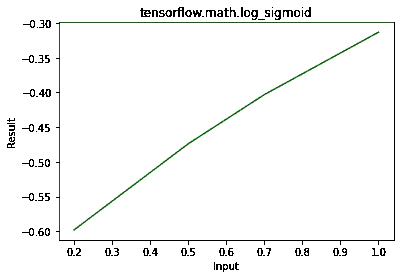

# Python–tensorflow . math . log _ sigmoid()

> 原文:[https://www . geesforgeks . org/python-tensorflow-math-log _ sigmoid/](https://www.geeksforgeeks.org/python-tensorflow-math-log_sigmoid/)

[TensorFlow](https://www.geeksforgeeks.org/introduction-to-tensorflow/) 是谷歌为开发机器学习模型和深度学习神经网络而设计的开源 python 库。 **log_sigmoid()** 用来求 x 的元素态 log sigmoid，具体来说，y = log(1 / (1 + exp(-x))。

> **语法:** tf.math.log_sigmoid(x，name)
> 
> **参数:**
> 
> *   **x:** 是输入张量。这个张量允许的数据类型是 float32，float64。
> *   **名称(可选):**定义操作的名称。
> 
> **返回:**
> 返回一个与 x 相同数据类型的张量

**例 1:**

## 蟒蛇 3

```
# Importing the library
import tensorflow as tf

# Initializing the input tensor
a = tf.constant([.2, .5, .7, 1], dtype = tf.float64)

# Printing the input tensor
print('Input: ', a)

# Calculating result
res = tf.math.log_sigmoid(x = a)

# Printing the result
print('Result: ', res)
```

**输出:**

```
Input:  tf.Tensor([0.2 0.5 0.7 1\. ], shape=(4, ), dtype=float64)
Result:  tf.Tensor([-0.59813887 -0.47407698 -0.40318605 -0.31326169], shape=(4, ), dtype=float64)

```

**示例 2:** 可视化

## 蟒蛇 3

```
# importing the library
import tensorflow as tf
import matplotlib.pyplot as plt

# Initializing the input tensor
a = tf.constant([.2, .5, .7, 1], dtype = tf.float64)

# Calculating result
res = tf.math.log_sigmoid(x = a)

# Plotting the graph
plt.plot(a, res, color = 'green')
plt.title('tensorflow.math.log_sigmoid')
plt.xlabel('Input')
plt.ylabel('Result')
plt.show()
```

**输出:**

