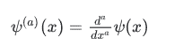

# python–tensorlow . math . poly gamma()

> 哎哎哎:# t0]https://www . geeksforgeeks . org/python-tensorlow-math-poly gamma/

TensorFlow 是谷歌设计的开源 Python 库，用于开发机器学习模型和深度学习神经网络。

**多配偶()**用于计算多配偶函数。多配偶功能定义为:



此函数仅针对非负整数阶定义，即 a 的值应为非负。

> **语法:**tensorflow . math . polyma(a，x，name)
> 
> **参数:**
> 
> *   **a:** 它是非负值的张量。允许的 DTY 是 float32、float64。
> *   **x:** 它是一个与 a 相同数据类型的张量。
> *   **名称(可选):**定义操作的名称。
> 
> **返回:**
> 
> 它返回与 a 相同数据类型的张量。

**例 1:**

## 蟒蛇 3

```
# importing the library
import tensorflow as tf

# Initializing the input tensor
a = tf.constant([1, 2, 3], dtype = tf.float64)
x = tf.constant([7, 9, 13], dtype = tf.float64)

# Printing the input tensor
print('a: ', a)
print('x: ', x)

# Calculating result
res = tf.math.polygamma(a, x)

# Printing the result
print('Result: ', res)
```

**输出:**

```
a:  tf.Tensor([1\. 2\. 3.], shape=(3, ), dtype=float64)
x:  tf.Tensor([ 7\.  9\. 13.], shape=(3, ), dtype=float64)
Result:  tf.Tensor([ 0.15354518 -0.01379332  0.00102074], shape=(3, ), dtype=float64)

```

**例 2:** 对于负值，返回的输出为 nan。

## 蟒蛇 3

```
# importing the library
import tensorflow as tf

# Initializing the input tensor
a = tf.constant([-1, 2, 3], dtype = tf.float64)
x = tf.constant([7, 9, 13], dtype = tf.float64)

# Printing the input tensor
print('a: ', a)
print('x: ', x)

# Calculating Result
res = tf.math.polygamma(a, x)

# Printing the result
print('Result: ', res)
```

**输出:**

```
a:  tf.Tensor([-1\.  2\.  3.], shape=(3, ), dtype=float64)
x:  tf.Tensor([ 7\.  9\. 13.], shape=(3, ), dtype=float64)
Result:  tf.Tensor([        nan -0.01379332  0.00102074], shape=(3, ), dtype=float64)

```