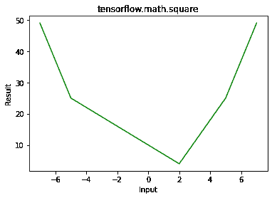

# Python–tensorflow . math . square()

> 哎哎哎:# t0]https://www . geeksforgeeks . org/python-tensorlow-math-square/

TensorFlow 是谷歌设计的开源 Python 库，用于开发机器学习模型和深度学习神经网络。

**square()** 用于计算 x 的元素方，即 x*x。

> **语法:** tensorflow.math.square(x，name)
> 
> **参数:**
> 
> *   **x:** 是张量。允许的数据类型有 bfloat16、half、float32、float64、complex64、complex128。
> *   **名称(可选):**定义操作的名称。
> 
> **返回:**返回张量。

**例 1:**

## 蟒蛇 3

```
# importing the library
import tensorflow as tf

# Initializing the input tensor
a = tf.constant([ -5, -7, 2, 5, 7], dtype = tf.float64)

# Printing the input tensor
print('a: ', a)

# Calculating result
res = tf.math.square(a)

# Printing the result
print('Result: ', res)
```

**输出:**

```
a:  tf.Tensor([-5\. -7\.  2\.  5\.  7.], shape=(5, ), dtype=float64)
Result:  tf.Tensor([25\. 49\.  4\. 25\. 49.], shape=(5, ), dtype=float64)

```

**示例 2:** 可视化

## 蟒蛇 3

```
# import tensorflow as tf
import matplotlib.pyplot as plt

# Initializing the input tensor
a = tf.constant([ -7, -5, 2, 5, 7], dtype = tf.float64)

# Calculating tangent
res = tf.math.square(a)

# Plotting the graph
plt.plot(a, res, color ='green')
plt.title('tensorflow.math.square')
plt.xlabel('Input')
plt.ylabel('Result')
plt.show()
```

**输出:**

