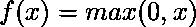

# python | tensorlow nn . rel()和 nn . Leakey _ rel()

> 哎哎哎:# t0]https://www . geeksforgeeks . org/python-tensorlow-nn-relu 和-nn-leaky _ rel/

[Tensorflow](https://www.geeksforgeeks.org/introduction-to-tensorflow/) 是谷歌开发的开源机器学习库。其应用之一是开发深度神经网络。模块`**tensorflow.nn**`为许多基本的神经网络操作提供支持。

激活函数是应用于神经网络层输出的函数，然后作为输入传递给下一层。激活函数是神经网络的重要组成部分，因为它们提供非线性，没有非线性，神经网络就简化为逻辑回归模型。最广泛使用的激活函数是整流线性单元。ReLU 定义为。由于以下原因，ReLU 在最近成为一种流行的选择:

*   **计算速度更快**:ReLU 是一个高度简化的函数，很容易计算。
*   **更少的消失梯度**:在机器学习中，参数的更新与误差函数相对于该参数的偏导数成正比。如果梯度变得非常小，更新将不会有效，网络可能会停止训练。ReLU 在正方向上不饱和，而其他激活函数如 sigmoid 和双曲正切在两个方向上都饱和。因此，它具有更少的消失梯度，导致更好的训练。

功能`nn.relu()`为张量流中的 ReLU 提供支持。

> **语法** : tf.nn.relu(特征，名称=无)
> 
> **参数** :
> **特征**:以下任一类型的张量:float32、float64、int32、uint8、int16、int8、int64、bfloat16、uint16、half、uint32、uint64。
> **名称**(可选):操作的名称。
> 
> **返回类型**:与特征类型相同的张量。

```
# Importing the Tensorflow library
import tensorflow as tf

# A constant vector of size 6
a = tf.constant([1.0, -0.5, 3.4, -2.1, 0.0, -6.5], dtype = tf.float32)

# Applying the ReLu function and
# storing the result in 'b'
b = tf.nn.relu(a, name ='ReLU')

# Initiating a Tensorflow session
with tf.Session() as sess:
    print('Input type:', a)
    print('Input:', sess.run(a))
    print('Return type:', b)
    print('Output:', sess.run(b))
```

**输出:**

```
Input type: Tensor("Const_10:0", shape=(6, ), dtype=float32)
Input: [ 1\.        -0.5        3.4000001 -2.0999999  0\.        -6.5      ]
Return type: Tensor("ReLU_9:0", shape=(6, ), dtype=float32)
Output: [ 1\.         0\.         3.4000001  0\.         0\.         0\.       ]

```

**泄漏的 ReLU:**
ReLu 函数存在所谓的“垂死的 ReLu”问题。由于负端 ReLU 函数的斜率为零，因此粘在负端的神经元不太可能从中恢复。这导致神经元每次输入都输出零，从而使其无用。这个问题的一个解决方案是使用漏 ReLU，它在负侧有一个小的斜率。

**`nn.leaky_relu()`** 功能为张量流中的 ReLU 提供支持。

> **语法** : tf.nn.leaky_relu(特征，alpha，名称=无)
> 
> **参数** :
> **特征**:以下任一类型的张量:float32、float64、int32、uint8、int16、int8、int64、bfloat16、uint16、half、uint32、uint64。
> **α**:函数的斜率为 x < 0。默认值为 0.2。
> **名称**(可选):操作的名称。
> 
> **返回类型**:与特征类型相同的张量。

```
# Importing the Tensorflow library
import tensorflow as tf 

# A constant vector of size 6
a = tf.constant([1.0, -0.5, 3.4, -2.1, 0.0, -6.5], dtype=tf.float32)

# Applying the Leaky ReLu function with
# slope 0.01 and storing the result in 'b'
b = tf.nn.leaky_relu(a, alpha=0.01, name='Leaky_ReLU')

# Initiating a Tensorflow session
with tf.Session() as sess: 
    print('Input type:', a)
    print('Input:', sess.run(a))
    print('Return type:', b)
    print('Output:', sess.run(b))
```

**输出:**

```
Input type: Tensor("Const_2:0", shape=(6,), dtype=float32)
Input: [ 1\.        -0.5        3.4000001 -2.0999999  0\.        -6.5      ]
Return type: Tensor("Leaky_ReLU_1/Maximum:0", shape=(6,), dtype=float32)
Output: [ 1\.        -0.005      3.4000001 -0.021      0\.        -0.065    ]

```