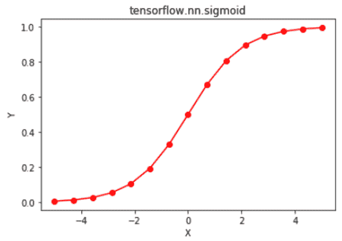

# Python | Tensorflow nn . sigmoid()

> 哎哎哎:# t0]https://www . geeksforgeeks . org/python-tensorlow-nn-sigmoid/

[Tensorflow](https://www.geeksforgeeks.org/introduction-to-tensorflow/) 是谷歌开发的开源机器学习库。其应用之一是开发深度神经网络。
模块 **tensorflow.nn** 为许多基本的神经网络操作提供支持。
众多激活功能之一是乙状结肠功能，定义为。
Sigmoid 函数的输出在(0，1)的范围内，这使得它非常适合二进制分类问题，我们需要找到数据属于特定类别的概率。sigmoid 函数在每个点都是可微的，其导数为。由于表达式包含 sigmoid 函数，因此可以重用它的值来加快反向传播。
Sigmoid 函数存在“消失梯度”的问题，因为它在两端变平，导致反向传播过程中权重变化非常小。这会使神经网络拒绝学习，陷入困境。由于这个原因，sigmoid 函数的使用正在被其他非线性函数取代，例如整流线性单元(ReLU)。
函数 TF . nn . sigmoid()[别名 tf.sigmoid]为 Tensorflow 中的 sigmoid 函数提供支持。

> **语法** : tf.nn.sigmoid(x，name=None)或 tf.sigmoid(x，name=None)
> **参数** :
> **x** :以下任一类型的张量:float16、float32、float64、complex64 或 complex128。
> **名称**(可选):操作的名称。
> **返回类型**:与 x 类型相同的张量。

**代码#1:**

## 蟒蛇 3

```py
# Importing the Tensorflow library
import tensorflow as tf

# A constant vector of size 6
a = tf.constant([1.0, -0.5, 3.4, -2.1, 0.0, -6.5], dtype = tf.float32)

# Applying the sigmoid function and
# storing the result in 'b'
b = tf.nn.sigmoid(a, name ='sigmoid')

# Initiating a Tensorflow session
with tf.Session() as sess:
    print('Input type:', a)
    print('Input:', sess.run(a))
    print('Return type:', b)
    print('Output:', sess.run(b))
```

**输出:**

```py
Input type: Tensor("Const_1:0", shape=(6, ), dtype=float32)
Input: [ 1\.        -0.5        3.4000001 -2.0999999  0\.        -6.5      ]
Return type: Tensor("sigmoid:0", shape=(6, ), dtype=float32)
Output: [ 0.7310586   0.37754068  0.96770459  0.10909683  0.5         0.00150118]
```

**代码#2:** 可视化

## 蟒蛇 3

```py
# Importing the Tensorflow library
import tensorflow as tf

# Importing the NumPy library
import numpy as np

# Importing the matplotlib.pyplot function
import matplotlib.pyplot as plt

# A vector of size 15 with values from -5 to 5
a = np.linspace(-5, 5, 15)

# Applying the sigmoid function and
# storing the result in 'b'
b = tf.nn.sigmoid(a, name ='sigmoid')

# Initiating a Tensorflow session
with tf.Session() as sess:
    print('Input:', a)
    print('Output:', sess.run(b))
    plt.plot(a, sess.run(b), color = 'red', marker = "o")
    plt.title("tensorflow.nn.sigmoid")
    plt.xlabel("X")
    plt.ylabel("Y")

    plt.show()
```

**输出:**

```py
Input: Input: [-5\.         -4.28571429 -3.57142857 -2.85714286 -2.14285714 -1.42857143
 -0.71428571  0\.          0.71428571  1.42857143  2.14285714  2.85714286
  3.57142857  4.28571429  5\.        ]
Output: [ 0.00669285  0.01357692  0.02734679  0.05431327  0.10500059  0.19332137
  0.32865255  0.5         0.67134745  0.80667863  0.89499941  0.94568673
  0.97265321  0.98642308  0.99330715]
```

