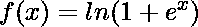
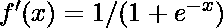
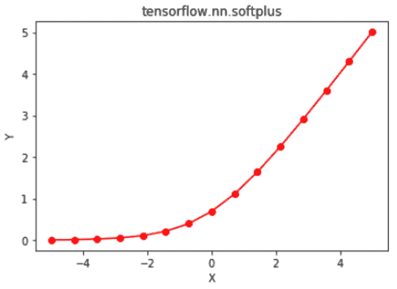

# python | tensorlow nn . soft plus()

> 哎哎哎:# t0]https://www . geeksforgeeks . org/python-tensorlow-nn-soft plus/

[Tensorflow](https://www.geeksforgeeks.org/introduction-to-tensorflow/) 是谷歌开发的开源机器学习库。其应用之一是开发深度神经网络。
模块 **tensorflow.nn** 为许多基本的神经网络操作提供支持。
激活函数是应用于神经网络层输出的函数，然后作为输入传递给下一层。激活函数是神经网络的重要组成部分，因为它们提供非线性，没有非线性，神经网络就简化为逻辑回归模型。众多激活功能之一是定义为的 Softplus 功能。
传统的激活函数如 sigmoid 和双曲正切都有上下限，而 softplus 函数输出在(0，∞)范围内。softplus 函数的导数出来是，这是 sigmoid 函数。软加函数与整流线性单元(ReLU)函数非常相似，主要区别在于软加函数在 x = 0 时的可微性。郑等(2015)的研究论文《利用 softplus 单元改进深度神经网络》指出，softplus 比 ReLU 函数为深度神经网络提供了更多的稳定性和性能。然而，ReLU 通常是优选的，因为它及其导数易于计算。激活函数及其导数的计算是神经网络中的常见操作，与 softplus 函数相比，ReLU 提供了更快的前向和后向传播。
函数 nn . softplus()[别名 math.softplus]为 Tensorflow 中的 soft plus 提供支持。

> **语法** : tf.nn.softplus(features，name=None)或 tf.math.softplus(features，name=None)
> **参数** :
> **特征**:以下任一类型的张量:float32、float64、int32、uint8、int16、int8、int64、bfloat16、uint16、half、uint32、uint64。
> **名称**(可选):操作的名称。
> **返回类型**:与特征类型相同的张量。

**代码#1:**

## 蟒蛇 3

```py
# Importing the Tensorflow library
import tensorflow as tf

# A constant vector of size 6
a = tf.constant([1.0, -0.5, 3.4, -2.1, 0.0, -6.5], dtype = tf.float32)

# Applying the softplus function and
# storing the result in 'b'
b = tf.nn.softplus(a, name ='softplus')

# Initiating a Tensorflow session
with tf.Session() as sess:
    print('Input type:', a)
    print('Input:', sess.run(a))
    print('Return type:', b)
    print('Output:', sess.run(b))
```

**输出:**

```py
Input type: Tensor("Const:0", shape=(6, ), dtype=float32)
Input: [ 1\.        -0.5        3.4000001 -2.0999999  0\.        -6.5      ]
Return type: Tensor("softplus:0", shape=(6, ), dtype=float32)
Output: [  1.31326163e+00   4.74076986e-01   3.43282866e+00   1.15519524e-01
   6.93147182e-01   1.50233845e-03]
```

**代码#2:** 可视化

## 蟒蛇 3

```py
# Importing the Tensorflow library
import tensorflow as tf

# Importing the NumPy library
import numpy as np

# Importing the matplotlib.pyplot function
import matplotlib.pyplot as plt

# A vector of size 15 with values from -5 to 5
a = np.linspace(-5, 5, 15)

# Applying the softplus function and
# storing the result in 'b'
b = tf.nn.softplus(a, name ='softplus')

# Initiating a Tensorflow session
with tf.Session() as sess:
    print('Input:', a)
    print('Output:', sess.run(b))
    plt.plot(a, sess.run(b), color = 'red', marker = "o")
    plt.title("tensorflow.nn.softplus")
    plt.xlabel("X")
    plt.ylabel("Y")

    plt.show()
```

**输出:**

```py
Input: [-5\.         -4.28571429 -3.57142857 -2.85714286 -2.14285714 -1.42857143
 -0.71428571  0\.          0.71428571  1.42857143  2.14285714  2.85714286
  3.57142857  4.28571429  5\.        ]
Output: [ 0.00671535  0.01366993  0.02772767  0.05584391  0.11093221  0.21482992
  0.39846846  0.69314718  1.11275418  1.64340135  2.25378936  2.91298677
  3.59915624  4.29938421  5.00671535]
```

