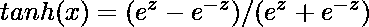
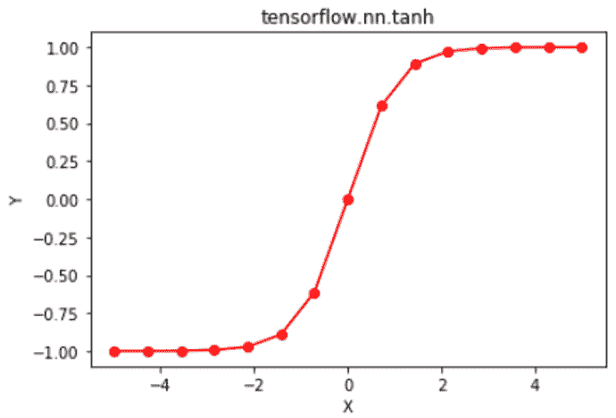

# Python | Tensorflow nn . tanh()

> 哎哎哎:# t0]https://www . geeksforgeeks . org/python-tensorlow-nn-tanh/

[Tensorflow](https://www.geeksforgeeks.org/introduction-to-tensorflow/) 是谷歌开发的开源机器学习库。其应用之一是开发深度神经网络。
模块 **tensorflow.nn** 为许多基本的神经网络操作提供支持。
众多激活函数之一是双曲正切函数(也称为 tanh)，定义为。
双曲正切函数在(-1，1)范围内输出，因此将强负输入映射为负值。与 sigmoid 函数不同，只有接近零的值被映射到接近零的输出，这在一定程度上解决了“消失梯度”问题。双曲正切函数在每个点都是可微的，其导数为。由于表达式包含 tanh 函数，因此可以重用它的值来加快反向传播。
尽管与 sigmoid 函数相比，网络被“卡住”的几率较低，但双曲正切函数仍然存在“消失梯度”的问题。整流线性单元可以用来克服这个问题。
函数 TF . nn . tanh()[别名 tf.tanh]为 Tensorflow 中的双曲正切函数提供支持。

> **语法** : tf.nn.tanh(x，name=None)或 tf.tanh(x，name=None)
> **参数:**
> **x** :以下任一类型的张量:float16、float32、double、complex64 或 complex128。
> **名称**(可选):操作的名称。
> **返回**:与 x 类型相同的张量。

**代码#1:**

## 蟒蛇 3

```py
# Importing the Tensorflow library
import tensorflow as tf

# A constant vector of size 6
a = tf.constant([1.0, -0.5, 3.4, -2.1, 0.0, -6.5], dtype = tf.float32)

# Applying the tanh function and
# storing the result in 'b'
b = tf.nn.tanh(a, name ='tanh')

# Initiating a Tensorflow session
with tf.Session() as sess:
    print('Input type:', a)
    print('Input:', sess.run(a))
    print('Return type:', b)
    print('Output:', sess.run(b))
```

**输出:**

```py
Input type: Tensor("Const_2:0", shape=(6, ), dtype=float32)
Input: [ 1\.        -0.5        3.4000001 -2.0999999  0\.        -6.5      ]
Return type: Tensor("tanh_2:0", shape=(6, ), dtype=float32)
Output: [ 0.76159418 -0.46211717  0.9977749  -0.97045201  0\.         -0.99999547]
```

**代码#2:** 可视化

## 蟒蛇 3

```py
# Importing the Tensorflow library
import tensorflow as tf

# Importing the NumPy library
import numpy as np

# Importing the matplotlib.pyplot function
import matplotlib.pyplot as plt

# A vector of size 15 with values from -5 to 5
a = np.linspace(-5, 5, 15)

# Applying the tanh function and
# storing the result in 'b'
b = tf.nn.tanh(a, name ='tanh')

# Initiating a Tensorflow session
with tf.Session() as sess:
    print('Input:', a)
    print('Output:', sess.run(b))
    plt.plot(a, sess.run(b), color = 'red', marker = "o")
    plt.title("tensorflow.nn.tanh")
    plt.xlabel("X")
    plt.ylabel("Y")

    plt.show()
```

**输出:**

```py
Input: [-5\.         -4.28571429 -3.57142857 -2.85714286 -2.14285714 -1.42857143
 -0.71428571  0\.          0.71428571  1.42857143  2.14285714  2.85714286
  3.57142857  4.28571429  5\.        ]
Output: [-0.9999092  -0.99962119 -0.99842027 -0.99342468 -0.97284617 -0.89137347
 -0.61335726  0\.          0.61335726  0.89137347  0.97284617  0.99342468
  0.99842027  0.99962119  0.9999092 ]
```

