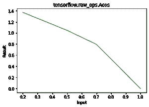

# python–tensorlow . raw _ ops。Acos()

> 哎哎哎:# t0]https://www . geeksforgeeks . org/python-tensorlow-raw _ ops-acos/

[TensorFlow](https://www.geeksforgeeks.org/introduction-to-tensorflow/) 是谷歌为开发机器学习模型和深度学习神经网络而设计的开源 python 库。TensorFlow raw_ops 提供对所有 TensorFlow 操作的低级访问。Acos()用于寻找 x 的元素式 acos。

> **语法:** tf.raw_ops。助理文书主任(x，姓名)
> 
> **论据:**
> 
> *   **x:** 是输入张量。这个张量允许的数据类型是 bfloat16，half，float32，float64。
> *   **名称(可选):**定义操作的名称。
> 
> **返回:**
> 返回一个与 x 相同数据类型的张量

**注意:**只接受关键字参数。

**例 1:**

## 蟒蛇 3

```py
# Importing the library
import tensorflow as tf

# Initializing the input tensor
a = tf.constant([.2, .5, .7, 1], dtype=tf.float64)

# Printing the input tensor
print('Input: ', a)

# Calculating Acos
res = tf.raw_ops.Acos(x=a)

# Printing the result
print('Result: ', res)
```

**输出:**

```py
Input:  tf.Tensor([0.2 0.5 0.7 1\. ], shape=(4,), dtype=float64)
Result:  tf.Tensor([1.36943841 1.04719755 0.79539883 0\.        ], shape=(4,), dtype=float64)

```

**示例 2:** 可视化

## 蟒蛇 3

```py
# importing the library
import tensorflow as tf
import matplotlib.pyplot as plt

# Initializing the input tensor
a = tf.constant([.2, .5, .7, 1], dtype=tf.float64)

# Calculating Acos
res = tf.raw_ops.Acos(x=a)

# Plotting the graph
plt.plot(a, res, color='green')
plt.title('tensorflow.raw_ops.Acos')
plt.xlabel('Input')
plt.ylabel('Result')
plt.show()
```

**输出:**

