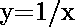
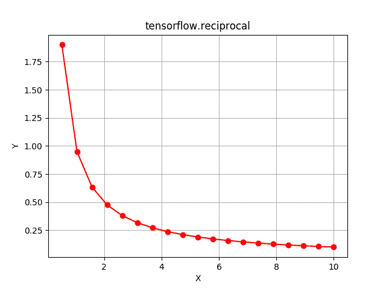

# Python | Tensorflow 倒数()方法

> 原文:[https://www . geesforgeks . org/python-tensorflow-倒数-method/](https://www.geeksforgeeks.org/python-tensorflow-reciprocal-method/)

[Tensorflow](https://www.geeksforgeeks.org/introduction-to-tensorflow/) 是谷歌开发的开源机器学习库。其应用之一是开发深度神经网络。
模块 **tensorflow.math** 为许多基本的数学运算提供支持。函数 tf .倒数()[别名 tf.math .倒数]支持计算 Tensorflow 中输入的*倒数*。它期望以复数形式输入，浮点数和整数。输入类型是张量，如果输入包含一个以上的元素，则计算元素方向的倒数，。

> **语法** : tf .倒数(x，name=None)或 tf.math .倒数(x，name=None)
> **参数**:
> **x**:bfloat 16、half、float32、float64、int32、int64、complex64 或 complex128 类型的张量。
> **名称**(可选):操作的名称。
> **返回类型**:与 x 相同大小和类型的张量。

**代码#1:**

## 蟒蛇 3

```
# Importing the Tensorflow library
import tensorflow as tf

# A constant vector of size 6
a = tf.constant([-0.5, -0.1, 0, 0.1, 0.5, 2], dtype = tf.float32)

# Applying the reciprocal function and
# storing the result in 'b'
b = tf.reciprocal(a, name ='reciprocal')

# Initiating a Tensorflow session
with tf.Session() as sess:
    print('Input type:', a)
    print('Input:', sess.run(a))
    print('Return type:', b)
    print('Output:', sess.run(b))
```

**输出:**

```
Input type: Tensor("Const:0", shape=(6, ), dtype=float32)
Input: [-0.5 -0.1  0\.   0.1  0.5  2\. ]
Return type: Tensor("reciprocal:0", shape=(6, ), dtype=float32)
Output: [ -2\.  -10\.    inf  10\.    2\.    0.5]
```

表示当输入趋近于零时，倒数趋近于无穷大。
T3】代码#2: 可视化

## 蟒蛇 3

```
# Importing the Tensorflow library
import tensorflow as tf

# Importing the NumPy library
import numpy as np

# Importing the matplotlib.pyplot function
import matplotlib.pyplot as plt

# Two vector each of size 20 with values from 0 to 10
a = np.linspace(0, 10, 20)

# Applying the reciprocal function and
# storing the result in 'b'
b = tf.reciprocal(a, name ='reciprocal')

# Initiating a Tensorflow session
with tf.Session() as sess:
    print('Input:', a)
    print('Output:', sess.run(b))
    plt.plot(a, sess.run(b), color = 'red', marker ='o')
    plt.title("tensorflow.reciprocal")
    plt.xlabel("X")
    plt.ylabel("Y")
    plt.grid()

    plt.show()
```

**输出:**

```
Input: [ 0\.          0.52631579  1.05263158  1.57894737  2.10526316  2.63157895
  3.15789474  3.68421053  4.21052632  4.73684211  5.26315789  5.78947368
  6.31578947  6.84210526  7.36842105  7.89473684  8.42105263  8.94736842
  9.47368421 10\.        ]
Output: [       inf 1.9        0.95       0.63333333 0.475      0.38
 0.31666667 0.27142857 0.2375     0.21111111 0.19       0.17272727
 0.15833333 0.14615385 0.13571429 0.12666667 0.11875    0.11176471
 0.10555556 0.1       ]
```

