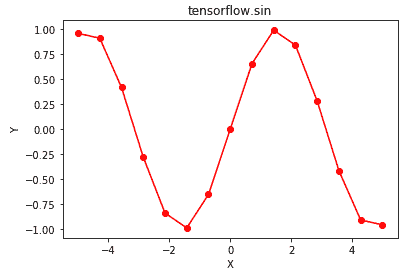

# Python | Tensorflow sin()方法

> 原文:[https://www.geeksforgeeks.org/python-tensorflow-sin-method/](https://www.geeksforgeeks.org/python-tensorflow-sin-method/)

[Tensorflow](https://www.geeksforgeeks.org/introduction-to-tensorflow/) 是谷歌开发的开源机器学习库。其应用之一是开发深度神经网络。
模块 **tensorflow.math** 为许多基本的数学运算提供支持。函数 TF . sin()[别名 tf.math.sin]为 Tensorflow 中的*正弦*函数提供支持。它需要弧度形式的输入，输出在[-1，1]范围内。输入类型是张量，如果输入包含一个以上的元素，则计算元素式正弦。

> **语法** : tf.sin(x，name=None)或 tf.math.sin(x，name=None)
> **参数** :
> **x** :以下任一类型的张量:float16、float32、float64、complex64 或 complex128。
> **名称**(可选):操作的名称。
> **返回类型**:与 x 类型相同的张量。

**代码#1:**

## 蟒蛇 3

```
# Importing the Tensorflow library
import tensorflow as tf

# A constant vector of size 6
a = tf.constant([1.0, -0.5, 3.4, -2.1, 0.0, -6.5], dtype = tf.float32)

# Applying the sin function and
# storing the result in 'b'
b = tf.sin(a, name ='sin')

# Initiating a Tensorflow session
with tf.Session() as sess:
    print('Input type:', a)
    print('Input:', sess.run(a))
    print('Return type:', b)
    print('Output:', sess.run(b))
```

**输出:**

```
Input type: Tensor("Const_1:0", shape=(6, ), dtype=float32)
Input: [ 1\.        -0.5        3.4000001 -2.0999999  0\.        -6.5      ]
Return type: Tensor("sin_0:0", shape=(6, ), dtype=float32)
Output: [ 0.84147096 -0.47942555 -0.25554121 -0.86320943  0\.         -0.21511999]
```

**代码#2:** 可视化

## 蟒蛇 3

```
# Importing the Tensorflow library
import tensorflow as tf

# Importing the NumPy library
import numpy as np

# Importing the matplotlib.pyplot function
import matplotlib.pyplot as plt

# A vector of size 15 with values from -5 to 5
a = np.linspace(-5, 5, 15)

# Applying the sigmoid function and
# storing the result in 'b'
b = tf.sin(a, name ='sin')

# Initiating a Tensorflow session
with tf.Session() as sess:
    print('Input:', a)
    print('Output:', sess.run(b))
    plt.plot(a, sess.run(b), color = 'red', marker = "o")
    plt.title("tensorflow.sin")
    plt.xlabel("X")
    plt.ylabel("Y")

    plt.show()
```

**输出:**

```
Input: [-5\.         -4.28571429 -3.57142857 -2.85714286 -2.14285714 -1.42857143
 -0.71428571  0\.          0.71428571  1.42857143  2.14285714  2.85714286
  3.57142857  4.28571429  5\.        ]
Output: [ 0.95892427  0.91034694  0.41672165 -0.2806294  -0.84078711 -0.98990308
 -0.6550779   0\.          0.6550779   0.98990308  0.84078711  0.2806294
 -0.41672165 -0.91034694 -0.95892427]
```

