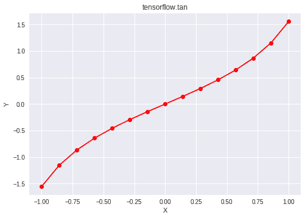

# Python | Tensorflow tan()方法

> 原文:[https://www.geeksforgeeks.org/python-tensorflow-tan-method/](https://www.geeksforgeeks.org/python-tensorflow-tan-method/)

[Tensorflow](https://www.geeksforgeeks.org/introduction-to-tensorflow/) 是谷歌开发的开源机器学习库。其应用之一是开发深度神经网络。
模块 **tensorflow.math** 为许多基本的数学运算提供支持。函数 TF . tan()[别名 tf.math.tan]为 Tensorflow 中的*正切*函数提供支持。它需要弧度形式的输入。输入类型是张量，如果输入包含多个元素，则计算元素方向的切线。

> **语法** : tf.tan(x，name=None)或 tf.math.tan(x，name=None)
> **参数** :
> **x** :以下任一类型的张量:float16、float32、float64、complex64 或 complex128。
> **名称**(可选):操作的名称。
> **返回类型**:与 x 类型相同的张量。

**代码#1:**

## 蟒蛇 3

```
# Importing the Tensorflow library
import tensorflow as tf

# A constant vector of size 6
a = tf.constant([1.0, -0.5, 3.4, -2.1, 0.0, -6.5],
                               dtype = tf.float32)

# Applying the tan function and
# storing the result in 'b'
b = tf.tan(a, name ='tan')

# Initiating a Tensorflow session
with tf.Session() as sess:
    print('Input type:', a)
    print('Input:', sess.run(a))
    print('Return type:', b)
    print('Output:', sess.run(b))
```

**输出:**

```
Input type: Tensor("Const:0", shape=(6, ), dtype=float32)
Input: [ 1\.  -0.5  3.4 -2.1  0\.  -6.5]
Return type: Tensor("tan:0", shape=(6, ), dtype=float32)
Output: [ 1.5574077 -0.5463025  0.264317   1.7098469  0\.        -0.2202772]
```

**代码#2:** 可视化

## 蟒蛇 3

```
# Importing the Tensorflow library
import tensorflow as tf

# Importing the NumPy library
import numpy as np

# Importing the matplotlib.pyplot function
import matplotlib.pyplot as plt

# A vector of size 15 with values from -1 to 1
a = np.linspace(-1, 1, 15)

# Applying the tangent function and
# storing the result in 'b'
b = tf.tan(a, name ='tan')

# Initiating a Tensorflow session
with tf.Session() as sess:
    print('Input:', a)
    print('Output:', sess.run(b))
    plt.plot(a, sess.run(b), color = 'red', marker = "o")
    plt.title("tensorflow.tan")
    plt.xlabel("X")
    plt.ylabel("Y")

    plt.show()
```

**输出:**

```
Input: [-1\.         -0.85714286 -0.71428571 -0.57142857 -0.42857143 -0.28571429
 -0.14285714  0\.          0.14285714  0.28571429  0.42857143  0.57142857
  0.71428571  0.85714286  1\.        ]
Output: [-1.55740772 -1.15486601 -0.86700822 -0.64298589 -0.45689311 -0.29375136
 -0.14383696  0\.          0.14383696  0.29375136  0.45689311  0.64298589
  0.86700822  1.15486601  1.55740772]
```

