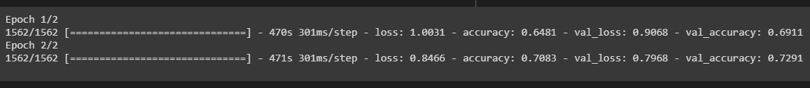
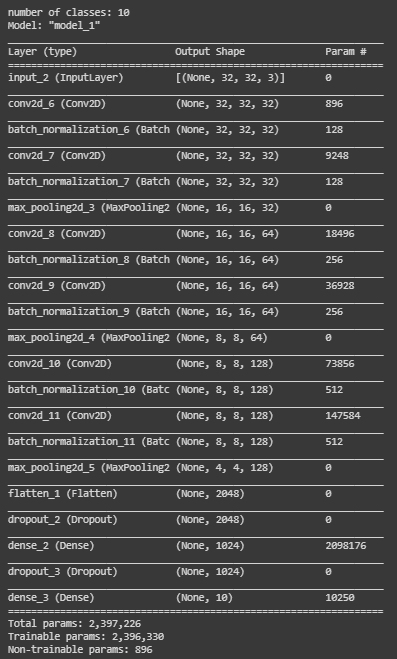
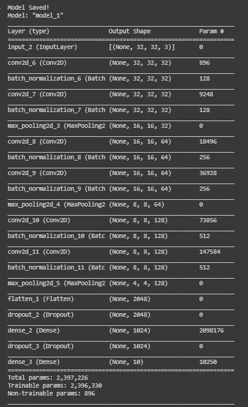
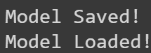
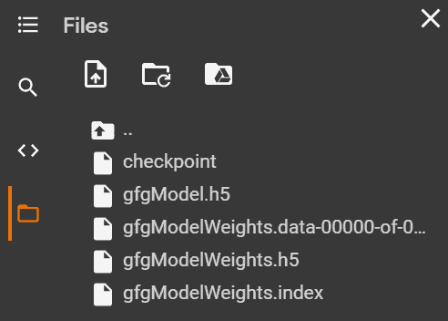

# 在 Tensorflow 中保存和加载模型

> 原文:[https://www . geesforgeks . org/保存并加载 tensorflow 中的模型/](https://www.geeksforgeeks.org/save-and-load-models-in-tensorflow/)

模型的开发可以在测试前后保存。因此，模型将从停止的地方恢复，以消除长时间的训练。如果您保存模型，您仍然可以共享您的模型，并让其他人复制它。大多数机器学习专业人员在发布测试模型和技术时都会分享以下内容:

*   创建模型的代码
*   模型的训练权重

共享这些信息可以让其他人更好地理解模型是如何运行的，并使用新数据对其进行测试。

除此之外，教授机器学习模型将花费大量的时间和精力。然而，关闭笔记本电脑或机器会导致所有这些重量以及更多重量随着内存的清空而消失。为了充分利用您的时间，保存模型以优化可重用性非常重要。


一旦我们完成了对模型的评估，我们就可以继续保存它。

**保存和加载机器学习模型的方法如下:**

*   使用内置功能 **model.save()**
*   使用内置功能**模型，保存权重()**

### **使用 save()方法**

现在我们可以通过调用 save()方法并传入文件路径作为参数来保存我们的模型。这将保存模型的

*   模型架构
*   模型权重
*   模型优化器状态(从我们停止的地方恢复)

> **语法:**tensorflow . keras . x . save(location/model _ name)
> 
> *   这里，X 指的是顺序、功能模型或模型子类。它们都有 save()方法。
> *   在此方法中，位置和模型名称一起作为参数传递。如果只传递模型名称，那么模型将保存在与 Python 文件相同的位置。

我们可以加载使用张量流模块中的 **load_method()** 保存的模型。

> **语法:**tensorflow . keras . models . load _ model(位置/model_name)
> 
> 在此方法中，位置和模型名称一起作为参数传递。

**注意:**如果我们指定“. h5”，模型将以 hdf5 格式保存；如果没有指定扩展名，模型将以 TensorFlow 本机格式保存。

### 使用保存权重()方法

现在，您可以简单地使用 save_weights()方法保存所有图层的权重。它保存模型中包含的图层的权重。建议使用 save()方法保存 h5 模型，而不是使用 tensorflow 保存模型的 save_weights()方法。但是，h5 模型也可以使用 save_weights()方法保存。

> **语法:**tensorflow . keras . model . save _ weights(位置/weights_name)
> 
> 在此方法中，位置和权重名称作为参数传递。如果只传递权重名称，那么它将保存在与 Python 文件相同的位置。

以下是我们保存初始模型权重的程序:

## 蟒蛇 3

```py
# import module
import tensorflow

# create object
model=tensorflow.keras.Model()

# assign location
path='Weights_folder/Weights'

# save
model.save_weights(path)
```

它将创建一个名为权重文件夹的新文件夹，并将所有权重以 Tensorflow 本机格式保存为我的权重。总共有三个文件夹。

*   **检查点:**是一个人类可读的文件，包含以下文本，

```py
model_checkpoint_path: "Weights"
all_model_checkpoint_paths: "Weights"
```

*   **数据-00000-of-00001:** 该文件包含模型的实际重量。
*   **索引:**这个文件告诉 TensorFlow 哪些权重存储在哪里。

我们可以加载使用 load_weights()方法保存的模型。

**语法:**

> tensorflow . keras . model . load _ weights(位置/权重 _ 名称)
> 
> 在此方法中，位置和权重名称作为参数传递。

**注意:**为模型加载重量时，我们必须首先确保模型的设计正确。我们不能将模型(具有 2 个密集层)的权重加载到具有 1 个密集层的顺序模型中，因为两者不一致。

下面是一个示例，描述了保存和加载模型的所有上述方法。在这里，我们开发了一个模型，并使用内置数据集对其进行训练，最后以各种方式再次保存和加载该模型。

导入模块。

## 蟒蛇 3

```py
# import required modules
import tensorflow as tf
import numpy as np
import matplotlib.pyplot as plt
from tensorflow.keras.layers import Input, Conv2D, Dense, Flatten, Dropout
from tensorflow.keras.layers import GlobalMaxPooling2D, MaxPooling2D
from tensorflow.keras.layers import BatchNormalization
from tensorflow.keras.models import Model
from tensorflow.keras.models import load_model
```

加载和拆分数据集，然后更改数据的一些属性。

## 蟒蛇 3

```py
# Load in the data
cifar10 = tf.keras.datasets.cifar10

# Distribute it to train and test set
(x_train, y_train), (x_test, y_test) = cifar10.load_data()
print(x_train.shape, y_train.shape, x_test.shape, y_test.shape)

# Reduce pixel values
x_train, x_test = x_train / 255.0, x_test / 255.0

# flatten the label values
y_train, y_test = y_train.flatten(), y_test.flatten()
```

**输出:**



通过添加层来开发模型。

## 蟒蛇 3

```py
# number of classes
K = len(set(y_train))
# calculate total number of classes for output layer
print("number of classes:", K)

# Build the model using the functional API
# input layer
i = Input(shape=x_train[0].shape)
x = Conv2D(32, (3, 3), activation='relu', padding='same')(i)
x = BatchNormalization()(x)
x = Conv2D(32, (3, 3), activation='relu', padding='same')(x)
x = BatchNormalization()(x)
x = MaxPooling2D((2, 2))(x)

x = Conv2D(64, (3, 3), activation='relu', padding='same')(x)
x = BatchNormalization()(x)
x = Conv2D(64, (3, 3), activation='relu', padding='same')(x)
x = BatchNormalization()(x)
x = MaxPooling2D((2, 2))(x)

x = Conv2D(128, (3, 3), activation='relu', padding='same')(x)
x = BatchNormalization()(x)
x = Conv2D(128, (3, 3), activation='relu', padding='same')(x)
x = BatchNormalization()(x)
x = MaxPooling2D((2, 2))(x)

x = Flatten()(x)
x = Dropout(0.2)(x)

# Hidden layer
x = Dense(1024, activation='relu')(x)
x = Dropout(0.2)(x)

# last hidden layer i.e.. output layer
x = Dense(K, activation='softmax')(x)

model = Model(i, x)
model.summary()
```

**输出:**



使用 Save()方法将模型保存为 h5 格式。

## 蟒蛇 3

```py
# saving and loading the .h5 model

# save model
model.save('gfgModel.h5')
print('Model Saved!')

# load model
savedModel=load_model('gfgModel.h5')
savedModel.summary()
```

**输出:**



使用 save_weights()方法保存模型权重。

## 蟒蛇 3

```py
# saving and loading the model weights

# save model
model.save_weights('gfgModelWeights')
print('Model Saved!')

# load model
savedModel = model.load_weights('gfgModelWeights')
print('Model Loaded!')
```

**输出:**



使用 save_weights()方法将模型保存为 h5 格式模型。

## 蟒蛇 3

```py
# saving and loading the .h5 model

# save model
model.save_weights('gfgModelWeights.h5')
print('Model Saved!')

# load model
savedModel = model.load_weights('gfgModelWeights.h5')
print('Model Loaded!')
```

**输出:**


以上模型是在谷歌 colab 开发的。因此，在保存模型时，它们被临时存储并可以下载。以下是保存的型号和重量:

