# 使用张量流的软最大回归

> 原文:[https://www . geesforgeks . org/soft max-revolution-use-tensorflow/](https://www.geeksforgeeks.org/softmax-regression-using-tensorflow/)

本文讨论了 Softmax 回归的基础知识及其在 Python 中使用 TensorFlow 库的实现。

**什么是 Softmax 回归？**

**Softmax 回归**(或**多项式逻辑回归**)是**逻辑回归**对我们要处理多个类的情况的推广。

这里可以找到对**线性回归**的温和介绍:
[理解逻辑回归](https://www.geeksforgeeks.org/understanding-logistic-regression/)

在二元逻辑回归中，我们假设标签是二元的，即观察，
T2

但是考虑一个场景，我们需要从两个或更多的类标签中对一个观察进行分类。例如，数字分类。这里，可能的标签有:
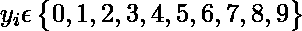

在这种情况下，我们可以使用 **Softmax 回归**。

让我们首先定义我们的模型:

*   让数据集具有“m”个特征和“n”个观察值。此外，还有“k”类标签，也就是说，每个观察值都可以归类为“k”个可能的目标值之一。例如，如果我们有一个向量大小为 28×28 的 100 个手写数字图像的数据集用于数字分类，那么我们有，n = 100，m = 28×28 = 784，k = 10。

*   **特征矩阵** 特征矩阵表示为:这里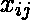表示观察的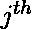特征的值。矩阵有尺寸: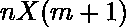

*   **权重矩阵** 我们将权重矩阵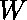定义为: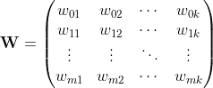这里，表示为类别标签分配给特征的权重。矩阵有尺寸: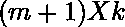。最初，使用一些正态分布填充权重矩阵。

*   **Logit score matrix** Then, we define our net input matrix(also called **logit score matrix**), 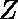, as:

    ```py
    Z = XW
    ```

    矩阵有维度: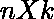。

    > 目前，我们在特征矩阵中多取一列，在权重矩阵中多取一行。这些额外的列和行对应于与每个预测相关联的偏差项。这可以通过定义一个额外的偏差矩阵来简化，大小为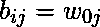。(实际上，我们只需要一个大小的向量和一些偏置项的广播技巧！)
    > 
    > 所以，最终的分数矩阵，是:
    > 
    > Z = XW+b
    > 
    > 其中矩阵有维度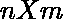，而有维度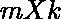。但是矩阵仍然有相同的值和维度！

    但是矩阵意味着什么？实际上，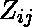是标签 j 对于观察的可能性。它不是一个合适的概率值，但可以被认为是每个观察给每个类别标签的分数！

    让我们将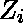定义为用于观察的**逻辑得分向量**。

    例如，让向量![Z_5 = [1.1, 2.0, 3.1, 5.2, 1.0, 1.5, 0.2, 0.1, 1.2, 0.4]](img/77b648029238bba244ec604905ce6175.png "Rendered by QuickLaTeX.com")代表手写数字分类问题中每个类别标签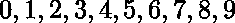的分数，用于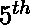观察。这里，最大分数是 5.2，对应于类别标签“3”。因此，我们的模型目前预测观察/图像为‘3’。

*   **Softmax layer** It is harder to train the model using score values since it is hard to differentiate them while implementing **Gradient Descent algorithm** for minimizing the cost function. So, we need some function which normalizes the logit scores as well as makes them easily differentiable!In order to convert the score matrix  to probabilities, we use **Softmax function**.

    对于一个向量，softmax 函数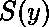定义为: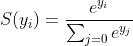那么，softmax 函数将做 2 件事:

    ```py
    1\. convert all scores to probabilities.
    2\. sum of all probabilities is 1.

    ```

    回想一下，在二元逻辑分类器中，我们对同一任务使用了 **sigmoid 函数**。Softmax 函数不过是 sigmoid 函数的推广！现在，这个 softmax 函数计算训练样本属于类的概率，给定逻辑向量为:
    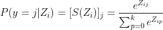
    在向量形式中，我们可以简单地写:
    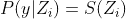
    为了简单起见，让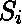表示 **softmax 概率向量**用于观察。

*   **One-hot encoded target matrix** Since softmax function provides us with a vector of probabilities of each class label for a given observation, we need to convert target vector in the same format to calculate the cost function! Corresponding to each observation, there is a target vector (instead of a target value!) composed of only zeros and ones where only correct label is set as 1\. This technique is called **one-hot encoding**.See the diagram given below for a better understanding:

    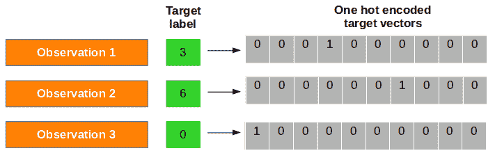

    现在，我们将观察的单热编码向量表示为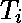

*   **成本函数** 现在，我们需要定义一个成本函数，对于这个成本函数，我们必须比较软最大概率和一个热编码的目标向量的相似性。我们同样使用**交叉熵**的概念。**交叉熵**是一个**距离计算函数**，它从 softmax 函数和创建的一个热编码矩阵中获取计算的概率来计算距离。对于正确的目标类，距离值会更小，而对于错误的目标类，距离值会更大。我们用软最大概率向量和单热点目标向量为观测定义交叉熵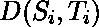为: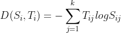

而现在，成本函数，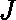可以定义为平均交叉熵，即:
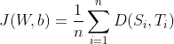
，任务就是最小化这个成本函数！

*   **梯度下降算法** 为了通过梯度下降学习我们的 softmax 模型，我们需要计算导数: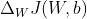和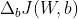，然后我们使用它们来更新梯度相反方向的权重和偏差: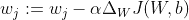和对于每个类，其中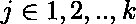和是学习率。使用这个成本梯度，我们迭代地更新权重矩阵，直到我们达到指定数量的时期(通过训练集)或达到期望的成本阈值。

**实施**

现在让我们使用**张量流**库在 [MNIST 手写数字数据集](https://en.wikipedia.org/wiki/MNIST_database)上实现 **Softmax 回归**。

对于 **TensorFlow** 的温和介绍，请遵循本教程:
[TensorFlow 介绍](https://www.geeksforgeeks.org/introduction-to-tensorflow/) 

**步骤 1:导入依赖关系**

首先，我们导入依赖项。

```py
import tensorflow as tf
import numpy as np
import matplotlib.pyplot as plt
```

**第二步:下载数据**

TensorFlow 允许您自动下载和读取 MNIST 数据。考虑下面给出的代码。它会将数据下载并保存到您当前项目目录中的文件夹 **MNIST_data** 中，并将其加载到当前程序中。

```py
from tensorflow.examples.tutorials.mnist import input_data
mnist = input_data.read_data_sets("MNIST_data/", one_hot=True)
```

```py
Extracting MNIST_data/train-images-idx3-ubyte.gz
Extracting MNIST_data/train-labels-idx1-ubyte.gz
Extracting MNIST_data/t10k-images-idx3-ubyte.gz
Extracting MNIST_data/t10k-labels-idx1-ubyte.gz

```

**第三步:了解数据**

现在，我们试图理解数据集的结构。

MNIST 数据分为三部分:55000 个数据点的训练数据( **mnist.train** )、10000 个数据点的测试数据( **mnist.test** )和 5000 个数据点的验证数据( **mnist.validation** )。

每幅图像都是 28 像素乘 28 像素，已经被展平成尺寸为 784 的一维数字阵列。类别标签的数量为 10。每个目标标签已经以一次性编码的形式提供。

```py
print("Shape of feature matrix:", mnist.train.images.shape)
print("Shape of target matrix:", mnist.train.labels.shape)
print("One-hot encoding for 1st observation:\n", mnist.train.labels[0])

# visualize data by plotting images
fig,ax = plt.subplots(10,10)
k = 0
for i in range(10):
    for j in range(10):
        ax[i][j].imshow(mnist.train.images[k].reshape(28,28), aspect='auto')
        k += 1
plt.show()
```

输出:

```py
Shape of feature matrix: (55000, 784)
Shape of target matrix: (55000, 10)
One-hot encoding for 1st observation:
 [ 0\.  0\.  0\.  0\.  0\.  0\.  0\.  1\.  0\.  0.]

```

**第四步:定义计算图**

现在，我们创建一个计算图。

```py
# number of features
num_features = 784
# number of target labels
num_labels = 10
# learning rate (alpha)
learning_rate = 0.05
# batch size
batch_size = 128
# number of epochs
num_steps = 5001

# input data
train_dataset = mnist.train.images
train_labels = mnist.train.labels
test_dataset = mnist.test.images
test_labels = mnist.test.labels
valid_dataset = mnist.validation.images
valid_labels = mnist.validation.labels

# initialize a tensorflow graph
graph = tf.Graph()

with graph.as_default():
    """
    defining all the nodes
    """

    # Inputs
    tf_train_dataset = tf.placeholder(tf.float32, shape=(batch_size, num_features))
    tf_train_labels = tf.placeholder(tf.float32, shape=(batch_size, num_labels))
    tf_valid_dataset = tf.constant(valid_dataset)
    tf_test_dataset = tf.constant(test_dataset)

    # Variables.
    weights = tf.Variable(tf.truncated_normal([num_features, num_labels]))
    biases = tf.Variable(tf.zeros([num_labels]))

    # Training computation.
    logits = tf.matmul(tf_train_dataset, weights) + biases
    loss = tf.reduce_mean(tf.nn.softmax_cross_entropy_with_logits(
                        labels=tf_train_labels, logits=logits))

    # Optimizer.
    optimizer = tf.train.GradientDescentOptimizer(learning_rate).minimize(loss)

    # Predictions for the training, validation, and test data.
    train_prediction = tf.nn.softmax(logits)
    valid_prediction = tf.nn.softmax(tf.matmul(tf_valid_dataset, weights) + biases)
    test_prediction = tf.nn.softmax(tf.matmul(tf_test_dataset, weights) + biases)
```

需要注意的一些要点:

*   For the training data, we use a placeholder that will be fed at run time with a training minibatch. The technique of using minibatches for training model using gradient desc Enttermedia as **stochastic gradient descent** .

    > In gradient descent (GD) and random gradient descent (SGD), you update a set of parameters iteratively to minimize the error function. In GD, you must traverse all the samples in the training set to update the parameters in a specific iteration, while in SGD, you can only use one or a subset of the training samples in the training set to update the parameters in a specific iteration. If SUBSET is used, it is called Minibatch random gradient descent. Therefore, if the number of training samples is very large, in fact, it may take too long to use gradient descent, because in each iteration, when you update the parameter values, you are running the entire training set. On the other hand, it is faster to use SGD because you only use one training sample, and it will improve itself from the first sample. Compared with GD, SGD usually converges faster, but the error function is not as small as that of GD. Usually, in most cases, the approximation of the parameter values you get in SGD is enough, because they reach the optimal value and keep oscillating there.

*   权重矩阵使用服从(截断的)正态分布的随机值初始化。这是使用**方法实现的。使用**TF . zero**方法将偏差初始化为零。**
*   现在，我们将输入乘以权重矩阵，并加上偏差。我们使用**TF . nn . softmax _ cross _ 熵 _with_logits** 计算 soft max 和交叉熵(这是 TensorFlow 中的一个操作，因为它很常见，可以优化)。我们使用 **tf.reduce_mean** 方法对所有训练示例取此交叉熵的平均值。
*   我们将使用梯度下降来最小化损失。为此，我们使用**TF . train . gradientdescentoptimizer**。
*   **train_prediction** 、 **valid_prediction** 和 **test_prediction** 不是训练的一部分，而仅仅是为了我们在训练的时候能够报告精确的数字。

**第五步:运行计算图**

既然我们已经构建了计算图，现在是时候运行它了。

```py
# utility function to calculate accuracy
def accuracy(predictions, labels):
    correctly_predicted = np.sum(np.argmax(predictions, 1) == np.argmax(labels, 1))
    accu = (100.0 * correctly_predicted) / predictions.shape[0]
    return accu

with tf.Session(graph=graph) as session:
    # initialize weights and biases
    tf.global_variables_initializer().run()
    print("Initialized")

    for step in range(num_steps):
        # pick a randomized offset
        offset = np.random.randint(0, train_labels.shape[0] - batch_size - 1)

        # Generate a minibatch.
        batch_data = train_dataset[offset:(offset + batch_size), :]
        batch_labels = train_labels[offset:(offset + batch_size), :]

        # Prepare the feed dict
        feed_dict = {tf_train_dataset : batch_data,
                     tf_train_labels : batch_labels}

        # run one step of computation
        _, l, predictions = session.run([optimizer, loss, train_prediction],
                                        feed_dict=feed_dict)

        if (step % 500 == 0):
            print("Minibatch loss at step {0}: {1}".format(step, l))
            print("Minibatch accuracy: {:.1f}%".format(
                accuracy(predictions, batch_labels)))
            print("Validation accuracy: {:.1f}%".format(
                accuracy(valid_prediction.eval(), valid_labels)))

    print("\nTest accuracy: {:.1f}%".format(
        accuracy(test_prediction.eval(), test_labels)))
```

输出:

```py
Initialized
Minibatch loss at step 0: 11.68728256225586
Minibatch accuracy: 10.2%
Validation accuracy: 14.3%
Minibatch loss at step 500: 2.239773750305176
Minibatch accuracy: 46.9%
Validation accuracy: 67.6%
Minibatch loss at step 1000: 1.0917563438415527
Minibatch accuracy: 78.1%
Validation accuracy: 75.0%
Minibatch loss at step 1500: 0.6598564386367798
Minibatch accuracy: 78.9%
Validation accuracy: 78.6%
Minibatch loss at step 2000: 0.24766433238983154
Minibatch accuracy: 91.4%
Validation accuracy: 81.0%
Minibatch loss at step 2500: 0.6181786060333252
Minibatch accuracy: 84.4%
Validation accuracy: 82.5%
Minibatch loss at step 3000: 0.9605385065078735
Minibatch accuracy: 85.2%
Validation accuracy: 83.9%
Minibatch loss at step 3500: 0.6315320730209351
Minibatch accuracy: 85.2%
Validation accuracy: 84.4%
Minibatch loss at step 4000: 0.812285840511322
Minibatch accuracy: 82.8%
Validation accuracy: 85.0%
Minibatch loss at step 4500: 0.5949224233627319
Minibatch accuracy: 80.5%
Validation accuracy: 85.6%
Minibatch loss at step 5000: 0.47554320096969604
Minibatch accuracy: 89.1%
Validation accuracy: 86.2%

Test accuracy: 86.5%

```

需要注意的一些要点:

*   在每次迭代中，通过使用 **np.random.randint** 方法选择随机偏移值来选择迷你批次。
*   为了馈送占位符 **tf_train_dataset** 和 **tf_train_label** ，我们创建了一个 **feed_dict** 如下所示:

    ```py
    feed_dict = {tf_train_dataset : batch_data, tf_train_labels : batch_labels}

    ```

*   A shortcut way of performing one step of computation is:

    ```py
    _, l, predictions = session.run([optimizer, loss, train_prediction], feed_dict=feed_dict)

    ```

    在执行优化步骤后，该节点返回损失和预测的新值。

这将我们带到实现的结尾。完整的代码可以在[这里](https://gist.github.com/nikhilkumarsingh/c80a575b81b47739c0543b5fa52b349a)找到。

最后，这里有几点值得思考:

*   你可以试着调整学习速率、批量、时代数量等参数，取得更好的效果。您也可以尝试不同的优化器，如[。](http://www.tensorflow.org/api_docs/python/train.html#AdamOptimizer)
*   上述模型的精度可以通过使用具有一个或多个隐藏层的神经网络来提高。我们将在接下来的一些文章中讨论它使用 TensorFlow 的实现。
*   **Softmax Regression vs. k Binary Classifiers** One should be aware of the scenarios where softmax regression works and where it doesn’t. In many cases, you may need to use k different binary logistic classifiers for each of the k possible values of the class label.

    假设您正在处理一个计算机视觉问题，您试图将图像分为三个不同的类别:

    **案例一:**假设你的班级是室内 _ 场景、室外 _ 城市 _ 场景、室外 _ 荒野 _ 场景。

    **案例二:**假设你的班级是室内 _ 场景、黑白 _ 图像、图像 _ 有 _ 人。

    哪种情况下你会使用**软最大回归**分类器，哪种情况下你会使用 3 **二元逻辑回归**分类器？

    这将取决于这 3 个类是否互斥。

    在**情况 1** 中，场景可以是室内 _ 场景、室外 _ 城市 _ 场景或室外 _ 荒野 _ 场景。因此，假设每个训练示例都用 3 个类中的一个来标记，我们应该构建一个 k = 3 的 softmax 分类器。

    然而，在**情况 2** 中，类并不相互排斥，因为一个场景既可以是室内的，也可以有人在其中。因此，在这种情况下，构建 3 个二元逻辑回归分类器会更合适。这样，对于每个新场景，您的算法可以分别决定它是否属于 3 个类别中的每一个。

**参考文献:**

*   [http://www . kdkings . com/2016/07/soft max-回归相关-logistic-relationship . html](http://www.kdnuggets.com/2016/07/softmax-regression-related-logistic-regression.html)
*   [https://classroom.udacity.com/courses/ud730](https://classroom.udacity.com/courses/ud730)
*   [http://ufldl.stanford.edu/wiki/index.php/Softmax_Regression](http://ufldl.stanford.edu/wiki/index.php/Softmax_Regression)

本文由 [**尼基尔·库马尔**](https://www.facebook.com/nikhilksingh97) 供稿。如果你喜欢 GeeksforGeeks 并想投稿，你也可以使用[write.geeksforgeeks.org](https://write.geeksforgeeks.org)写一篇文章或者把你的文章邮寄到 review-team@geeksforgeeks.org。看到你的文章出现在极客博客主页上，帮助其他极客。

如果你发现任何不正确的地方，或者你想分享更多关于上面讨论的话题的信息，请写评论。