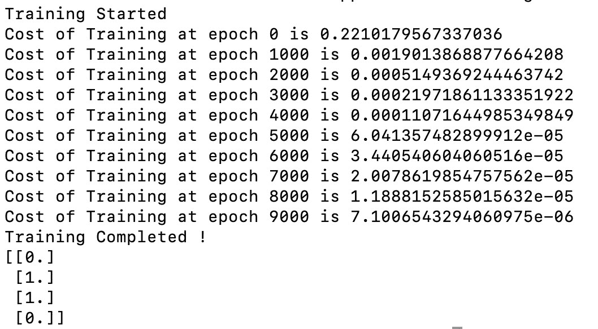

# 张量流中的异或实现

> 原文:[https://www . geesforgeks . org/xor-implement-in-tensorflow/](https://www.geeksforgeeks.org/xor-implementation-in-tensorflow/)

在本文中，我们将学习如何在张量流中实现异或门。在我们进入张量流实现之前，我们将看一下异或门真值表，以深入了解异或门。

<figure class="table">

| 

**X**

 | 

**Y**

 | 

**X(异或)Y**

 |
| --- | --- | --- |
| Zero | Zero | Zero |
| Zero | one | one |
| one | Zero | one |
| one | one | Zero |

</figure>

从上面的真值表，我们知道只有当一个输入为 1 时，门的输出才为 1。如果两个输入相同，则输出为 0。现在我们知道了异或门是如何工作的，让我们从使用张量流实现异或开始。

### 方法

我们将从使用张量流实现异或开始。

**步骤 1:** 导入所有需要的库。这里我们用的是 ***张量*** 和 ***numpy*** 。

```py
import tensorflow.compat.v1 as tf
tf.disable_v2_behaviour()
import numpy as np
```

**步骤 2:** 为输入和输出创建占位符。输入的形状为(4×2)，输出的形状为(4 × 1)。

```py
X = tf.placeholder(dtype=tf.float32, shape=(4,2))
Y = tf.placeholder(dtype=tf.float32, shape=(4,1))
```

**第三步:**创建训练输入输出。

```py
INPUT_XOR = [[0,0],[0,1],[1,0],[1,1]]
OUTPUT_XOR = [[0],[1],[1],[0]]
```

**第 4 步:**给出标准学习率和模型应该训练的时期数。

```py
learning_rate = 0.01
epochs = 10000
```

**步骤 5:** 为模型创建一个隐藏层。隐藏层有权重和偏差。隐藏层的操作是将提供的输入与权重相乘，然后将偏差添加到产品中。然后，这个答案被提供给 Relu 激活函数，以将输出提供给下一层。

> 带 tf.variable_scope('隐藏'):
> 
> h_w = tf。变量(tf .截断 _normal([2，2])，名称='weights ')
> 
> h_b = tf。变量(tf .截断 _normal([4，2])，名称= ' biases ')
> 
> h = tf.nn.relu(tf.matmul(X，h_w) + h_b)

**步骤 6:** 为模型创建输出图层。类似于隐藏层的输出层具有权重和偏差，并且执行相同的功能，但是我们使用 Sigmoid 激活函数来获取 0 到 1 之间的输出，而不是 Relu 激活。

> 带 tf.variable_scope('output '):
> 
> o_w = tf。变量(tf .截断 _normal([2，1])，名称=“权重”)
> 
> o_b = tf。变量(tf .截断 _normal([4，1])，名称= ' biases ')
> 
> y _ estimation = TF . nn . sigmoid(TF . mat mul(h，o_w) + o_b)

**步骤 7:** 创建损失/成本函数。这将计算模型在给定数据上进行训练的成本。这里我们做 RMSE 的预测产值和实际产值。RMSE —均方根误差。

```py
with tf.variable_scope('cost'):
    cost = tf.reduce_mean(tf.squared_difference(Y_estimation, Y))
```

**步骤 8:** 创建一个训练变量，以给定的学习速率用 [ADAM Optimizer](https://www.geeksforgeeks.org/intuition-of-adam-optimizer/) 训练具有给定成本/损失函数的模型，以最小化损失。

```py
with tf.variable_scope('train'):
    train = tf.train.AdamOptimizer(learning_rate).minimize(cost)
```

**第 9 步:**现在所有需要的东西都已经初始化，我们将启动 Tensorflow Session，并通过初始化上面声明的所有变量来开始训练。

```py
with tf.Session() as session:
    session.run(tf.global_variables_initializer())
    print("Training Started")
```

**步骤 10:** 训练模型并给出预测。这里我们运行关于输入和输出的训练，因为我们正在进行监督学习。然后我们计算每 1000 个时代的成本，最后预测产量，并根据实际产量进行测试。

```py
log_count_frac = epochs/10
    for epoch in range(epochs):

        # Training the base network
        session.run(train, feed_dict={X: INPUT_XOR, Y:OUTPUT_XOR})

        # log training parameters
        # Print cost for every 1000 epochs
        if epoch % log_count_frac == 0:
            cost_results = session.run(cost, feed_dict={X: INPUT_XOR, Y:OUTPUT_XOR})
            print("Cost of Training at epoch {0} is {1}".format(epoch, cost_results))

    print("Training Completed !")
    Y_test = session.run(Y_estimation, feed_dict={X:INPUT_XOR})
    print(np.round(Y_test, decimals=1))
```

下面是完整的实现。

## 蟒蛇 3

```py
# import tensorflow library
# Since we'll be using functionalities
# of tensorflow V1 Let us import Tensorflow v1
import tensorflow.compat.v1 as tf
tf.disable_v2_behavior()
import numpy as np

# Create placeholders for input X and output Y
X = tf.placeholder(dtype=tf.float32, shape=(4, 2))
Y = tf.placeholder(dtype=tf.float32, shape=(4, 1))

# Give training input and label
INPUT_XOR = [[0,0],[0,1],[1,0],[1,1]]
OUTPUT_XOR = [[0],[1],[1],[0]]

# Give a standard learning rate and the number
# of epochs the model has to train for.
learning_rate = 0.01
epochs = 10000

# Create/Initialize a Hidden Layer variable
with tf.variable_scope('hidden'):

      # Initialize weights and biases for the
    # hidden layer randomly whose mean=0 and
    # std_dev=1
    h_w = tf.Variable(tf.truncated_normal([2, 2]), name='weights')
    h_b = tf.Variable(tf.truncated_normal([4, 2]), name='biases')

    # Pass the matrix multiplied Input and
    # weights added with Bias to the relu
    # activation function
    h = tf.nn.relu(tf.matmul(X, h_w) + h_b)

# Create/Initialize an Output Layer variable
with tf.variable_scope('output'):

    # Initialize weights and biases for the
    # output layer randomly whose mean=0 and
    # std_dev=1
    o_w = tf.Variable(tf.truncated_normal([2, 1]), name='weights')
    o_b = tf.Variable(tf.truncated_normal([4, 1]), name='biases')

    # Pass the matrix multiplied hidden layer
    # Input and weights added with Bias
    # to a sigmoid activation function
    Y_estimation = tf.nn.sigmoid(tf.matmul(h, o_w) + o_b)

# Create/Initialize Loss function variable
with tf.variable_scope('cost'):

      # Calculate cost by taking the Root Mean
    # Square between the estimated Y value
    # and the actual Y value
    cost = tf.reduce_mean(tf.squared_difference(Y_estimation, Y))

# Create/Initialize Training model variable
with tf.variable_scope('train'):

      # Train the model with ADAM Optimizer
    # with the previously initialized learning
    # rate and the cost from the previous variable
    train = tf.train.AdamOptimizer(learning_rate).minimize(cost)

# Start a Tensorflow Session
with tf.Session() as session:

    # initialize the session variables
    session.run(tf.global_variables_initializer())
    print("Training Started")

    # log count
    log_count_frac = epochs/10
    for epoch in range(epochs):

        # Training the base network
        session.run(train, feed_dict={X: INPUT_XOR, Y:OUTPUT_XOR})

        # log training parameters
        # Print cost for every 1000 epochs
        if epoch % log_count_frac == 0:
            cost_results = session.run(cost, feed_dict={X: INPUT_XOR, Y:OUTPUT_XOR})
            print("Cost of Training at epoch {0} is {1}".format(epoch, cost_results))

    print("Training Completed !")
    Y_test = session.run(Y_estimation, feed_dict={X:INPUT_XOR})
    print(np.round(Y_test, decimals=1))
```

**输出:**



上述程序的输出